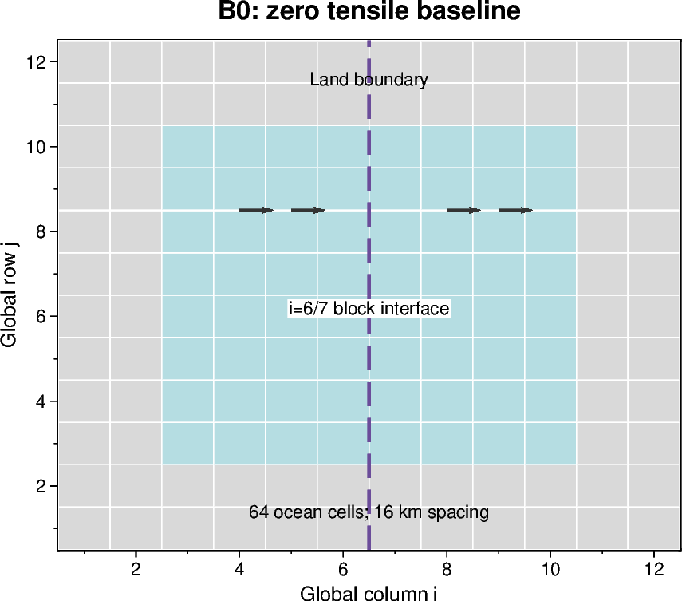
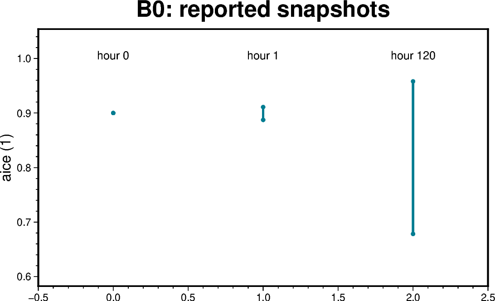

# B0 — Mechanics baseline with zero tensile factor

[Box01 contents](box01_dev_dynamic_tensile_strength.md) · [Case figure notebook](../../CICE_testing/notebooks/B0.ipynb)

## Status and scope

**Limited baseline evidence: completion and three snapshots; full archive unavailable.** Updated 7 October 2026. Results below are supplied archive/log evidence; no new model runs or unseen NetCDF results are inferred by this reorganisation.

## Purpose and test logic

Establish a finite, mechanically interpretable reference before introducing a tensile multiplier. With thermodynamics disabled, volume should be conserved to numerical precision while advection and ridging redistribute area and thickness.

## Mathematical and implementation interpretation

$V=\sum_{i,j} A_{ij}\,h_{ij}$, where `hi` is grid-cell ice volume per unit cell area; $h_{ice}=hi/aice$ on occupied cells. In the mechanics-only closed box, compare $V(t)-V(0)$ against roundoff and inspect area redistribution separately.

## Conceptual figure

This PyGMT depiction shows the configuration, analytical expectation or comparison design. It is **not measured model output**. Recreate its PNG/PDF and provenance with [B0.ipynb](../../CICE_testing/notebooks/B0.ipynb). Optional measured-history cells in the notebook call the existing PyGMT validation API with actual user-supplied files; they fail rather than substitute synthetic results.

## Figure from recorded results

This figure uses only numbers explicitly supplied in the recorded tables below, retained in `CICE_testing/resources/box_reported_snapshots.csv`. Spatial min/max bars are not uncertainty intervals. These are transcript/archive-review values, not a new inspection of raw NetCDF files. The notebook also exposes raw-history plotting when actual files are supplied.

## CICE changes and configuration scope

This is a configuration baseline, not a new rheology implementation. The recorded change disables mixed-layer evolution after the earlier SST NaNs; it does not diagnose their cause. Preserve the distinction between the initial failed setup and the accepted mechanics-only baseline.

## Procedure, expected outcomes, code changes and recorded results

The dated record below preserves exact settings, commands, source references and numerical results. Earlier planning statements describe the state at that time; the status above and final recorded outcome take precedence. See [case organisation](case_organisation.md) for current configuration paths. Run archive IDs and immutable provenance stay historical.

### B0: zero-tensile-factor baseline

Accepted log `cice.runlog.260924-202649`; inspected initial, first-hour and final
history snapshots. The complete accepted baseline was not archived. Source
revision/executable checksum were not supplied. Successful completion and finite
inspected mechanical fields were confirmed; this is a mechanics baseline, not
an analytical-solution or full-output verification.

| Quantity | Initial | Hour 1 | Hour 120 |
|---|---:|---:|---:|
| aice range | 0.9 | 0.887405–0.910943 | 0.678257–0.958043 |
| hi range (m) | 0.9 | 0.887428–0.912513 | 0.678341–0.976533 |
| Maximum reported uvel (m/s) | 0 | 0.0620842 | 0.001200285 |
| Divergence range (%/day) | 0 | -33.3668 to 33.5255 | -0.117907 to 0.648155 |
| Ice volume (m³) | 1.47456e10 | 1.47456e10 | 1.474559999999999e10 |
| Ice area (km²) | 14745.6 | 14742.3225 | 14637.5721 |

Volume conservation to roundoff and western opening/eastern compression support
the intended mechanics. An earlier mixed-layer-on run (`260924-200806`, archive
`dyntens-box01.mixedlayer-on.20260924-202016`) contained SST NaNs; disabling the
mixed layer removed those reported NaNs. Their precise origin was not diagnosed.

