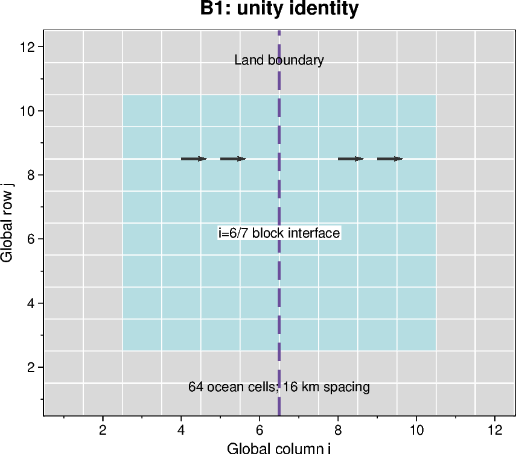

# B1 — Unity multiplier identity

[Box01 contents](box01_dev_dynamic_tensile_strength.md) · [Case figure notebook](../../CICE_testing/notebooks/B1.ipynb)

## Status and scope

**Three historical snapshots match; full unity identity subsequently passes under B4.** Updated 7 October 2026. Results below are supplied archive/log evidence; no new model runs or unseen NetCDF results are inferred by this reorganisation.

## Purpose and test logic

A multiplier equal to one must preserve the existing nonzero-tensile solution. Otherwise the implementation changes the control before any physical hypothesis is tested.

## Mathematical and implementation interpretation

$K_{t,eff}=K_t\,g$. With $g=1$, $K_{t,eff}=0.2$ equals the disabled control. Identity requires matching all physical fields, not only this scalar.

## Conceptual figure

This PyGMT depiction shows the configuration, analytical expectation or comparison design. It is **not measured model output**. Recreate its PNG/PDF and provenance with [B1.ipynb](../../CICE_testing/notebooks/B1.ipynb). Optional measured-history cells in the notebook call the existing PyGMT validation API with actual user-supplied files; they fail rather than substitute synthetic results.

## CICE changes and configuration scope

The scalar multiplier is read/validated in `ice_init.F90`, carried by the dynamic shared state and applied consistently in the viscosity and replacement-pressure coefficient expressions. `ice_dyn_evp.F90` and the history modules expose the applied coefficient. The recorded enabled and disabled controls differ by the declared multiplier switch; initial evidence covers three snapshots only.

## Procedure, expected outcomes, code changes and recorded results

The dated record below preserves exact settings, commands, source references and numerical results. Earlier planning statements describe the state at that time; the status above and final recorded outcome take precedence. See [case organisation](case_organisation.md) for current configuration paths. Run archive IDs and immutable provenance stay historical.

### B1: nonzero Ktens and g=1 identity

Reported disabled control: `dyntens-box01.step1.20260924-213915`.
Enabled g=1: `dyntens-box01.step2.20260925-110235`, log `260925-065019`.
Both are parts of B1 despite the archive names. The enabled log confirms Ktens=0.2,
use_dyntens=T, g=1 and successful completion. The disabled control's full provenance
was not supplied with the initial snapshot review.

Initial, hour-1 and hour-120 pairs match all decoded values and masks exactly
(137, 72 and 72 variables respectively). This is a three-snapshot identity result,
not a complete five-day comparison. Relative to B0, the reported Ktens=0.2 control
has hour-1 maximum speed 0.0583330 m/s and day-five 0.001191054 m/s; day-five
ice area 14640.1727 km². It remains mechanically consistent with the same forcing.
B4 closes the full identity check on the accepted spatial implementation.

