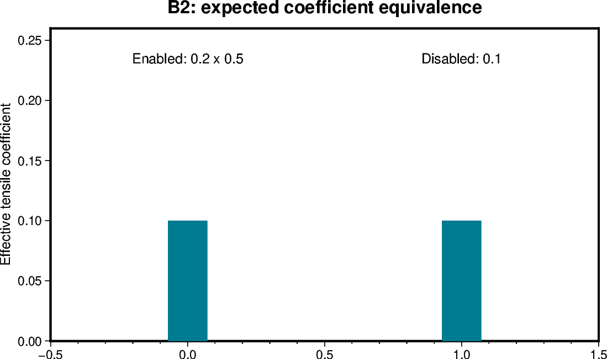

# B2 — Constant multiplier equivalence

[Box01 contents](box01_dev_dynamic_tensile_strength.md) · [Case figure notebook](../../CICE_testing/notebooks/B2.ipynb)

## Status and scope

**PASS: 126 histories and five restarts, exact decoded equality on a common executable.** Updated 7 October 2026. Results below are supplied archive/log evidence; no new model runs or unseen NetCDF results are inferred by this reorganisation.

## Purpose and test logic

Separate the multiplication pathway from its physical interpretation: two ways of supplying the same effective tensile coefficient should produce the same solution.

## Mathematical and implementation interpretation

$0.2\times0.5=0.1$. Enabled $(K_t,g)=(0.2,0.5)$ must match disabled $K_t=0.1$ on the same executable.

## Conceptual figure

This PyGMT depiction shows the configuration, analytical expectation or comparison design. It is **not measured model output**. Recreate its PNG/PDF and provenance with [B2.ipynb](../../CICE_testing/notebooks/B2.ipynb). Optional measured-history cells in the notebook call the existing PyGMT validation API with actual user-supplied files; they fail rather than substitute synthetic results.

## CICE changes and configuration scope

No new mapping or FSD calculation is introduced by this case. It exercises the existing scalar coefficient pathway with a different namelist product. Both runs use the recorded common executable hash; the full 131-pair result supports numerical equivalence for that setup.

## Procedure, expected outcomes, code changes and recorded results

The dated record below preserves exact settings, commands, source references and numerical results. Earlier planning statements describe the state at that time; the status above and final recorded outcome take precedence. See [case organisation](case_organisation.md) for current configuration paths. Run archive IDs and immutable provenance stay historical.

### B2: constant-g equivalence

Complete archives reviewed:

- `dyntens-box01.step2-run1.20260925-131357`: log `260925-124634`, disabled Ktens=0.1.
- `dyntens-box01.step2-run2.20260925-132240`: log `260925-131803`, enabled Ktens=0.2, g=0.5.

The namelists differ only in Ktens, use_dyntens and the ignored/enabled scalar g.
Both executable SHA-256 hashes are
`253cb3b95dd2b2ae99609f98ec1bebe633a66bb62b5a9e03528ff53ab376bbfe`.
All 126 histories and five restarts match exactly: **131 file pairs, 9,462
variable pairs, zero value/mask differences and no unmasked nonfinite numeric
values**. This establishes scalar equivalence for the tested setup. It is not
a stopped/resumed restart test. At day five, volume is 1.474559999999999e10 m³
and area 14638.8138 km².

