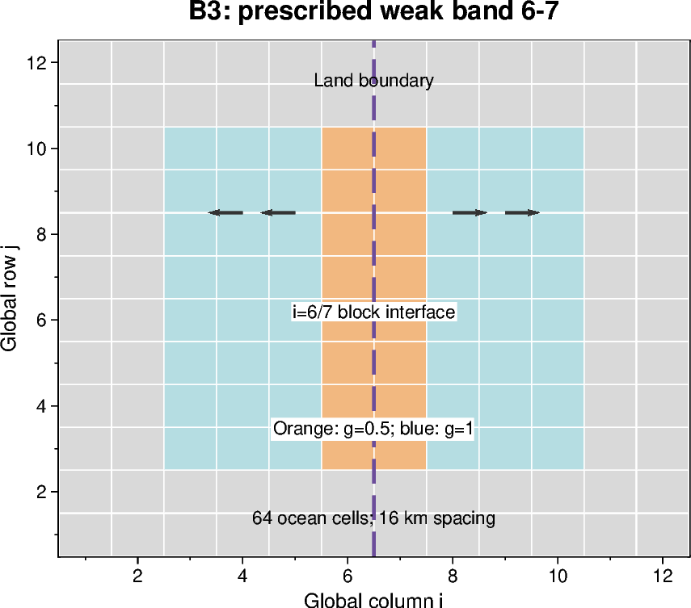
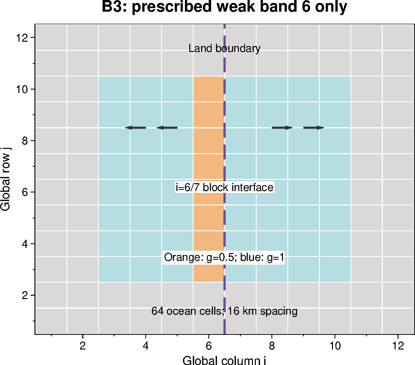
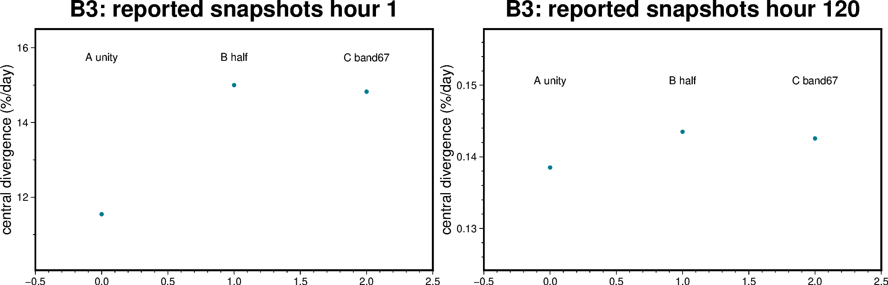

# B3 — Spatial tensile loading and decomposition

[Box01 contents](box01_dev_dynamic_tensile_strength.md) · [Case figure notebook](../../CICE_testing/notebooks/B3.ipynb)

## Status and scope

**PASS: six layout checks and four exact 131-file comparisons for prescribed bands.** Updated 7 October 2026. Results below are supplied archive/log evidence; no new model runs or unseen NetCDF results are inferred by this reorganisation.

## Purpose and test logic

A coefficient jump crossing an internal block boundary exposes indexing and halo errors that uniform g cannot reveal. Opposing winds generate extensional loading in the central band.

## Mathematical and implementation interpretation

$g(i)=0.5$ inside the declared global-column band and $g(i)=1$ outside; $K_{t,eff}(i)=0.2g(i)$. The prescribed wind is $u_a=-5$ m/s for $i\le6$ and $+5$ m/s for $i\ge7$. A halo copies a neighbour; it adds no physical cell.

## Conceptual figure



This PyGMT depiction shows the configuration, analytical expectation or comparison design. It is **not measured model output**. Recreate its PNG/PDF and provenance with [B3.ipynb](../../CICE_testing/notebooks/B3.ipynb). Optional measured-history cells in the notebook call the existing PyGMT validation API with actual user-supplied files; they fail rather than substitute synthetic results.



The one-column variant breaks symmetry across the block interface; both variants belong to B3.

## Figure from recorded results



This figure uses only numbers explicitly supplied in the recorded tables below, retained in `CICE_testing/resources/box_reported_snapshots.csv`. Spatial min/max bars are not uncertainty intervals. These are transcript/archive-review values, not a new inspection of raw NetCDF files. B3's C executable differed from A/B; that qualification remains essential. The notebook also exposes raw-history plotting when actual files are supplied.

## CICE changes and configuration scope

The prescribed `box_band` field uses global column indices; `ice_forcing.F90` similarly defines opposing winds independently of local block/rank. `ice_dyn_evp.F90` exchanges scalar g halos before deriving the effective coefficient. Upper-band validation was moved after domain initialization (a321096). History/checker fixes account for pre-forcing IC, dual stream names and block ownership; these do not relax physical-field equality.

## Procedure, expected outcomes, code changes and recorded results

The dated record below preserves exact settings, commands, source references and numerical results. Earlier planning statements describe the state at that time; the status above and final recorded outcome take precedence. See [case organisation](case_organisation.md) for current configuration paths. Run archive IDs and immutable provenance stay historical.

## B3: tensile loading and spatial coefficients

| Archive under `~/AFIM_archive/LFI-waves-dyntens/` | Archived wind | Coefficient | History gate |
|---|---|---|---|
| `dyntens-box01.step3-0.20260927-130227` | uniform_east | disabled; effective 0.2 | 126/126 pass with uniform-east assertion |
| `dyntens-box01.step3-A.20260927-142925` | box_tensile | constant g=1; effective 0.2 | 126/126 pass |
| `dyntens-box01.step3-B.20260927-143430` | box_tensile | constant g=0.5; effective 0.1 | 126/126 pass |
| `dyntens-box01.step3-C.20260927-154047` | box_tensile | g=0.5 in columns 6–7, 1 elsewhere | 126/126 pass |

All four hourly inventories cover hours 1–120 with one-hour time-coordinate
spacing. All five restart files per archive pass an independent scan of every
unmasked numeric value for finiteness. This does not establish split-run restart
reproducibility. Masked storage and arbitrary missing-field completeness are not
certified by the finite scan.

3-0 is a uniform-east reference, not a matched disabled-path tensile control.
Its `uatm` is +5 m/s throughout the active ocean. Applying `--tensile` correctly
rejects it. Preserve it; obtain a separate disabled `box_tensile` run for the
identity comparison. A and B namelists differ only in `dyntens_g_const`; A and C
namelists differ only in `dyntens_g_mode`.

Executable SHA-256:

- 3-0, A, B: `9703f37187a64e717873c63c0dc145f6114c58aab8e6ca7565b51c463c5c2202`
- C: `24b9df36e1c01fb9e1093b2a4369c9838ac716f9f616db755e18d49d1da18158`

The C executable differs following the startup-validation rebuild. The hashes
alone cannot establish that this is its only source/build difference. Repeat the
matched tensile controls using the accepted C executable before attributing all
A–C differences exclusively to the coefficient map.

### Measured tensile response

Values below are instantaneous snapshots, sampled over active T cells in global
columns 6–7. Spatial differences within that central set are below the displayed
precision. `sig1` is dimensionless principal stress normalised by strength;
`sigP` is vertically integrated pressure, positive in compression (N/m).

| Quantity | 3A: g=1 | 3B: g=0.5 | 3C: weak band |
|---|---:|---:|---:|
| Hour 1 central divergence (%/day) | 11.547084 | 15.001759 | 14.825436 |
| Hour 1 central sig1 | 0.269396 | 0.164093 | 0.164092 |
| Hour 1 central sigP (N/m) | -165.574497 | -50.821862 | -50.821324 |
| Hour 120 central divergence (%/day) | 0.138509 | 0.143498 | 0.142564 |
| Hour 120 central sig1 | 0.243639 | 0.148884 | 0.148790 |
| Hour 120 central aice | 0.883963 | 0.878667 | 0.879060 |

At hour 1, the ocean velocity extrema have opposing signs: ±0.0213835 m/s
(A), ±0.0277810 (B), and ±0.0274545 (C). Positive central divergence and
principal stress, negative central pressure, and compression elsewhere support
the intended extensional loading. Reduced g produces greater initial opening and
lower central tensile stress. By hour 120, transport and strength feedback have
substantially reduced opening rates. A and B form the clean same-executable
comparison; C gives consistent spatial-case evidence subject to the rebuild
qualification above. These diagnostics do not by themselves certify a yield
surface, a crack threshold or resolution convergence.

Do not interpret the small central-divergence values printed for daily files as
the magnitude of the initial transient: the first hourly snapshot resolves a
much larger response. Some CICE stress/divergence fields are snapshots even in
daily output; consult their variable comments rather than assuming every field
in a daily file is a daily mean.


### Decomposition results supplied 4 October 2026

Evidence: `Pasted text(7).txt`, containing the complete ordered checker loop over
b67 then b6, and s1 then s2 then m2. The transcript reports the checkout up to
date and shows the blkmask exclusion from checker revision `a3ea8c8`; it does not
print the model source revision or executable hashes. Case attribution follows
the displayed loop order. Preserve the actual case namelists, job/build logs and
checksums with these results, including confirmation of the two-rank launches.

| Case | Prescribed band | History checks | Reference comparison | Result |
|---|---|---:|---|---|
| dt_b67_s1 | columns 6–7 | 126/126 | Reference | PASS |
| dt_b67_s2 | columns 6–7 | 126/126 | 131 pairs vs b67_s1 | PASS, atol=rtol=0 |
| dt_b67_m2 | columns 6–7 | 126/126 | 131 pairs vs b67_s1 | PASS, atol=rtol=0 |
| dt_b6_s1 | column 6 | 126/126 | Reference | PASS |
| dt_b6_s2 | column 6 | 126/126 | 131 pairs vs b6_s1 | PASS, atol=rtol=0 |
| dt_b6_m2 | column 6 | 126/126 | 131 pairs vs b6_s1 | PASS, atol=rtol=0 |

Total: **756 history-file checks and 524 pairwise file comparisons**. Each
comparison covers 126 histories and five restarts; these counts include repeated
use of the references. Histories check prescribed coefficient maps, finite
unmasked numeric fields and the outward wind (except pre-forcing IC wind).
Reference comparisons check inventories, dimensions, masks and decoded unmasked
values. NetCDF metadata and masked storage are excluded. **Only history blkmask
value equality is exempt**, because CICE defines it as mytask + iblk/100; its
inventory/dimensions/masks/finiteness remain checked. No physical-field tolerance
was relaxed. This is exact decoded numerical agreement, not byte-identical files.

| Band | Central divergence at hour 1 (%/day) | At hour 120 (%/day) |
|---|---:|---:|
| 6–7 | 14.825436 to 14.825436 | 0.14256394 to 0.14256394 |
| 6 only | 0.20074359 to 26.469676 | 0.0035674161 to 0.30690565 |

The same printed ranges occur for all three layouts within each band. The
one-column case deliberately breaks east–west symmetry and puts unequal g
values across the internal 6/7 boundary. Agreement includes the physical fields
and restarts, not merely the coefficient map. **The prescribed-g decomposition
gate passes for these tested layouts. Do not rerun it simply because this record
has been consolidated.** It does not establish global-grid or FSD-dependent
exchange, restart continuation, or physical yield-surface convergence.

## Implementation and resolved setup issues

- `ice_init.F90`: reads/broadcasts/validates enabled mode, constants and band;
  supported path is C-grid, standard_2d EVP, avg_zeta, ellipse, revised EVP off.
- `ice_dyn_shared.F90`: owns controls and optional local coefficient in both
  viscosity and replacement-pressure expressions.
- `ice_dyn_evp.F90`: constructs public T-cell g/ktens_eff arrays when enabled,
  exchanges scalar g halos then derives ktens_eff; updates at initialisation and
  each dynamics step. Existing viscosity/stress exchange before T-to-U averaging
  remains necessary. Coefficients are derived, not prognostic restart fields.
- `ice_forcing.F90`: box_tensile winds are prescribed from global column indices.
- `ice_history*.F90`: dimensionless coefficient diagnostics; daily base names,
  instantaneous `_1` names, both in IC. IC precedes atmospheric initialisation.
- Band upper-bound validation moved after domain initialisation (commit a321096).
  The subsequent successful 3C archives resolve the startup failure.
- Checker corrections handle pre-forcing IC winds, dual-stream names and
  layout-specific blkmask (a3ea8c8). Twenty-four fixture tests passed when the
  final correction was made; the six new runs supply runtime evidence.
- Generated cases need the accepted physics namelist plus their own domain and
  paths. Working env/Macros must be copied before building; initialise modules
  inside noninteractive csh. The successful s1 build uses -O2 -fp-model precise.
  The analysis3 `test` wrapper interfered with module initialisation: use a fresh
  build/submission environment and load the analysis environment for Python only.
- Serial WHACS compatibility stub supports the box build but aborts on actual
  WHACS use. No serial wave-forcing validation is implied.

## Decomposition check

The following recipe is retained for reproducibility. **Its six reported cases
have now passed; it is not the next task. Continue with B4 above.**

#### 1. Define the six cases

The setup's explicit `-p` format is tasks × threads × block-x × block-y ×
maximum-blocks-per-rank. Global dimensions remain 12×12 in every case.

| Case name | Band columns | `-p` | Purpose |
|---|---|---|---|
| `dt_b67_s1` | 6–7 | `1x1x12x12x1` | Fresh one-block 3C reference |
| `dt_b67_s2` | 6–7 | `1x1x6x12x2` | Two blocks on one rank; local copies |
| `dt_b67_m2` | 6–7 | `2x1x6x12x1` | One block per rank; MPI exchange |
| `dt_b6_s1` | 6 only | `1x1x12x12x1` | One-column-band reference |
| `dt_b6_s2` | 6 only | `1x1x6x12x2` | Coefficient jump across local block edge |
| `dt_b6_m2` | 6 only | `2x1x6x12x1` | Coefficient jump across MPI boundary |

The internal boundary lies between global columns 6 and 7. With the two-column
band, both sides have g=0.5. With the one-column band, column 6 has g=0.5 and
column 7 has g=1: this explicitly tests copying unlike neighbour values. A halo
is a neighbour's copied value, not an extra physical cell. Compare each split
layout with its matching one-block reference; do not compare b6 with b67 or
require east–west symmetry in b6.

#### 2. Generate separate cases from the same source revision

Run from Bash on Gadi. Use the working compiler/module environment established
for the successful build. Case creation must complete without unresolved module
errors. The guard prevents accidental regeneration of an existing case.

```bash
cd /g/data/gv90/da1339/src/CICE_dyntens
git pull --ff-only origin dev
git rev-parse HEAD
for band in b67 b6; do
    for layout in s1 s2 m2; do
        case "$layout" in
            s1) pes=1x1x12x12x1 ;;
            s2) pes=1x1x6x12x2 ;;
            m2) pes=2x1x6x12x1 ;;
        esac
        case_name="dt_${band}_${layout}"
        if [ -e "$case_name" ]; then
            echo "Already exists: $case_name; inspect it before proceeding"
            break 2
        fi
        ./cice.setup -c "$case_name" -m gadi1 -e intel \
            -g gbox12 -p "$pes" -s boxforcee,boxclosed,buildclean || break 2
    done
done
```

Do not update model source between these builds/runs. Record `git diff` as well
as the commit if there are uncommitted model changes. Different serial/MPI
executables are expected; identical source and compiler flags are the controls.

#### 3. Apply the verified physics without losing the generated decomposition

The setup options alone do not recreate the accepted experiment. Use the
**archived successful 3C `ice_in`**, not an actively edited working namelist.
The following one-time preparation copies that configuration while retaining
**each generated `domain_nml` in full**. The archived output paths are relative
and therefore resolve inside each case's own run directory. It saves the
original generated namelist for inspection and refuses to overwrite that backup.

```bash
python3 - <<'PY'
from pathlib import Path
import re

source = Path.home() / 'AFIM_archive/LFI-waves-dyntens/dyntens-box01.step3-C.20260927-154047/ice_in'
accepted = source.read_text()
domain = re.compile(r'(?ms)^\s*&domain_nml\b.*?^\s*/\s*$')
assert len(domain.findall(accepted)) == 1, 'expected one archived domain_nml'
for key, value in [('ice_ic', "'internal'"), ('npt', '5'),
                   ('atm_data_type', "'box_tensile'"),
                   ('use_dyntens', '.true.'), ('dyntens_g_mode', "'box_band'")]:
    match = re.search(r'(?mi)^\s*' + key + r'\s*=\s*([^!\n]+)', accepted)
    assert match and match[1].strip() == value, (key, 'unexpected template')
for key in ['restart_dir', 'history_dir', 'incond_dir', 'pointer_file']:
    match = re.search(r'(?mi)^\s*' + key + r"\s*=\s*'([^']+)'", accepted)
    assert match and match[1].startswith('./'), (key, 'expected case-relative path')

prepared = []
for band, upper in [('b67', 7), ('b6', 6)]:
    for layout in ['s1', 's2', 'm2']:
        case = Path(f'dt_{band}_{layout}')
        target = case / 'ice_in'
        generated = target.read_text()
        matches = domain.findall(generated)
        assert len(matches) == 1, (case, 'expected one generated domain_nml')
        backup = case / 'ice_in.setup-original'
        assert not backup.exists(), (backup, 'already prepared')
        result = domain.sub(lambda m: matches[0], accepted)
        result, count = re.subn(r'(?mi)^(\s*dyntens_band_ihi\s*=).*$',
                               lambda m: m[1] + f' {upper}', result)
        assert count == 1
        prepared.append((target, backup, generated, result))
# Validate all six before writing any of them.
for target, backup, generated, result in prepared:
    backup.write_text(generated)
    target.write_text(result)
    print('Prepared', target)
PY
```

Check that these settings are present in each prepared case:

- `use_dyntens=.true.`, mode `box_band`, background 1, band 0.5,
  `Ktens=0.2`, lower column 6; upper column 7 or 6 as above.
- `atm_data_type='box_tensile'`; free-slip C-grid; lateral drag, waves,
  thermodynamics and mixed-layer evolution remain as in archived 3C.
- Internal initial conditions, five days, one-hour timestep, the same EVP
  subcycling; daily plus hourly coefficient/stress/velocity output.

```bash
for case_name in dt_b67_s1 dt_b67_s2 dt_b67_m2 dt_b6_s1 dt_b6_s2 dt_b6_m2; do
    echo "$case_name"
    sed -n '/&domain_nml/,/^\//p' "$case_name/ice_in"
    grep -E 'ICE_(CASEDIR|RUNDIR|NTASKS|NTHRDS|COMMDIR)' "$case_name/cice.settings"
done
```

Expected `nprocs/block_size_x/block_size_y/max_blocks` are `1/12/12/1`
for s1, `1/6/12/2` for s2, and `2/6/12/1` for m2. Keep global nx/ny=12,
`roundrobin` and the generated processor-shape settings. Verify the actual
block/rank allocation in the model startup diagnostic too; a launch with only
one rank does not test MPI.

#### 4. Preserve the working build environment; check the launcher

Reuse the accepted environment and compiler macros, but keep the newly generated
`cice.settings`, `cice.run`, `cice.submit` and case paths. For example, after
confirming these are still the working files from the successful box build:

```bash
for case_name in dt_b67_s1 dt_b67_s2 dt_b67_m2 dt_b6_s1 dt_b6_s2 dt_b6_m2; do
    cp dyntens_box01/env.gadi1_intel "$case_name/"
    cp dyntens_box01/Macros.gadi1_intel "$case_name/"
done
```

In each generated `cice.run`, inspect the PBS header and executable launch line:

| Setting | s1 and s2 | m2 |
|---|---|---|
| `ICE_NTASKS` in settings | 1 | 2 |
| `ICE_NTHRDS` | 1 | 1 |
| Effective `ICE_COMMDIR` | serial | mpi |
| PBS `ncpus` | 1 | 2 |
| PBS memory / walltime | 4gb / 00:30:00 | 4gb / 00:30:00 |
| Launch | `./cice >&! $ICE_RUNLOG_FILE` | `mpirun -np 2 ./cice >&! $ICE_RUNLOG_FILE` |

Retain project `gv90`, queue `normalbw`, working storage directives and each
case's own PBS output path. The generator may already supply the correct MPI
launcher: inspect it rather than adding a second launch. Never copy the old
serial `cice.run` into an MPI case. The generated `cice.settings` selects the
communication directory from `ICE_NTASKS`; do not force it to serial for m2.

#### 5. Build, submit and retain each run

Start with `dt_b67_s1`. After its check passes, do s2 then m2; repeat for b6.
Build each generated case: do not copy the old serial executable into m2.

```bash
case_name=dt_b67_s1    # change to the next case from the table
(
    cd "$case_name" || exit
    ./cice.build > build.decomp.log 2>&1 && ./cice.submit
)
```

Submission is asynchronous. Wait for completion before checking or changing
anything. Confirm `CICE COMPLETED SUCCESSFULLY`, final step 120 / 2005-01-06,
and the intended rank/block count in the log/diagnostics. Keep the build log.
Each case should have its own `ICE_RUNDIR` under
`/g/data/gv90/da1339/cice-dirs/runs/`; verify that path in `cice.settings`.
If a chosen run directory already contains results, archive those and use a
fresh directory before submitting. Do not mix old and new NetCDF output.

Archive each completed run using the established workflow, retaining executable,
`ice_in`, `cice.settings`, compiler environment/macros, build/run logs, history,
restarts and source revision. Record the executable SHA-256. Keep the six run
directories intact until their comparisons are complete.

#### 6. Check maps and compare all decoded fields

After all six jobs complete, run from the repository root. Use the actual
`ICE_RUNDIR` paths if yours differ from those below. `load_modules` is for the
Python checks, after the model build/run environment has done its job.

```bash
load_modules
runs=/g/data/gv90/da1339/cice-dirs/runs
for band in b67 b6; do
    if [ "$band" = b67 ]; then upper=7; else upper=6; fi
    reference="$runs/dt_${band}_s1"
    python3 test_scripts/check_box_spatial_g.py "$reference" \
        --mode box_band --ktens 0.2 --background 1 --band 0.5 \
        --ilo 6 --ihi "$upper" --tensile || break
    for layout in s2 m2; do
        python3 test_scripts/check_box_spatial_g.py "$runs/dt_${band}_${layout}" \
            --mode box_band --ktens 0.2 --background 1 --band 0.5 \
            --ilo 6 --ihi "$upper" --tensile \
            --reference-run "$reference" || break 2
    done
done
```

Expected for this five-day configuration: six summaries of
`PASS prescribed fields/finite history: 126 files`, plus four summaries of
`PASS reference comparison: 131 file pairs; atol=0.0, rtol=0.0` (126 histories
and five restarts). Compare only runs with the same band. Record the actual
counts and any first failing field. If arithmetic differences occur, measure
and explain them before considering a tolerance; do not loosen tolerances simply
to obtain a pass. Equal g maps alone cannot verify stress/velocity exchange.

Optionally compare the fresh b67/s1 with archived 3C using the same
`--reference-run` option to establish continuity with the accepted archive.
A difference across builds is a separate question from decomposition equivalence.

**Acceptance criterion (met by the supplied transcript):** both band profiles pass across local and remote block
boundaries, with physical history and restarts matching the appropriate reference.
This closes the decomposition gate only. A continuous versus split-run comparison
and the matched-control/spatial-null checks remain required; FSD feedback and
global experiments follow the box acceptance sequence below.

