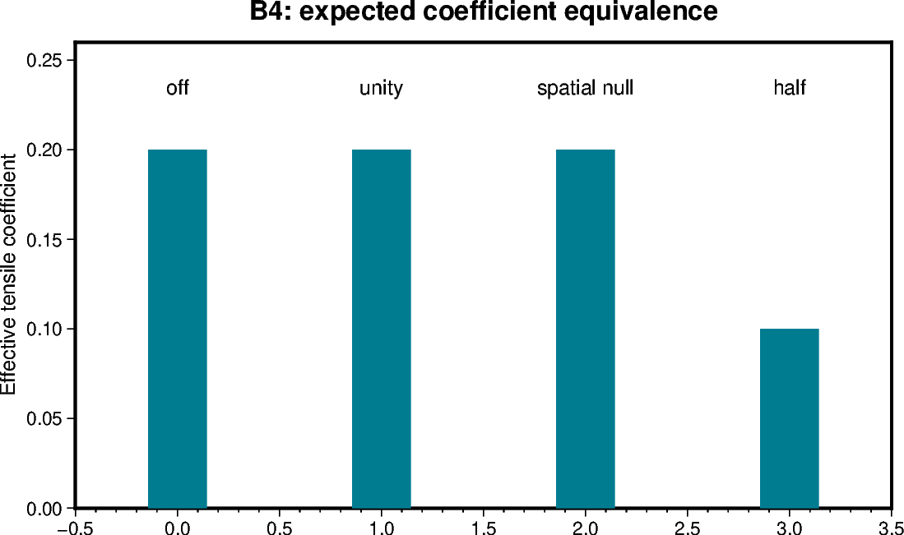
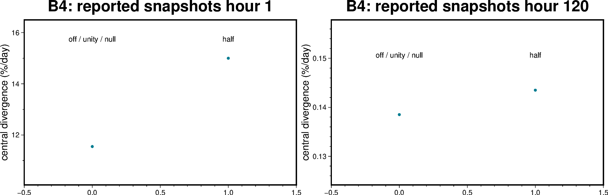

# B4 — Matched controls on the accepted spatial build

[Box01 contents](box01_dev_dynamic_tensile_strength.md) · [Case figure notebook](../../CICE_testing/notebooks/B4.ipynb)

## Status and scope

**PASS: unity/off, spatial-null and half-g matched controls (4 October 2026).** Updated 7 October 2026. Results below are supplied archive/log evidence; no new model runs or unseen NetCDF results are inferred by this reorganisation.

## Purpose and test logic

The first spatial experiment required a rebuild. These matched controls close the attribution gap using the accepted spatial implementation and consistent forcing.

## Mathematical and implementation interpretation

$g=1$ and a spatial band whose background and band both equal one are the same physical coefficient. Half-g is compared against its effective-$K_t=0.1$ reference, not against unity.

## Conceptual figure

This PyGMT depiction shows the configuration, analytical expectation or comparison design. It is **not measured model output**. Recreate its PNG/PDF and provenance with [B4.ipynb](../../CICE_testing/notebooks/B4.ipynb). Optional measured-history cells in the notebook call the existing PyGMT validation API with actual user-supplied files; they fail rather than substitute synthetic results.

## Figure from recorded results

This figure uses only numbers explicitly supplied in the recorded tables below, retained in `CICE_testing/resources/box_reported_snapshots.csv`. Spatial min/max bars are not uncertainty intervals. These are transcript/archive-review values, not a new inspection of raw NetCDF files. The notebook also exposes raw-history plotting when actual files are supplied.

## CICE changes and configuration scope

These are matched configurations using the accepted prescribed spatial implementation. No additional model physics change is needed to execute the four controls. The comparisons are intended to resolve the earlier rebuild/forcing attribution limits, not retune the rheology.

## Procedure, expected outcomes, code changes and recorded results

The dated record below preserves exact settings, commands, source references and numerical results. Earlier planning statements describe the state at that time; the status above and final recorded outcome take precedence. See [case organisation](case_organisation.md) for current configuration paths. Run archive IDs and immutable provenance stay historical.

## B4 -- Matched controls results

Results supplied 4 October 2026 in `Pasted text(8).txt` close the B4
matched-controls gate. This subsection supersedes the earlier B4 “pending/next”
status above and the original B4 acceptance recipe below; those sections are
retained unchanged as requested. **B5 restart continuation is now the next gate.**

The four cases used separate run directories under
`/g/data/gv90/da1339/cice-dirs/runs/`. The displayed namelists specify fresh
internal initial conditions, five days, `box_tensile` forcing and `Ktens=0.2`;
the job scripts request one CPU. The preparation procedure reused the accepted
`dt_b67_s1` executable without rebuilding. The supplied transcript does not print
executable checksums, so retain the generated `cice.sha256` and `README.case`
records with the actual run namelists and logs.

| Case | PBS job | Enabled / mode | Prescribed g | Effective coefficient | History check | Reference comparison |
|---|---|---|---|---|---|---|
| dt_b4_off | 180464581 | false / constant | 1 | 0.2 | PASS, 126 files | Reference |
| dt_b4_one | 180464582 | true / constant | 1 | 0.2 | PASS, 126 files | PASS vs off, 131 pairs |
| dt_b4_null | 180464583 | true / box_band | background 1, band 1, columns 6–7 | 0.2 | PASS, 126 files | PASS vs one, 131 pairs |
| dt_b4_half | 180464584 | true / constant | 0.5 | 0.1 | PASS, 126 files | PASS vs archived 3-B, 131 pairs |

The half reference is
`/home/581/da1339/AFIM_archive/LFI-waves-dyntens/dyntens-box01.step3-B.20260927-143430`.
All three distinct reference comparisons report **atol=0.0, rtol=0.0** across
126 history files and five restart files. This establishes exact decoded,
unmasked numerical agreement under the existing comparison rules, not binary
file identity. History `blkmask` value equality remains the sole field-value
exception; physical-field tolerances were not relaxed.

The transcript contains six 126-file checker passes and four 131-pair comparison
passes because null was checked twice (first as a uniform field, then explicitly
with `--mode box_band --background 1 --band 1 --ilo 6 --ihi 7`), and half was
checked both alone and against 3-B. Count these as **four distinct runs and three
distinct reference comparisons**, not six independent experiments.

| Cases | Central divergence at hour 1 (%/day) | At hour 120 (%/day) |
|---|---:|---:|
| off / one / null | 11.547084 | 0.1385088 |
| half | 15.001759 | 0.14349826 |

The three unity-g controls agree across the full compared physical state.
Uniform half-g reproduces the earlier 3-B solution. Thus enabling g=1 and
selecting a spatial band with no contrast introduce no detected numerical
change in this tested tensile-loading setup. This does not yet demonstrate
restart continuation or FSD-dependent behaviour.

The displayed off-job report records `CICE COMPLETED SUCCESSFULLY` and exit
status 0. It also prints a missing `/g/data/xp65/public/modules` directory
message before execution; this did not prevent that run completing. These
results are recorded from the supplied transcript; the four new NetCDF datasets
were not independently inspected here.

### B4 — close the matched controls (next)

Use the accepted one-block executable and identical internal initial conditions,
box_tensile forcing, numerical settings and five-day output for these controls.
Archive separately; only the entries listed below change.

| Control | use_dyntens | mode | background | band | Ktens | Expected comparison |
|---|---|---|---:|---:|---:|---|
| off | false | constant | 1 | ignored | 0.2 | Reference |
| one | true | constant | 1 | ignored | 0.2 | Exact full history/restart match to off |
| null | true | box_band | 1 | 1 | 0.2 | Exact full match to one; bounds 6–7 |
| half | true | constant | 0.5 | ignored | 0.2 | Check continuity with archived 3B across the rebuild |

Use `check_box_spatial_g.py --tensile --ktens 0.2` with the matching mode and
background/band, and `--reference-run` for equal-solution pairs. Expected identity
comparisons: 131 pairs at zero tolerance. Do not compare half against one expecting
equality. Existing archives may satisfy a row if their configuration, executable
and full comparison evidence establish it; the original 3-0 cannot because it
used uniform_east. Record source revision, local diff and executable SHA-256.

