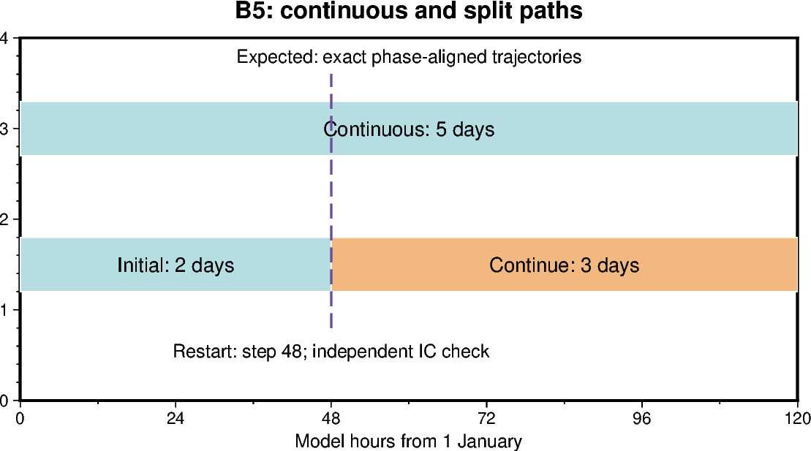
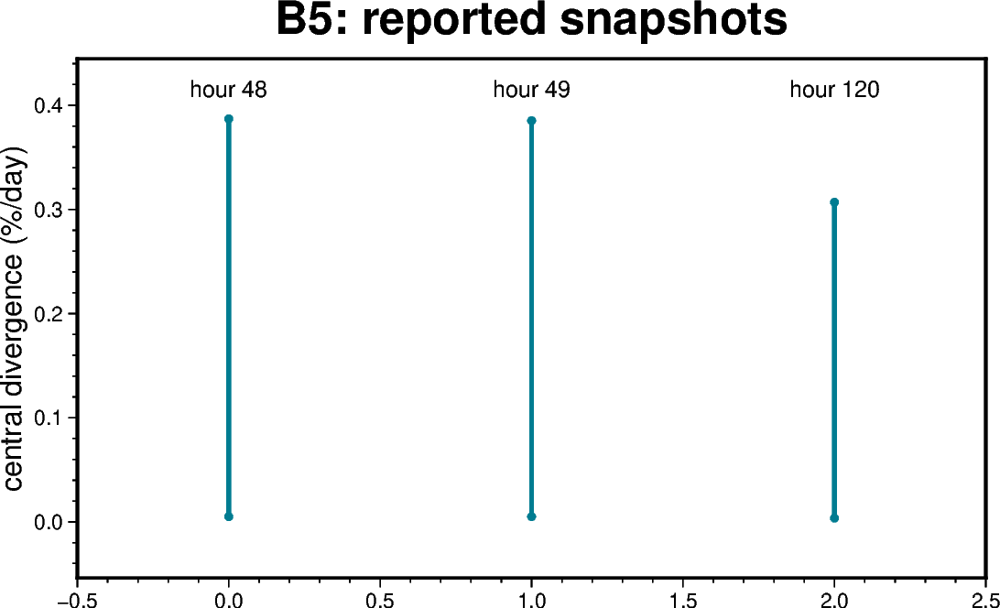

# B5 — Prescribed spatial coefficient restart continuation

[Box01 contents](box01_dev_dynamic_tensile_strength.md) · [Case figure notebook](../../CICE_testing/notebooks/B5.ipynb)

## Status and scope

**PASS: exact 2+3-day prescribed spatial restart continuation (5 October 2026).** Updated 7 October 2026. Results below are supplied archive/log evidence; no new model runs or unseen NetCDF results are inferred by this reorganisation.

## Purpose and test logic

A coefficient derived from configuration must reconstruct after restart without stale values or a change in trajectory. A split run tests this independently of a finite restart-file scan.

## Mathematical and implementation interpretation

For identical restored state $S(t_s)$, forcing and executable, $S_{continuous}(t_s+\tau)=S_{restart}(\tau)$. Here $t_s=48$ h and $\tau=72$ h. Extra restart IC output is phase-specific and not an extra continuous history pair.

## Conceptual figure

This PyGMT depiction shows the configuration, analytical expectation or comparison design. It is **not measured model output**. Recreate its PNG/PDF and provenance with [B5.ipynb](../../CICE_testing/notebooks/B5.ipynb). Optional measured-history cells in the notebook call the existing PyGMT validation API with actual user-supplied files; they fail rather than substitute synthetic results.

## Figure from recorded results

This figure uses only numbers explicitly supplied in the recorded tables below, retained in `CICE_testing/resources/box_reported_snapshots.csv`. Spatial min/max bars are not uncertainty intervals. These are transcript/archive-review values, not a new inspection of raw NetCDF files. The notebook also exposes raw-history plotting when actual files are supplied.

## CICE changes and configuration scope

The prescribed coefficient is reconstructed from configuration and is not an added prognostic restart tracer. No new physical closure is introduced. The workflow checks restart clock, staged input, aligned output intervals and exact restored trajectories; an extra continuation IC is handled separately.

## Procedure, expected outcomes, code changes and recorded results

The dated record below preserves exact settings, commands, source references and numerical results. Earlier planning statements describe the state at that time; the status above and final recorded outcome take precedence. See [case organisation](case_organisation.md) for current configuration paths. Run archive IDs and immutable provenance stay historical.

## B5 -- Restart continuation results

Results supplied 5 October 2026 in `Pasted text(9).txt` establish successful
split-run execution and restart staging. The subsequent `Pasted text(10).txt`,
`pre_split.log` and `post_split.log` establish prescribed-field checks and
exact continuous-versus-split agreement. **The B5 numerical restart comparison
passes for this tested prescribed-g box configuration: 53 pairs before the
split and 78 pairs after it, with atol=rtol=0.** This supersedes earlier
pending B5 wording elsewhere in this document; B6 is the next box-development
task. The rest of this document is retained unchanged.

The agreed setup uses the accepted `dt_b6_m2` two-rank, one-column-band case:
`box_tensile` forcing, `Ktens=0.2`, background g=1 and g=0.5 at global
column 6. Three separate cases were prepared for a five-day continuous run,
a two-day initial segment, and a three-day continuation. These are the intended
settings from the preparation procedure; the new transcript does not print the
actual run namelists or executable checksums.

| Case | Intended experiment | Evidence supplied | Status |
|---|---|---|---|
| dt_b5_cont | Five days from internal initial conditions | 126-file prescribed-field check; reference for both comparison windows | History checks PASS; reference comparisons PASS |
| dt_b5_seg1 | Two days from the same internal state | Job 180508707.gadi-pbs; CICE completed successfully; exit status 0 | Execution and 53-pair comparison PASS |
| dt_b5_seg2 | Three further days from the segment-1 restart | Job 180509882.gadi-pbs; CICE completed successfully; exit status 0 | Execution and 78-pair comparison PASS |

Both supplied job reports request two CPUs and 9 GB memory, with a 30-minute
walltime limit. Segment 1 ran on 5 October 2026 from 14:19:58 to 14:20:11 AEDT
(`cice.runlog.261005-141958`); segment 2 ran from 14:49:00 to 14:49:07 AEDT
(`cice.runlog.261005-144900`). Each reports 0.01 service units.
Both print the missing `/g/data/xp65/public/modules` directory message before
execution, but subsequently report successful model completion.

The segment-1 directory listing contains daily histories for 1–2 January,
hourly histories through `iceh_inst.2005-01-03-00000.nc`, and restarts
`iced.2005-01-02-00000.nc` and `iced.2005-01-03-00000.nc`.
This inventory is consistent with the intended two-day segment; the restart
header and step counter were not printed.

The transcript shows the following restart transfer under
`/g/data/gv90/da1339/cice-dirs/runs/`:

- Source: `dt_b5_seg1/restart/iced.2005-01-03-00000.nc`.
- Staged input: `dt_b5_seg2/input_restart/iced.2005-01-03-00000.nc`.
- `cmp` completed successfully under `set -euo pipefail`, confirming that the
  staged copy is byte-identical to the source.
- The printed `dt_b5_seg2/ice.restart_file` points to that staged input by
  absolute path. Segment 2 was then submitted and completed successfully.

### Numerical validation supplied 5 October 2026

The complete-run checker transcript `Pasted text(10).txt` reports prescribed
coefficient/loading and finite-history PASS results for 126 continuous files,
51 segment-1 files and 76 segment-2 files. The segment-2 total includes its
restart-time IC snapshot; that additional snapshot is excluded from the
continuous-versus-split comparison.

| Comparison log | Split output versus continuous reference | History checks | Restart pairs | Total comparison | Result |
|---|---|---:|---:|---:|---|
| pre_split.log | Segment 1: initial snapshot, daily histories for 1–2 January and hourly histories through 3 January 00:00 | 51 | 2 | 53 pairs | PASS, atol=0.0, rtol=0.0 |
| post_split.log | Segment 2: daily histories for 3–5 January and 72 hourly histories from 3 January 01:00 through 6 January 00:00 | 75 | 3 | 78 pairs | PASS, atol=0.0, rtol=0.0 |

Case attribution and restart-date selection follow the supplied comparison
procedure. Together these windows compare 126 histories and five restarts
against the continuous run, including the split-time and final restart states.
The two logs report no comparison failures. Coefficients and finite history
pass after continuation, and the compared physical fields retain exact
decoded, unmasked numerical agreement. This is not a claim of byte-identical
NetCDF files.

The checker retains its history `blkmask` value exception (51 pre-split and
75 post-split history pairs), because those values identify block/rank ownership.
Variable inventories, dimensions and masks remain checked; physical-field
tolerances were not relaxed.

| Instantaneous output | Central divergence minimum (%/day) | Maximum (%/day) |
|---|---:|---:|
| Split boundary: 3 January 00:00 | 0.0049842222 | 0.38701003 |
| First post-restart hour: 3 January 01:00 | 0.0049583075 | 0.38524518 |
| Final output: 6 January 00:00 | 0.0035674161 | 0.30690565 |

The exact comparisons support restart reproducibility across the tested
two-day plus three-day split with a prescribed spatial coefficient jump.
They also support correct reconstruction of the diagnostic g and ktens_eff
fields after restart. They do not establish evolving-FSD or global-forcing
restart behaviour.

Provenance qualification: these uploaded comparison logs contain the checker
output only. The preparation script separately checks executable hashes,
restart headers (3 January/step 48 and 6 January/step 120), the staged copy,
and daily time units/calendar/bounds before invoking the checker. Its preflight
stdout is not included in these two log files, so the actual hash values,
header values and interval-check messages are not independently recorded here.
Preserve that stdout, actual namelists, launch settings and model startup logs
with the experiment archive. Numerical comparison PASS results are directly
present in the supplied logs; the new NetCDF datasets were not independently
inspected here.

### B5 — restart continuation

Use a spatial case, preferably the tested two-rank one-column band, with the
same executable, layout and forcing for both paths:

- Continuous path: five days from internal initial conditions (existing accepted
  output can serve if provenance matches).
- Split path: two days from the same initial state, then three days from its
  2005-01-03 restart with restart time honoured. Preserve both segments.

Confirm restart date and step count before continuing; final time must be
2005-01-06, step 120. Compare matching post-restart instantaneous fields and
final restart values/masks exactly; compare daily averages only over aligned
intervals. Exclude a second-segment IC snapshot from the continuous inventory.
The existing full-directory comparator requires identical file inventories, so
prepare explicitly matched comparison sets or add a time-selection facility
before using it for this split test. Do not interpret an inventory mismatch as
a physics failure. Verify g and ktens_eff reconstruct from configuration and
are not stale/missing after restart. Publish the exact restart namelist and
comparison commands when implementing this task; no new restart switches are
assumed here.

