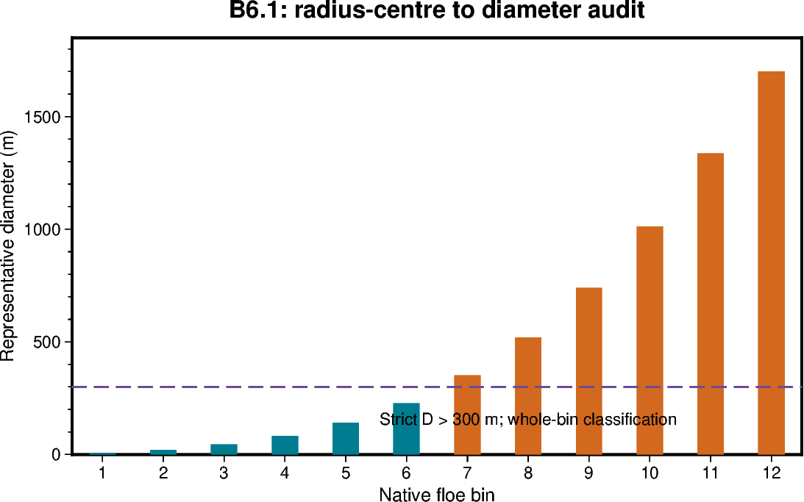

# B6.1 — Icepack FSD interface and bin audit

[Box01 contents](box01_dev_dynamic_tensile_strength.md) · [Case figure notebook](../../CICE_testing/notebooks/B6.1.ipynb)

## Status and scope

**Source audit complete at c7c8770; adapter integration is tested in the later stages.** Updated 7 October 2026. Results below are supplied archive/log evidence; no new model runs or unseen NetCDF results are inferred by this reorganisation.

## Purpose and test logic

Restart names do not establish tracer semantics. Trace the actual live arrays, bin units and update order before applying any mathematical mapping.

## Mathematical and implementation interpretation

$D_k=2r_{c,k}$ and $r_{c,k}=(r_{lo,k}+r_{hi,k})/2$. Live/restart $f_{k,n}$ is already bin-integrated. History `afsdn` stores $a_n f_{k,n}/\Delta r_k$; it is not the raw tracer.

## Conceptual figure

This PyGMT depiction shows the configuration, analytical expectation or comparison design. It is **not measured model output**. Recreate its PNG/PDF and provenance with [B6.1.ipynb](../../CICE_testing/notebooks/B6.1.ipynb). Optional measured-history cells in the notebook call the existing PyGMT validation API with actual user-supplied files; they fail rather than substitute synthetic results.

## Procedure, expected outcomes, code changes and recorded results

The dated record below preserves exact settings, commands, source references and numerical results. Earlier planning statements describe the state at that time; the status above and final recorded outcome take precedence. See [case organisation](case_organisation.md) for current configuration paths. Run archive IDs and immutable provenance stay historical.

### B6.1 — audit the inherited FSD interface

Trace the actual tracer access, bin definitions and normalisation convention
through the inherited Icepack and CICE source. Record file/function references
at the implementation revision.

Establish whether the exposed tracer is already a bin-integrated category
fraction, a density requiring bin widths, or a differently weighted quantity.
Check category and bin indexing, radius/diameter units, missing-value handling,
and tracer availability at initialisation and restart.

Produce an adapter contract with explicit array dimensions and conversions.
Do not infer this from fsd001-style restart names alone. If the actual
representation differs from the analytical input, convert it explicitly and
test that conversion independently.

### B6.1 audit results — 5 October 2026

**Source/interface audit complete at revision c7c8770055196406eccfb3f47e01ddceafdf4160. Runtime adapter validation
remains pending under B6.2–B6.5.** This audit does not diagnose the origin of
the inherited global normalisation errors and makes no physics changes.

#### Live state, indexing and weighting

The adapter input for one owned ocean T cell is:

~~~fortran
! Interface sketch; not implemented by this audit.
a(n)   = aicen(i,j,n,iblk)
f(k,n) = trcrn(i,j,nt_fsd+k-1,n,iblk)
D(k)   = 2.0_dbl_kind * floe_rad_c(k)
~~~

Obtain nt_fsd through icepack_query_tracer_indices(nt_fsd_out=nt_fsd);
obtain/check tr_fsd through the tracer-flag interface. Require tr_fsd before
reading this slice, validate nt_fsd:nt_fsd+nfsd-1 against the tracer extent, and
check ncat/nfsd and bound-array availability. Do not hardcode a tracer offset.
The descriptive nt_nfsd comment near the top of icepack_fsd.F90 is not the
actual interface name: executable code uses nt_fsd.

CICE allocates nfsd consecutive tracers when tr_fsd is enabled
([ice_init_column.F90:1998–2002](https://github.com/dpath2o/CICE_dyntens/blob/c7c8770055196406eccfb3f47e01ddceafdf4160/cicecore/shared/ice_init_column.F90#L1998-L2002)).
The FSD dependency is explicitly area-weighted, trcr_depend=0
([ice_init.F90:3174–3178](https://github.com/dpath2o/CICE_dyntens/blob/c7c8770055196406eccfb3f47e01ddceafdf4160/cicecore/cicedyn/general/ice_init.F90#L3174-L3178)).

The tracer is already an integrated bin fraction. Initialisation constructs
number distribution times representative floe area times radius-bin width,
then normalises the bin sum
([icepack_fsd.F90:325–340](https://github.com/dpath2o/CICE_dyntens/blob/c7c8770055196406eccfb3f47e01ddceafdf4160/icepack/columnphysics/icepack_fsd.F90#L325-L340)).
Therefore sum the selected f(k,n) directly. **Do not multiply by width or floe
area again, and do not divide by aicen to recover the live tracer.**
Weight categories once by aicen, and use sum(aicen) for the denominator.

#### Radius bounds and diameter conversion

The source defines radius lower/upper bounds in metres, arithmetic midpoint
radius floe_rad_c=(lower+upper)/2, and radius width upper-lower
([icepack_fsd.F90:192–206](https://github.com/dpath2o/CICE_dyntens/blob/c7c8770055196406eccfb3f47e01ddceafdf4160/icepack/columnphysics/icepack_fsd.F90#L192-L206)).
The mapped representative diameter is twice that midpoint radius.
The separately defined representative floe area is the midpoint of endpoint
areas; it is not the definition of the radius centre and must not replace it.

Supported source bin counts are 1, 12, 16 and 24; other counts abort during
bound initialisation
([icepack_fsd.F90:127–169](https://github.com/dpath2o/CICE_dyntens/blob/c7c8770055196406eccfb3f47e01ddceafdf4160/icepack/columnphysics/icepack_fsd.F90#L127-L169)).
For the 12-bin scheme, the following values were calculated from the source
bounds; classification uses unrounded values and D>300 m:

| Bin | Lower radius (m) | Upper radius (m) | Representative diameter (m) | Classification |
|---|---:|---:|---:|---|
| 1 | 0.066500 | 5.310308 | 5.376808 | small |
| 2 | 5.310308 | 14.286586 | 19.596895 | small |
| 3 | 14.286586 | 29.057669 | 43.344255 | small |
| 4 | 29.057669 | 52.412214 | 81.469882 | small |
| 5 | 52.412214 | 87.869141 | 140.281354 | small |
| 6 | 87.869141 | 139.518470 | 227.387610 | small |
| 7 | 139.518470 | 211.635752 | 351.154222 | large |
| 8 | 211.635752 | 308.037274 | 519.673026 | large |
| 9 | 308.037274 | 431.203059 | 739.240333 | large |
| 10 | 431.203059 | 581.277225 | 1012.480284 | large |
| 11 | 581.277225 | 755.141047 | 1336.418272 | large |
| 12 | 755.141047 | 945.812834 | 1700.953881 | large |

Bin 7 spans diameters 279.036940–423.271504 m. Its centre is above 300 m,
so the entire bin is classified large despite straddling the threshold.
This is the agreed centre-based approximation, not a resolved partial-bin
integral. A 12-bin adapter fixture can place small mass in bin 6 and large
mass in bin 7; the exact D=300 boundary test belongs in the standalone routine
because this bin grid has no centre at exactly 300 m.

The one-bin default spans radii 0.0665–300 m, giving representative diameter
300.0665 m. It would classify all normalised tracer mass as large at this
threshold. **It cannot exercise the desired small/large mixture test.**
Use a 12-bin, tr_fsd-enabled case for the eventual live adapter tests; preserve
the existing tr_fsd-disabled box controls. The synthetic two-bin unit driver
does not require changing Icepack's supported grids.

#### Restart and history are different representations

Restart routines write/read fsd001...fsdNNN directly from/to
trcrn(:,:,nt_fsd+k-1,:,:), with ncat and centre/scalar location on read
([ice_restart_column.F90:599–660](https://github.com/dpath2o/CICE_dyntens/blob/c7c8770055196406eccfb3f47e01ddceafdf4160/cicecore/shared/ice_restart_column.F90#L599-L660)).
There is no bin-width conversion in those FSD wrapper routines. With valid
occupied-category state, the appropriate restart check is sum_k fsd_k≈1.

By contrast, the history accumulation uses:

- afsd(k): sum_n[aicen(n)*f(k,n)] / floe_binwidth(k).
- afsdn(k,n): aicen(n)*f(k,n) / floe_binwidth(k).

See [ice_history_fsd.F90:459–471](https://github.com/dpath2o/CICE_dyntens/blob/c7c8770055196406eccfb3f47e01ddceafdf4160/cicecore/cicedyn/analysis/ice_history_fsd.F90#L459-L471) and
[ice_history_fsd.F90:491–505](https://github.com/dpath2o/CICE_dyntens/blob/c7c8770055196406eccfb3f47e01ddceafdf4160/cicecore/cicedyn/analysis/ice_history_fsd.F90#L491-L505).
These are radius-density diagnostics at accumulation, not the raw restart
fractions. For instantaneous unmasked data, reconstruct category fractions
from afsdn by multiplying by radius width and dividing by the corresponding
positive aicen. Do not use that inversion on averaged quantities and assume
it reconstructs the instantaneous mapping. Verify time_rep, units and masks
in actual output before an offline comparison. Width must remain in radius
coordinates unless the density itself is transformed to diameter coordinates.

Existing fsdrad is an area-weighted radius diagnostic
([ice_history_fsd.F90:418–433](https://github.com/dpath2o/CICE_dyntens/blob/c7c8770055196406eccfb3f47e01ddceafdf4160/cicecore/cicedyn/analysis/ice_history_fsd.F90#L418-L433)).
diam_ww is a number-weighted mean diameter
([ice_history_fsd.F90:380–394](https://github.com/dpath2o/CICE_dyntens/blob/c7c8770055196406eccfb3f47e01ddceafdf4160/cicecore/cicedyn/analysis/ice_history_fsd.F90#L380-L394)).
Neither mean determines the large-floe tail fraction uniquely; neither is a
substitute for summing the category FSD.

#### Initialisation and restart ordering

The standalone driver calls init_evp before initialising FSD bounds and before
init_state ([CICE_InitMod.F90:133–169](https://github.com/dpath2o/CICE_dyntens/blob/c7c8770055196406eccfb3f47e01ddceafdf4160/cicecore/drivers/standalone/cice/CICE_InitMod.F90#L133-L169)).
In the driver's init_restart routine, an enabled FSD is read from restart when requested (forced for
runtype=continue), otherwise init_fsd populates it
([CICE_InitMod.F90:426–434](https://github.com/dpath2o/CICE_dyntens/blob/c7c8770055196406eccfb3f47e01ddceafdf4160/cicecore/drivers/standalone/cice/CICE_InitMod.F90#L426-L434)).
The driver writes IC history later, at line 197.

Consequently, retain allocation/neutral defaults in init_evp, but initialise
the FSD-derived candidate **after init_restart returns and before IC history**.
The existing prescribed-g call inside init_evp must not simply be changed to
dereference the FSD. Recompute the candidate after restart restoration; do not
store it as an additional prognostic tracer. Disabled tr_fsd is “input
unavailable”, not an all-small distribution.

#### Update timing for the standalone driver

The inspected driver runs thermodynamics before wave fracture; fracture is
called only on even istep, with 2*dt, when tr_fsd and wave_spec are enabled.
It then loops over ndtd: horizontal dynamics/transport, ridging, update_state
([CICE_RunMod.F90:219–319](https://github.com/dpath2o/CICE_dyntens/blob/c7c8770055196406eccfb3f47e01ddceafdf4160/cicecore/drivers/standalone/cice/CICE_RunMod.F90#L219-L319)).
Inside step_dyn_horiz, EVP precedes horizontal transport
([ice_step_mod.F90:1313–1362](https://github.com/dpath2o/CICE_dyntens/blob/c7c8770055196406eccfb3f47e01ddceafdf4160/cicecore/cicedyn/general/ice_step_mod.F90#L1313-L1362)).

Use the current category areas/tracers immediately before each EVP call for the
future mapped coefficient, then hold that field fixed over the EVP subcycles.
For ndtd>1, recompute before each horizontal dynamics call: subsequent calls
see the preceding transport/ridging updates. With ndtd=1, this is once per
model timestep. On fracture timesteps it sees the just-updated fracture state;
on other timesteps no new wave fracture occurs in this driver.

This specifies a pre-dynamics candidate, not an end-of-timestep FSD diagnostic.
Record that sampling phase in history metadata. If an end-of-step diagnostic is
later needed for offline FSD comparisons, give it a separate definition rather
than overwriting the coefficient that was applied to momentum.

#### Cleanup and validity implications

icepack_cleanup_fsdn zeroes values below Icepack puny and normalises by the sum
when it exceeds puny, otherwise sets the distribution to zero
([icepack_fsd.F90:384–410](https://github.com/dpath2o/CICE_dyntens/blob/c7c8770055196406eccfb3f47e01ddceafdf4160/icepack/columnphysics/icepack_fsd.F90#L384-L410)).
Initial FSD setup invokes cleanup
([ice_init_column.F90:665–695](https://github.com/dpath2o/CICE_dyntens/blob/c7c8770055196406eccfb3f47e01ddceafdf4160/cicecore/shared/ice_init_column.F90#L665-L695)).
Wave fracture also invokes cleanup
([icepack_wavefracspec.F90:278–305](https://github.com/dpath2o/CICE_dyntens/blob/c7c8770055196406eccfb3f47e01ddceafdf4160/icepack/columnphysics/icepack_wavefracspec.F90#L278-L305) and
[icepack_wavefracspec.F90:552–553](https://github.com/dpath2o/CICE_dyntens/blob/c7c8770055196406eccfb3f47e01ddceafdf4160/icepack/columnphysics/icepack_wavefracspec.F90#L552-L553)).
The CICE wave wrapper explicitly documents retaining cleanup for cells skipped
by its cheap fracture eligibility checks
([ice_step_mod.F90:1030–1044](https://github.com/dpath2o/CICE_dyntens/blob/c7c8770055196406eccfb3f47e01ddceafdf4160/cicecore/cicedyn/general/ice_step_mod.F90#L1030-L1044)).

These existing operations do not justify assuming normalisation at every
adapter call. Validate the state actually sampled, and do not call cleanup from
the adapter: it would modify the control state and conceal invalid-input tests.
The B6 contract tolerance and inactive threshold are explicit mapping choices,
not claims that Icepack puny equals those values.

For NetCDF offline checks, decode fill/missing masks before numerical testing.
For the live adapter, use owned ocean cells and validate availability, finite
values, bounds and sums directly. Do not feed history fill sentinels into
the arithmetic routine. Preserve invalid/inactive distinctions in diagnostics.

#### B6.1 deliverable and remaining validation

The source contract is now established: category-area weights, integrated
fractions, queried tracer offset, radius-to-diameter conversion, native-bin
classification, and safe initialisation/update locations. No extra width
factor or hidden normalisation is required.

B6.2 must verify this with the production routine and adapter fixtures:
unequal category areas, bins 6/7 on the actual 12-bin grid, disabled-tracer
rejection, invalid occupied categories, zero-area handling, initialization
and restart reconstruction. The inherited global FSD departures remain an
observed separate issue; this source audit does not identify their cause.

