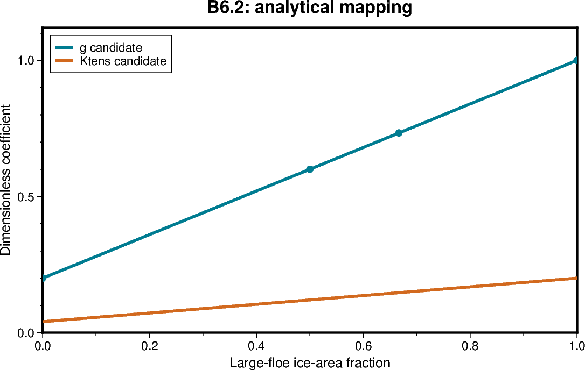

# B6.2 — Production arithmetic and analytical fixtures

[Box01 contents](box01_dev_dynamic_tensile_strength.md) · [Case figure notebook](../../CICE_testing/notebooks/B6.2.ipynb)

## Status and scope

**PASS: 67 compiler-driven production fixtures at absolute tolerance 1e-12.** Updated 7 October 2026. Results below are supplied archive/log evidence; no new model runs or unseen NetCDF results are inferred by this reorganisation.

## Purpose and test logic

The routine used by CICE must match independent analytical answers. A Python reference testing itself cannot establish correctness of the production Fortran.

## Mathematical and implementation interpretation

$F_L=\sum_n(a_n/A)\sum_{D_k>D_*}f_{k,n}$ and $g=g_{min}+(1-g_{min})F_L$. Thus $0\le F_L\le1$ implies $g_{min}\le g\le1$, and $\partial g/\partial F_L=1-g_{min}\ge0$. The arithmetic has no file I/O or halo exchange.

## Conceptual figure



This PyGMT depiction shows the configuration, analytical expectation or comparison design. It is **not measured model output**. Recreate its PNG/PDF and provenance with [B6.2.ipynb](../../CICE_testing/notebooks/B6.2.ipynb). Optional measured-history cells in the notebook call the existing PyGMT validation API with actual user-supplied files; they fail rather than substitute synthetic results.

## Current workflow entry point

Run from the repository root after `load_modules` and set `CICE_TEST_RUNS` to the existing external run root. The workflow resolves migrated cases without changing run archives. Do not recreate already accepted cases. Historical shell recipes below use the original root case paths; use the case registry for builds/submission after migration.

```bash
python CICE_testing/scripts/b6_fortran_mapping.py --help
python CICE_testing/scripts/b65_fortran_fixtures.py --help
```

## Procedure, expected outcomes, code changes and recorded results

The dated record below preserves exact settings, commands, source references and numerical results. Earlier planning statements describe the state at that time; the status above and final recorded outcome take precedence. See [case organisation](case_organisation.md) for current configuration paths. Run archive IDs and immutable provenance stay historical.

### B6.2 — implement and test the production calculation

Implement one reusable calculation that accepts category areas, integrated
bin fractions, representative diameters and mapping parameters. Return F_L,
candidate g, active/valid status and an identifiable failure reason.

Keep file I/O, namelist parsing and halo operations outside the arithmetic
routine. Test the actual routine used by CICE with a small Fortran driver.
The driver should emit inputs/results/status in a simple machine-readable form
that Python can compare to analytical expectations.

Use tight floating-point tolerances for Python-versus-Fortran formula checks
(e.g. 1e-12 absolute for these dimensionless fixtures); do not demand binary
identity across languages. Check bounds and expected failures separately.
Preserve zero-tolerance comparisons for equivalent CICE trajectories where
the arithmetic path warrants them.

The Python suite passing against itself is not sufficient for this step.

#### B6.2 routine added — 5 October 2026

New source: `cicecore/cicedyn/dynamics/ice_dyntens_mapping.F90`.
It exports the pure `dyntens_map_fsd` routine with inputs
`area(ncat), fsd(nbin,ncat), diameter(nbin), threshold, gmin, ktens`.
It returns `large_fraction, g, ktens_eff, status`; all inputs are intent(in).
The kind uses selected_real_kind(13), matching this repository's Icepack double
precision definition, while keeping the arithmetic module independently compilable.
There are no calls from the model yet and no new namelist options.

Status codes are named public constants: 0 valid, 1 inactive, 2 bad shape,
3 bad parameter, 4 bad diameter, 5 bad area, 6 bad occupied FSD.
Invalid outputs remain -1; inactive outputs are fraction=-1, g=1 and
ktens_eff=ktens. The negative sentinel is internal, not a history fill value.
Callers must inspect status before using results. Integration must translate
undefined fractions into masked diagnostics and implement collective error handling.

The routine does not repair FSDs or alter live state. It validates sums to 1e-10,
uses A<=1e-12 for inactive cells, classifies diameter strictly above the threshold,
and clips only accepted roundoff excursions in the derived fraction.

The new `test_scripts/test_b6_fortran_mapping.py` compiles the production source
with `b6_mapping_driver.F90` and checks 67 analytical and invalid-input fixtures.
It does not replace the user's local Python contract file. Native 12-bin fixtures
use the B6.1 audited bounds, but are not a test of live tracer extraction.
Python syntax, fixture names and Fortran line lengths were checked locally.
No Fortran compiler was available in the editing environment; compilation and
runtime results must be recorded after running the following on Gadi.

~~~bash
cd /g/data/gv90/da1339/src/CICE_dyntens
git pull --ff-only origin dev
# Load the same Intel compiler environment used for your CICE builds first.
bash <<'BASH'
set -euo pipefail
stamp=$(date +%Y%m%d-%H%M%S)
log="/g/data/gv90/da1339/cice-dirs/runs/b6-mapping-${stamp}.log"
python3 test_scripts/test_b6_fortran_mapping.py \\
    --fc ifort --fflags '-O0 -g -check all -traceback' 2>&1 | tee "$log"
BASH
~~~

Use --fc ifx if that is the loaded Intel compiler. For GNU use
--fc gfortran --fflags '-O0 -g -Wall -Wextra -fcheck=all'.
Do not use fast-math flags: finite/NaN rejection is part of the contract.
The runner needs Python's standard library only, builds in a temporary directory,
and exits nonzero on compilation or comparison failure. No PBS/CICE submission
is needed for these small routine tests. A successful result verifies this routine,
not the adapter, diagnostics, MPI halos, restart reconstruction or feedback.

