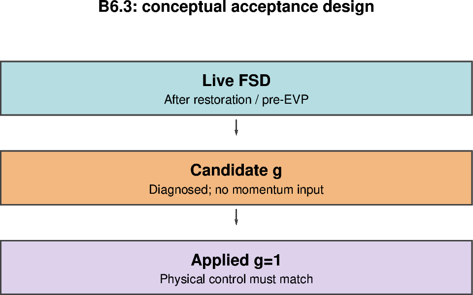

# B6.3 — Candidate diagnostics with momentum feedback disabled

[Box01 contents](box01_dev_dynamic_tensile_strength.md) · [Case figure notebook](../../CICE_testing/notebooks/B6.3.ipynb)

## Status and scope

**PASS: 126 candidate histories and exact matched physical-control agreement.** Updated 7 October 2026. Results below are supplied archive/log evidence; no new model runs or unseen NetCDF results are inferred by this reorganisation.

## Purpose and test logic

Observe candidate coefficients while retaining the original momentum trajectory. This distinguishes a diagnostic implementation defect from a feedback response.

## Mathematical and implementation interpretation

$g_{candidate}$ is diagnosed while $g_{applied}=1$ and $K_{t,applied}=K_t$. Candidate fields may differ from a control; physical state and restart fields must remain identical under the declared comparison rules.

## Conceptual figure



This PyGMT depiction shows the configuration, analytical expectation or comparison design. It is **not measured model output**. Recreate its PNG/PDF and provenance with [B6.3.ipynb](../../CICE_testing/notebooks/B6.3.ipynb). Optional measured-history cells in the notebook call the existing PyGMT validation API with actual user-supplied files; they fail rather than substitute synthetic results.

## Current workflow entry point

Run from the repository root after `load_modules` and set `CICE_TEST_RUNS` to the existing external run root. The workflow resolves migrated cases without changing run archives. Do not recreate already accepted cases. Historical shell recipes below use the original root case paths; use the case registry for builds/submission after migration.

```bash
python CICE_testing/scripts/check_b63_candidates.py --help
```

## Procedure, expected outcomes, code changes and recorded results

The dated record below preserves exact settings, commands, source references and numerical results. Earlier planning statements describe the state at that time; the status above and final recorded outcome take precedence. See [case organisation](case_organisation.md) for current configuration paths. Run archive IDs and immutable provenance stay historical.

### B6.3 — add candidate diagnostics with feedback disabled

Implemented candidate diagnostics (matched-history runtime validation PASS; see acceptance record below):

| Diagnostic | Purpose | Units |
|---|---|---|
| dtens_flarge | Derived F_L on active, valid T cells | 1 |
| dtens_gcand | Candidate multiplier | 1 |
| ktens_cand | K_t times candidate g | 1 |
| dtens_status | Distinguish valid, inactive and invalid input | 1 |

Retain existing dyntens_g and ktens_eff as the applied coefficients.
When candidate-only diagnostics are enabled, applied g remains one and applied
Ktens remains the control value. Candidate calculation needs an independent
enable path: the existing disabled dynamics path, which reports g=1, is not
by itself a candidate diagnostic mode.

Target integration points include ice_init.F90 for configuration/validation,
ice_dyn_shared.F90 for shared configuration, ice_dyn_evp.F90 for coefficient
application, and the history modules for output. Choose the calculation's module
location after the interface audit; do not duplicate the mapping in several
dynamics routines.

Make candidate diagnostics available on daily and instantaneous streams.
Define the IC snapshot behaviour so fields are initialised before output.
The implemented namelist names and constraints are recorded below.

#### B6.3 implementation — 5 October 2026

The standalone driver now initializes candidates after init_restart, when the
FSD bounds and initialized/restarted tracers exist. EVP refreshes candidates
before its dynamics work. The adapter uses aicen, the queried nt_fsd slice of
trcrn, and twice floe_rad_c; it never changes those inputs.

New dynamics_nml options:

~~~fortran
! dpath2o: dyntens
! Diagnose live FSD without changing the momentum coefficient.
    use_dyntens_diagnostics = .true.
    dyntens_diameter_threshold = 300.0
    dyntens_g_min = 0.2
! dpath2o: dyntens
~~~

Keep use_dyntens=.false. and Ktens=0.2. Diagnostic mode rejects use_dyntens=T,
and is restricted to the tested C-grid standard_2d EVP / avg_zeta / ellipse /
revised_evp=F configuration. It requires tr_fsd=T. The switch defaults to false;
the old prescribed-g experiments retain their existing behaviour.

For a new 12-bin initial-state test, set nfsd=12 in grid_nml and tr_fsd=T,
restart_fsd=F in tracer_nml. Both the matched control and diagnostic case must
use the same FSD-enabled configuration, initial state, forcing and executable.
Do not compare against the older tr_fsd-disabled control to infer neutrality:
enabling FSD itself is a separate model change. Do not copy a global restart
into this box test. The live adapter reads evolving FSD; it does not impose the
synthetic analytical mixtures. Those controlled fixtures remain B6.5 work.

Candidate history fields are now implemented in icefields_nml. For example,
with daily means and hourly snapshots configured identically in both cases:

~~~fortran
! In setup_nml, for both cases:
    histfreq   = 'd','h','x','x','x'
    histfreq_n = 1,1,1,1,1
    hist_avg = .true.,.false.,.true.,.true.,.true.

! In icefields_nml, for both cases:
    f_dyntens_g = 'dh'
    f_ktens_eff = 'dh'

! In icefields_nml, diagnostic case only:
! dpath2o: dyntens
! Match these frequency letters to the configured streams.
    f_dyntens_large_fraction = 'dh'
    f_dyntens_g_candidate = 'dh'
    f_ktens_eff_candidate = 'dh'
    f_dyntens_mapping_status = 'dh'
! dpath2o: dyntens
~~~

These are entries for existing groups, not a complete ice_in. If retaining a
timestep stream ('1') instead of hourly ('h'), use 'd1' for the field selectors.
Do not request candidate fields in the control: keep their default 'x' and
use_dyntens_diagnostics=F. Requesting candidate fields with the switch off
aborts rather than writing misleading zeros.

All four fields have units 1. Candidates describe the state before the latest
EVP call in each model timestep; they remain fixed through the subcycles.
With ndtd>1, history samples the last such call, not an average of all dynamics
calls. Use ndtd=1 for the first matched test. IC fields use the initialized or
restored state, not atmospheric-forcing initialization.

Inactive cells have g_candidate=1 and ktens_eff_candidate=Ktens, with the
large fraction masked. On averaged streams, large fraction is masked if any
sample was inactive; candidate coefficients include the neutral inactive
samples. dyntens_mapping_status is 0 for valid active and 1 for inactive
snapshots; its time mean is the inactive sample fraction. It must not be read
as an averaged categorical error code. Invalid occupied inputs log the first
rank/block/local-i/local-j/status failure per rank, complete a global count
reduction, then abort collectively. They are never repaired or fed to momentum.

Candidate arrays have neutral defaults outside owned ocean cells. History
accumulates owned cells only, so no candidate halo exchange is required yet.
This does not establish the B6.4 feedback halo contract. No prognostic restart
fields were added. Only the standalone CICE initialization driver is wired;
other coupling drivers are outside this implementation's supported scope.

Validation available now:

~~~bash
cd /g/data/gv90/da1339/src/CICE_dyntens
git pull --ff-only origin dev
# First complete the B6.2 compiler-driven routine test above.
python3 test_scripts/test_b63_candidates.py -v

# After clean-building and running matched FSD-enabled cases:
python3 test_scripts/check_b63_candidates.py "$diagnostic_run" \
    --control "$control_run" --ktens 0.2 --gmin 0.2
~~~

The checker handles base and suffixed IC/stream variables, requires all candidate
fields and applied coefficient diagnostics, validates masks, bounds and mapping
identities, and checks applied g=1 and ktens_eff=Ktens. With --control it requires
matching history file/variable sets (excluding only the four candidate families)
and exact decoded values and masks. It does not compare file bytes, global
attributes or restart files; retain the existing restart comparison workflow.
It does not independently reconstruct pre-EVP FSD from end-step history.
Analytical native-bin fixtures and the later controlled inputs supply the
independent mapping checks.

Initial local verification consisted of a preprocessed Fortran 2008 syntax
parse and ten synthetic NetCDF checker tests. Subsequent user-supplied evidence
establishes the full build, 67 B6.2 compiler fixtures, 19 checker regressions,
and B6.3's IC/daily/instantaneous diagnostics and matched-control history
identity. Restart-file equality and mapped restart reproducibility are separate
checks and are not established by the B6.3 history checker.

The separate mapping module remains the development arrangement. It can later
move unchanged into ice_dyn_shared's contains section, using dbl_kind and
shared status constants, while ice_dyn_evp retains state adaptation and field
updates. That organisational option does not change the equations or fixtures;
no consortium approval is assumed.


## B6.3 initialization-order correction — 5 October 2026

The first diagnostic run (job 180528071) aborted with mapping status 6 before
IC history. The candidate call had incorrectly been placed after init_state.
FSD initialization/read occurs later inside the standalone driver's init_restart,
including runtype=initial. The call is now after init_restart and before IC
history. The earlier B6.1 statement attributing FSD population to init_state
was incorrect and has been corrected above. No tolerance, mapping formula,
FSD state or momentum code changed.

User-supplied evidence before this correction: the full model built successfully;
all 67 production Fortran fixtures passed at absolute tolerance 1e-12; the
matched control completed with the expected history coverage. The diagnostic
run did not complete, so B6.3 has not passed. Rebuild and rerun both matched
cases with the same corrected executable, preserving the previous outputs.
A source-order regression check guards the call placement; runtime verification
on Gadi remains required.

## B6.3 history-name correction — 5 October 2026

After the initialization fix, job 180531265 reached IC history but aborted at
NetCDF variable definition. History metadata stores vname in 16 characters.
The original long candidate names lost their frequency suffixes on truncation,
creating duplicate names when daily and hourly fields shared the IC file.
The four output names are now short enough to preserve suffixes:

| Unchanged namelist selector | NetCDF base name |
|---|---|
| f_dyntens_large_fraction | dtens_flarge |
| f_dyntens_g_candidate | dtens_gcand |
| f_ktens_eff_candidate | ktens_cand |
| f_dyntens_mapping_status | dtens_status |

The Fortran array/index identifiers and namelist selectors remain unchanged.
The checker now expects these short names and their stream suffixes. A regression
test reads the Fortran field definitions and metadata name width, checks suffix
uniqueness, and defines the resulting names in NetCDF. No mapping or momentum
calculation changed. A full model rebuild and fresh matched runs are required;
B6.3 runtime acceptance remains pending.

## B6.3 IC ocean-domain checker correction — 5 October 2026

Both corrected model runs completed with expected history coverage. Five daily
files passed candidate validation and exact control comparison. The checker
then rejected the IC hourly candidate copy because it treated unmasked land
zeros as ocean values. User-supplied inspection showed 64 ocean cells in each
copy, all with g=0.32273816251731574, and 80 unmasked zero-valued non-ocean cells
only in dtens_gcand_h. There were no ocean bound violations in that inspection.

Candidate and applied-coefficient invariant checks now select ocean explicitly
from the box tmask: finite binary 0/1, with masked locations excluded. All ocean
coefficient/status values must be present and finite, including inactive ice
cells. Ocean bounds, equations and inactive-fraction masking remain enforced.
The exact control comparison remains unchanged across all stored unmasked
values and masks, including land. This is a checker-only correction; no rebuild
or model rerun is required.

Nineteen synthetic checker tests pass, including the observed IC land-zero
layout, rejection of ocean zeros and missing ocean values, missing/nonbinary
tmask rejection, and detection of control differences on land. Full 126-file
comparison remains pending; this partial result is not a B6.3 acceptance PASS.

## B6.3 matched-history acceptance — 5 October 2026

**PASS for candidate-only history validation and matched-control trajectory
identity over the supplied five-day box run.** The final user-supplied transcript
reports:

~~~
Ran 19 tests in 0.227s

OK
PASS B6.3 candidate history: 126 files
PASS exact decoded control history comparison (candidate diagnostics excluded)
~~~

Coverage is five daily files (1–5 January 2005), one IC file at 1 January
00:00 and 120 hourly instantaneous files from 1 January 01:00 through
6 January 00:00. All 126 files passed candidate validation. The comparison
excludes only the four candidate diagnostic families; applied coefficients and
all remaining decoded history values/masks, including stored land values,
remain part of the exact control comparison.

The 19 regressions cover mapping identities, validity/masks, stream names and
suffixes, inactive cells, ocean-domain enforcement, feedback rejection and
control differences including land. The earlier IC land-zero rejection was a
checker-domain error, resolved without changing the model mapping or momentum.

The inspected repository checker revision is
311e9a1b6a6c6a561c77b179a675bb5562334f86; this is not a claim that the supplied
transcript independently identifies the local source SHA or executable hash.
Archive the actual source revision/local diff, executable hash, both namelists,
job logs and full checker output with the accepted cases. Those provenance
values are not present in this final transcript and must not be invented.

This closes B6.3's matched-history gate. It does not compare restart files,
independently reconstruct evolving pre-EVP FSD from end-step history, establish
native-bin synthetic-fixture answers, verify mapped halos/feedback, or calibrate
the closure. Earlier failure/pending entries above are historical records;
this final acceptance entry supersedes their B6.3 history-gate status.

