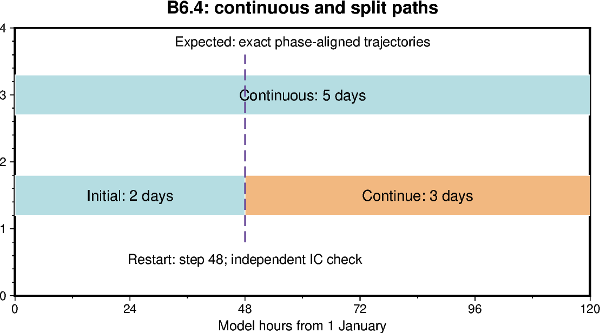

# B6.4 — Live-FSD diagnostic restart reconstruction

[Box01 contents](box01_dev_dynamic_tensile_strength.md) · [Case figure notebook](../../CICE_testing/notebooks/B6.4.ipynb)

## Status and scope

**PASS: independently reconstructed restart IC plus 126 exact histories and five restarts.** Updated 7 October 2026. Results below are supplied archive/log evidence; no new model runs or unseen NetCDF results are inferred by this reorganisation.

## Purpose and test logic

A restart restores raw FSD at a different phase from a continuous pre-EVP sample. Reconstruct the restart IC independently and compare only phase-aligned trajectories.

## Mathematical and implementation interpretation

$g^{EVP}=g[a_n,f_{k,n}]$ is sampled immediately before EVP and held fixed through its elastic subcycles. Restart IC recomputes the map after raw state restoration; it is not necessarily the previous pre-EVP sample.

## Conceptual figure



This PyGMT depiction shows the configuration, analytical expectation or comparison design. It is **not measured model output**. Recreate its PNG/PDF and provenance with [B6.4.ipynb](../../CICE_testing/notebooks/B6.4.ipynb). Optional measured-history cells in the notebook call the existing PyGMT validation API with actual user-supplied files; they fail rather than substitute synthetic results.

## Current workflow entry point

Run from the repository root after `load_modules` and set `CICE_TEST_RUNS` to the existing external run root. The workflow resolves migrated cases without changing run archives. Do not recreate already accepted cases. Historical shell recipes below use the original root case paths; use the case registry for builds/submission after migration.

```bash
python CICE_testing/scripts/b64_restart_workflow.py analyse \
    --repo "$PWD" --runs "$CICE_TEST_RUNS" --evidence validation_report/box/evidence
```

## Procedure, expected outcomes, code changes and recorded results

The dated record below preserves exact settings, commands, source references and numerical results. Earlier planning statements describe the state at that time; the status above and final recorded outcome take precedence. See [case organisation](case_organisation.md) for current configuration paths. Run archive IDs and immutable provenance stay historical.

### B6.4 — specify timing, halo and restart semantics

**Contract specified from source at dev revision
311e9a1b6a6c6a561c77b179a675bb5562334f86. This is a source audit and implementation
contract, not a mapped-feedback or restart runtime PASS.** No new namelist mode
or momentum change is introduced by this documentation update.

#### Timing and the state being sampled

| Phase | Required behaviour |
|---|---|
| init_evp | Keep allocation/neutral defaults; do not read uninitialized FSD |
| After init_restart, before IC history | Recompute from initialized/restored aicen and trcrn and initialized bin bounds |
| Each entry to EVP | Evaluate once from the current pre-EVP state |
| EVP subcycles | Hold the derived multiplier and effective coefficient fixed |
| Next horizontal dynamics call | Re-evaluate after preceding transport, ridging and update_state |
| History accumulation | Retain the latest pre-EVP sample; do not replace it with an end-step mapping |

The standalone driver executes thermodynamics and update_state, then wave
fracture on even istep when tr_fsd and wave_spec are enabled, then the ndtd
horizontal-dynamics/ridging/update_state loop
([CICE_RunMod.F90](https://github.com/dpath2o/CICE_dyntens/blob/311e9a1b6a6c6a561c77b179a675bb5562334f86/cicecore/drivers/standalone/cice/CICE_RunMod.F90#L219-L319)).
Inside step_dyn_horiz, EVP precedes transport
([ice_step_mod.F90](https://github.com/dpath2o/CICE_dyntens/blob/311e9a1b6a6c6a561c77b179a675bb5562334f86/cicecore/cicedyn/general/ice_step_mod.F90#L1313-L1365)).
Thus a fracture call's updated FSD is available to the next EVP in that same
model timestep. There is no fracture call on the intervening odd timesteps.
Use ndtd=1 first; with ndtd>1 this is once per horizontal dynamics call,
not once per full model timestep.

The implemented candidate call is at EVP entry, before the prescribed
coefficient update
([ice_dyn_evp.F90](https://github.com/dpath2o/CICE_dyntens/blob/311e9a1b6a6c6a561c77b179a675bb5562334f86/cicecore/cicedyn/dynamics/ice_dyn_evp.F90#L478-L482)).
The IC call is after init_restart
([CICE_InitMod.F90](https://github.com/dpath2o/CICE_dyntens/blob/311e9a1b6a6c6a561c77b179a675bb5562334f86/cicecore/drivers/standalone/cice/CICE_InitMod.F90#L184-L188)).

#### Owned cells, halos and physical boundaries

B6.3 maps owned ocean T cells only. Candidate arrays have neutral defaults
elsewhere and are not exchanged, because history reads owned cells and no
momentum stencil consumes them. This remains sufficient for diagnostic-only
mode. Do not infer mapped halo correctness from its history PASS.

For a future mapped-feedback path, use this order:

1. Evaluate and validate every owned ocean T cell.
2. Complete the existing global invalid-count reduction. Abort collectively
   before any coefficient exchange if an occupied input is invalid.
3. Initialize the applied multiplier array to one, then copy valid/inactive
   candidate values into owned ocean cells.
4. Exchange that applied scalar with ice_HaloUpdate, halo_info,
   field_loc_center, field_type_scalar and fillValue=1.
5. Derive ktens_effT=Ktens*dyntens_gT over the whole exchanged array, including
   halos, before any EVP stress calculation.

Inactive ocean cells and owned land use neutral g=1 and effective Ktens.
Unconnected physical ghost boundaries use the same neutral fill; internal
block/rank boundaries receive their neighbour's values, and periodic boundaries
follow the configured halo topology. Do not fill an internal boundary with a
local default or apply vector sign changes to g. F_L remains undefined for
inactive cells; the multiplier alone is the finite scalar needed by momentum.

The prescribed path already exchanges g before multiplying by Ktens
([ice_dyn_evp.F90](https://github.com/dpath2o/CICE_dyntens/blob/311e9a1b6a6c6a561c77b179a675bb5562334f86/cicecore/cicedyn/dynamics/ice_dyn_evp.F90#L143-L166)).
Its fillValue is dyntens_g_const. A mapped mode must use the neutral mapped
boundary policy above rather than inherit an unrelated prescribed constant.
The current update_dyntens_coefficients overwrites the applied field from the
prescribed configuration: a future mapped mode must select a distinct branch
there, otherwise a copied candidate would be overwritten.

Use global indices for controlled spatial inputs. The first spatial fixture
must put unlike coefficients across global columns 6/7, then compare one block,
two local blocks and two MPI ranks. Compare candidates, applied coefficients
and physical fields; require exact decoded values and masks for equivalent
layouts unless a numerical-policy change is explicitly documented.

#### Restart reconstruction and sampling alignment

Do not add g or F_L as prognostic restart tracers. Restore aicen, the raw FSD
tracers and the usual model state, initialize/check the same bin definitions,
then recompute the derived candidate before IC history. Mapping parameters,
source/build provenance, FSD restart settings and synthetic-input definitions
must be identical between continuous and split paths. A continuation must
restore FSD; it must not silently reinitialize it.

A restart contains end-step prognostic state, whereas the continuous run's
last stored candidate describes the earlier pre-EVP state. Consequently, a
restart IC candidate is a new evaluation of restored state and need not equal
the continuous run's last pre-EVP candidate at that timestamp. This phase
difference must be documented, not hidden by loosening tolerances.

For the two-day plus three-day test, compare matching physical restart state
at the split, verify the restart IC mapping independently from its restored
raw FSD, and compare candidate/applied/physical history at matching phases
after the first resumed EVP. Handle duplicate split-time IC output explicitly.
For daily means, use completed, aligned averaging intervals; do not compare a
partial restarted average with a full continuous average.

#### Next execution gates

| Gate | First evidence required |
|---|---|
| Live-FSD diagnostic continuation | Five-day continuous versus two-day plus three-day split; restored-FSD/IC checks and phase-aligned history comparison |
| Controlled spatial adapter | Native-bin small/large fixture across global columns 6/7; exact one-block/local-block/MPI agreement |
| Mapped momentum integration | Explicit mode selection, collective validation, scalar halo exchange and no prescribed-field overwrite |
| Feedback equivalence | B6.5 endpoint/equal-mixture cases versus independently prescribed g controls |

Keep feedback disabled for the first continuation test. Preserve accepted B6.3
outputs and use new cases/build directories when code changes become necessary.
The existing checker verifies neutrality against a matched control; it is not
a general continuous-versus-split comparator and must not be used to certify
restart coverage without a phase-aware comparison.

## B6.4 Bash workflow — diagnostic-only continuation

The helper `test_scripts/b64_restart_workflow.py` prepares new cases from the
accepted B6.3 diagnostic case, copies its executable without rebuilding, stages
the split restart and checks the complete expected inventory. It retains the
accepted layout and launcher; this is a continuation gate, not a new MPI/halo
test. Preparation refuses existing destinations and requires the accepted
12-bin daily/hourly five-day configuration.

Eight synthetic regression tests pass locally. They cover complete phase-aligned
comparison, missing output, physical/candidate differences, wrong restart clocks,
changed staging, wrong IC mapping and safe staging. These tests do not establish
a Gadi run PASS.

### Prepare and submit the initial runs

Run from Bash. Load the usual analysis environment providing numpy/netCDF4.
No compiler build is needed because only setup and checking are added.

~~~bash
(
set -euo pipefail
cd /g/data/gv90/da1339/src/CICE_dyntens
git pull --ff-only origin dev
load_modules
python3 test_scripts/test_b64_restart_workflow.py -v
python3 test_scripts/b64_restart_workflow.py prepare

# Auto-detection requires exactly one dt_b63* diagnostic case.
# If ambiguous, repeat prepare with --base-case /absolute/path/to/accepted/case.

for name in dt_b64_cont dt_b64_seg1 dt_b64_seg2; do
    echo "$name"
    rg '^#PBS|mpirun|^\\./cice|ICE_NTASKS|ICE_NTHRDS' "$name/cice.run" "$name/cice.settings"
done
)
~~~

Inspect the copied PBS header/launcher for the accepted rank count, working
queue/storage and new case paths. Then submit the five-day continuous path and
two-day initial segment:

~~~bash
(
set -euo pipefail
cd /g/data/gv90/da1339/src/CICE_dyntens
for name in dt_b64_cont dt_b64_seg1; do
    ( cd "$name"; qsub ./cice.run | tee b64-job-id.txt )
done
)
~~~

These submissions are asynchronous. Wait for both to finish. Confirm
CICE COMPLETED SUCCESSFULLY in each run log; the helper checks the dates,
step counts, FSD and complete output inventories during analysis.

### Stage and submit the three-day continuation

Do this only after segment 1 completes:

~~~bash
(
set -euo pipefail
cd /g/data/gv90/da1339/src/CICE_dyntens
load_modules
runs=/g/data/gv90/da1339/cice-dirs/runs
rg -l 'CICE COMPLETED SUCCESSFULLY' "$runs/dt_b64_seg1"/cice.runlog.*
python3 test_scripts/b64_restart_workflow.py stage
( cd dt_b64_seg2; qsub ./cice.run | tee b64-job-id.txt )
)
~~~

Staging requires 3 January 2005 00:00 / step 48 and all twelve raw fsd bins.
The staged copy is verified by SHA-256 and its absolute path is written to
the continuation run's ice.restart_file. The continuation namelist uses
runtype=continue, use_restart_time=T, restart_fsd=T and npt=3 days.

### Analyse after all three jobs finish

~~~bash
(
set -euo pipefail
cd /g/data/gv90/da1339/src/CICE_dyntens
load_modules
runs=/g/data/gv90/da1339/cice-dirs/runs
for name in dt_b64_cont dt_b64_seg1 dt_b64_seg2; do
    rg -l 'CICE COMPLETED SUCCESSFULLY' "$runs/$name"/cice.runlog.*
done
python3 test_scripts/b64_restart_workflow.py analyse \
    2>&1 | tee dt_b64_cont/b64-analysis.log
)
~~~

Expected history inventories are 126 continuous, 51 segment-1 and 76
segment-2 files. Candidate/applied invariants are checked in all of them,
including the continuation IC. The independent IC reconstruction uses restart
aicen and raw fsd001–fsd012, selecting audited native bins 7–12 for D>300 m.
It validates occupied-bin normalization and ignores empty categories; it does
not renormalize invalid input.

Exact comparison includes every decoded field and mask, including all candidate
diagnostics and land values. No blkmask exception is needed for an unchanged
layout. Variable units/calendar/bounds/time_rep are also compared. Pre-split
comparison covers 51 histories plus two restarts; post-split comparison covers
75 histories plus three restarts. Only the extra continuation IC is outside
that comparison and is instead checked against restored FSD, at mapping
absolute tolerance 1e-10. All equivalent-path comparisons use zero tolerance.

A final PASS establishes this diagnostic-only continuation gate. It does not
close controlled native-bin spatial, mapped momentum, halo or feedback gates.
Preserve the three runs, b64-provenance directories, job logs and analysis output.

## B6.4 restart_ext IC reconstruction correction — 5 October 2026

The supplied first analysis confirms matching executable SHA-256
4c86d2a6af83d57ffdfc6f0c5e473f7f8382e77b989f28b0e0689fec7ffd421f,
candidate/applied history PASS for 126/51/76 files, and all expected restart
dates/counters through 6 January / step 120. The continuation job
180538921 completed successfully. Analysis stopped at the independent IC
reconstruction because the checker incorrectly required identical restart
and history horizontal shapes. The printed dimension names were correct;
the old error message omitted the shapes that actually failed.

CICE's NetCDF restart writer uses nx_global+2*nghost and ny_global+2*nghost
when restart_ext=T (ice_restart.F90, init_restart_write). The audited
ice_blocks.F90 declares nghost=1. gather_global_ext offsets global i/j by
nghost; thus the matching global interior is [1:-1,1:-1] in Python.
The IC reconstruction now accepts either identical global shapes or exactly
one extra halo cell on each restart edge, applying the same interior selection
to aicen and all raw fsd bins. Unexpected shapes remain errors and are printed
explicitly. This is not an arbitrary crop to force matching dimensions.

All eleven synthetic workflow tests pass, including extended restart alignment,
rejection of invalid occupied ocean FSD after alignment, and rejection of
unsupported shape differences. No mapping tolerance changed. Exact split-run
restart comparisons still include every stored cell, including extended halos.
This is a checker-only correction: rerun analysis on the completed cases;
no preparation, rebuild, staging or model submission is required.
Full B6.4 continuation acceptance remains pending the final comparison output.

## B6.4 diagnostic-only continuation acceptance — 5 October 2026

**PASS for the five-day continuous versus two-day plus three-day live-FSD
diagnostic-only continuation gate.** This is user-supplied Gadi execution and
analysis evidence. It does not complete B6's controlled spatial or mapped-feedback
tests.

| Check | Supplied result |
|---|---|
| Workflow regression tests | 11 tests in 44.845 s; OK |
| Continuous candidate/applied history | 126 files PASS |
| Segment-1 candidate/applied history | 51 files PASS |
| Segment-2 candidate/applied history, including restart IC | 76 files PASS |
| Restart clocks and twelve-bin FSD inventories | All expected daily restarts PASS |
| Split clock | 3 January 2005, 00:00, step 48 |
| Final clock | 6 January 2005, 00:00, step 120 |
| Extended restart alignment | 14×14 restart interior aligned with 12×12 history |
| Restart IC candidate from restored raw FSD | PASS at mapping absolute tolerance 1e-10 |
| Segment 1 versus continuous | 51 history pairs and two restart pairs, exact |
| Segment 2 versus continuous | 75 history pairs and three restart pairs, exact |

All three executables have the supplied SHA-256:

~~~
4c86d2a6af83d57ffdfc6f0c5e473f7f8382e77b989f28b0e0689fec7ffd421f
~~~

The final checker summary is:

~~~
PASS restart IC candidate independently reconstructed from raw FSD (atol=1e-10)
PASS exact comparison dt_b64_seg1 51 histories + 2 restarts
PASS exact comparison dt_b64_seg2 75 histories + 3 restarts
PASS B6.4 diagnostic-only continuation: 126 history pairs and 5 restart pairs; atol=rtol=0
Restart IC checked independently; mapped-feedback/halo validation remains pending.
~~~

Exact comparisons include candidates, applied coefficients, physical fields,
stored values and masks, and the full restart arrays including halos.
The continuation's additional IC is validated independently from restored
aicen/raw FSD at the correct phase. It is not compared with the continuous
path's earlier pre-EVP diagnostic at the same timestamp. Candidate mapping
tolerance and exact-path comparison policy were not relaxed.

The checked helper is available at repository revision
33576d89cb1b01883bba46dc91fdb796e7b19985. The supplied output establishes
executable equality but does not independently print its build source revision
or compiler provenance; retain the b64-provenance directories with the outputs.
The earlier restart_ext failure is resolved as a checker layout error.

Next: B6.5 controlled native-bin fixtures and spatial adapter tests across global
columns 6/7 and equivalent decompositions, followed by mapped-feedback
integration and independently prescribed-coefficient equivalence. This accepted
diagnostic path supplies no FSD-derived coefficient to momentum, so its PASS
cannot establish the future mapped halo or feedback path.

