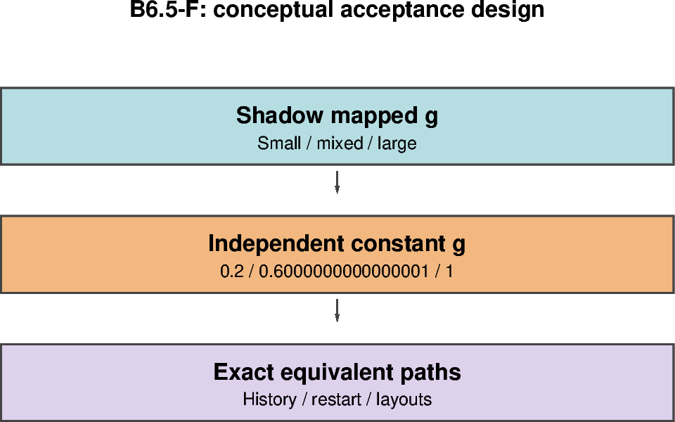

# B6.5-F — Mapped-feedback equivalence to independent controls

[Box01 contents](box01_dev_dynamic_tensile_strength.md) · [Case figure notebook](../../CICE_testing/notebooks/B6.5-F.ipynb)

## Status and scope

**PASS: 21 controlled cases; nine exact map/reference pairs, three unity/off pairs and layout agreement.** Updated 7 October 2026. Results below are supplied archive/log evidence; no new model runs or unseen NetCDF results are inferred by this reorganisation.

## Purpose and test logic

Show that mapped g actually reaches the rheology and reproduces independently prescribed coefficients. A diagnostic map alone cannot establish momentum feedback.

## Mathematical and implementation interpretation

The independent references prescribe $g_{ref}\in\{0.2,1,0.6000000000000001\}$. The mixed literal matches the actual binary64 operation order. Equivalent applied coefficients should give exact matched CICE trajectories; all-large unity must match feedback off.

## Conceptual figure



This PyGMT depiction shows the configuration, analytical expectation or comparison design. It is **not measured model output**. Recreate its PNG/PDF and provenance with [B6.5-F.ipynb](../../CICE_testing/notebooks/B6.5-F.ipynb). Optional measured-history cells in the notebook call the existing PyGMT validation API with actual user-supplied files; they fail rather than substitute synthetic results.

## Current workflow entry point

Run from the repository root after `load_modules` and set `CICE_TEST_RUNS` to the existing external run root. The workflow resolves migrated cases without changing run archives. Do not recreate already accepted cases. Historical shell recipes below use the original root case paths; use the case registry for builds/submission after migration.

```bash
python CICE_testing/scripts/b65_feedback_workflow.py analyse \
    --repo "$PWD" --runs "$CICE_TEST_RUNS" --evidence validation_report/box/evidence
```

## Procedure, expected outcomes, code changes and recorded results

The dated record below preserves exact settings, commands, source references and numerical results. Earlier planning statements describe the state at that time; the status above and final recorded outcome take precedence. See [case organisation](case_organisation.md) for current configuration paths. Run archive IDs and immutable provenance stay historical.

#### B6.5-F implementation and execution — 6 October 2026

`FeedbackWorkflow` / `CICE_testing/scripts/b65_feedback_workflow.py` implements
controlled **shadow-fixture momentum feedback** in fresh `dt_b65f_*` cases.
Local regressions preceded the accepted Gadi results recorded below. Preserve accepted `dt_b65_*` outputs and executables. A fresh full model
build is required for each of s1, s2 and m2; do not reuse the B6.5 executable.

The new explicit `dyntens_g_mode='box_fsd'` requires `use_dyntens=T`,
`use_dyntens_diagnostics=T`, a small/large/mixed shadow fixture, rectangular
`box_tensile` forcing and a 12x12 grid. Existing constant/box_band modes and
feedback-disabled diagnostic defaults retain their behaviour. This is not a
production evolving-FSD mode: it does not overwrite live tracer inputs and
cannot enable live/global feedback by setting the fixture to none.

After initialization/restoration, before IC output, and at each EVP entry,
the production mapper evaluates the controlled input on owned ocean cells.
Every rank completes the invalid-state reduction before the applied coefficient
is copied or exchanged. The applied array starts at neutral one, receives the
candidate on owned ocean, exchanges T-centred scalar halos with fillValue=1,
and then forms Ktens_eff=Ktens*g. The branch returns before prescribed settings
can overwrite it. It is held fixed through EVP subcycles.

An independent `box_constant` reference mode assigns the prescribed scalar to
owned ocean directly without calculating FSD candidates. It uses the same
neutral land/physical-boundary policy and halo exchange. This controlled
reference intentionally differs from the legacy constant mode's constant fill
on land/unconnected boundaries: boundary treatment must match to isolate the
mapping comparison. Both new modes are guarded to the small box.

| Fixture | Mapped expected F_L | Independently prescribed g literal | Ocean Ktens_eff |
|---|---:|---|---:|
| small | 0 | 0.2 | 0.04 (binary64 product) |
| large | 1 | 1.0 | 0.2 |
| mixed | 0.5 | 0.6000000000000001 | 0.12 (binary64 product) |

The mixed literal deliberately preserves the binary64 result of
`0.2 + (1.0 - 0.2)*0.5`; the exact physical comparison does not substitute a
rounded 0.6. Field analytical checks retain 1e-10 tolerance, while mapped versus
prescribed histories and restarts require exact decoded values and masks.

There are seven five-day cases per layout (21 total): small/large/mixed
`map`/`ref` pairs and `large_off`. Names are
`dt_b65f_<small|large|mixed>_<map|ref>_<s1|s2|m2>` plus
`dt_b65f_large_off_<layout>`. The off case has use_dyntens=F and g=1.
All use the existing B6.5 dates, FSD configuration, forcing, mapping parameters
and domain decomposition. Preparation copies each accepted B6.5 control's
machine environment and records source state, namelist/launcher/environment
hashes. It refuses existing destination cases/runs. Inspect PBS settings before
submission. Build one new executable per layout, then distribute it to all
seven cases in that layout; hashes must match during analysis.

Analysis requires one successful model log, 126 histories and five daily
restarts per case (2–6 January, steps 24–120), correct candidate and applied
fields on every stream, and exact mapped/reference physical histories and
restarts. Only candidate diagnostic families are excluded from that pair
comparison. Applied coefficients stay included. The large reference must also
match feedback-off histories/restarts exactly. Small versus large references
must differ in at least one ocean velocity/ice-state output after IC; a change
only in a coefficient diagnostic does not demonstrate momentum response.
Equivalent layouts compare all fields (including candidates) and restarts
exactly, excluding only history blkmask ownership values.

##### Prepare and build the new B6.5-F cases

```bash
(
set -euo pipefail
cd /g/data/gv90/da1339/src/CICE_dyntens
git pull --ff-only origin dev
load_modules
python -c 'import sys; assert sys.version_info >= (3, 10), "Activate Python 3.10+"'
runs=/g/data/gv90/da1339/cice-dirs/runs

python -m unittest discover -s CICE_testing/tests -p 'test_feedback.py' -v
python CICE_testing/scripts/b65_feedback_workflow.py prepare \
    --repo "$PWD" --runs "$runs"

for layout in s1 s2 m2; do
    (
        cd "dt_b65f_large_ref_$layout"
        ./cice.build 2>&1 | tee b65f-build.log
    )
done

python CICE_testing/scripts/b65_feedback_workflow.py distribute \
    --repo "$PWD" --runs "$runs"
)
```

##### Submit all 21 independent five-day runs

No split restart needs staging for this equivalence gate. The initial controls
are the independently prescribed references prepared above, not the archived
feedback-disabled B6.5 controls.

```bash
(
set -euo pipefail
cd /g/data/gv90/da1339/src/CICE_dyntens
for layout in s1 s2 m2; do
    for fixture in small large mixed; do
        for kind in map ref; do
            (
                cd "dt_b65f_${fixture}_${kind}_${layout}"
                qsub ./cice.run | tee b65f-job-id.txt
            )
        done
    done
    (
        cd "dt_b65f_large_off_$layout"
        qsub ./cice.run | tee b65f-job-id.txt
    )
done
)
```

##### Analyse after every job has finished

Check the submitted job IDs with `qstat -u da1339`. All 21 jobs must complete
successfully; expected-abort tests belong to B6.6, not this gate.

```bash
(
set -euo pipefail
cd /g/data/gv90/da1339/src/CICE_dyntens
load_modules
runs=/g/data/gv90/da1339/cice-dirs/runs

for layout in s1 s2 m2; do
    for fixture in small large mixed; do
        for kind in map ref; do
            rg -l 'CICE COMPLETED SUCCESSFULLY' \
                "$runs/dt_b65f_${fixture}_${kind}_${layout}"/cice.runlog.*
        done
    done
    rg -l 'CICE COMPLETED SUCCESSFULLY' \
        "$runs/dt_b65f_large_off_$layout"/cice.runlog.*
done

python -u CICE_testing/scripts/b65_feedback_workflow.py analyse \
    --repo "$PWD" --runs "$runs" \
    --evidence validation_report/box/evidence \
    2>&1 | tee dt_b65f_large_ref_s1/b65f-analysis.log
)
```

Archive `b65f-validation.json`, `b65f-analysis.txt`, all 21 provenance manifests,
per-layout build logs/hashes, namelists, PBS logs/accounting and full checker
output. A PASS closes the controlled shadow-feedback equivalence gate only.
It does not validate spatially varying mapped feedback, live FSD adapter
feedback, in-timestep invalid-state handling or global-grid behaviour. B6.6 and
subsequent live/global tests remain separate acceptance requirements.

#### B6.5-F acceptance — 6 October 2026

**PASS for controlled box shadow-feedback equivalence.** The user-supplied
`Pasted text(20261006-115105).txt` contains PBS output/accounting for all 21
`dt_b65f_*` cases and the complete successful analysis transcript. Its SHA-256 is
`ecf886ad99b23294ef1c370d385ead7b5b56bd9a484213bae0064fe362839198`.
Jobs 180647109–180647129 all report CICE COMPLETED SUCCESSFULLY and PBS exit
status 0. The run-log timestamps span 261006-224256 through 261006-224319;
accounting records show completion on 6 October 2026.

| Check | Accepted reported evidence |
|---|---|
| Candidate/applied fields and coverage | All 21 cases pass; 126 histories and five restart clocks/inventories each |
| Mapped versus independent prescribed controls | All nine small/large/mixed pairs pass exact physical history and restart comparisons across s1/s2/m2 |
| Unity versus feedback off | All three layout comparisons pass |
| Physical response to g=0.2 versus g=1 | Each layout detects a difference in `hi` in `iceh.2005-01-01.nc`; this is a response check, not a quantified magnitude or attribution |
| Decomposition | All seven case types pass s2 versus s1 and m2 versus s1 (14 comparisons); only history blkmask ownership values excluded |

```text
PASS exact mapped/prescribed small s1
PASS exact mapped/prescribed large s1
PASS exact mapped/prescribed mixed s1
PASS unity/off s1
PASS physical response s1 ('iceh.2005-01-01.nc', 'hi')
PASS B6.5F controlled shadow-feedback equivalence; not live/global FSD validation
```

Corresponding mapped/prescribed, unity/off and response lines are present for
s2 and m2. No tolerance or mask rule was relaxed. Repository implementation
commit is `6865d5d5f3edad82947beb8fdab66321595f3776`; preserve the actual per-case
source/build provenance and executable hashes rather than inferring them from
this document. The uploaded transcript does not contain those build/hash
records or the contents/checksums of the generated evidence JSON.

PBS output contains the message
`ERROR: Directory '/g/data/xp65/public/modules' not found` once per job. This
message did not prevent these jobs completing with exit status 0 and passing
validation; its underlying environment configuration is not diagnosed here.
Retain the original PBS logs with the accepted evidence.

Archive `validation_report/box/evidence/b65f-validation.json`,
`validation_report/box/evidence/b65f-analysis.txt`,
`dt_b65f_large_ref_s1/b65f-analysis.log` and all 21 `b65f-provenance` directories.
This closes B6.5-F's controlled uniform shadow-feedback equivalence requirement,
in addition to the accepted diagnostic matrix. It does not certify live/global
FSD feedback, a spatially varying applied mapped coefficient, or deliberate
invalid-state handling. The B6.5-F unity/off checks supply new-build unity
regression evidence; the remaining B6.6 controls are identified below.

