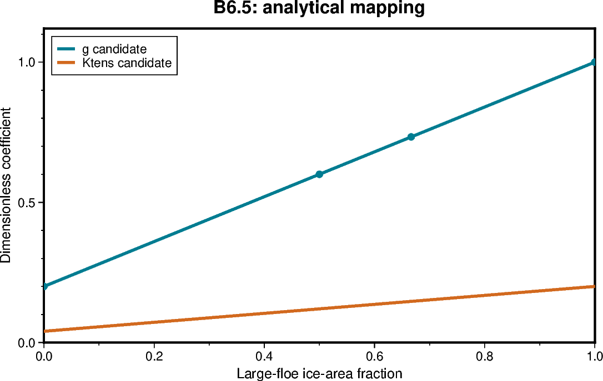

# B6.5 — Diagnostic shadow-fixture matrix

[Box01 contents](box01_dev_dynamic_tensile_strength.md) · [Case figure notebook](../../CICE_testing/notebooks/B6.5.ipynb)

## Status and scope

**PASS: 14 diagnostic shadow-fixture cases, analytical, neutrality, decomposition and continuation.** Updated 7 October 2026. Results below are supplied archive/log evidence; no new model runs or unseen NetCDF results are inferred by this reorganisation.

## Purpose and test logic

Exercise native bins, unequal category areas, open-water dilution invariance, inactive masks, spatial indexing and decompositions using controlled shadow inputs. Shadow inputs do not overwrite prognostic FSD.

## Mathematical and implementation interpretation

Equal small/large area gives $F_L=1/2$, $g=0.6$. Unequal areas $(0.3,0.6)$ give $F_L=2/3$, $g=11/15$. Scaling both areas by the same positive factor leaves $F_L$ unchanged until the declared inactive threshold is reached.

## Conceptual figure



This PyGMT depiction shows the configuration, analytical expectation or comparison design. It is **not measured model output**. Recreate its PNG/PDF and provenance with [B6.5.ipynb](../../CICE_testing/notebooks/B6.5.ipynb). Optional measured-history cells in the notebook call the existing PyGMT validation API with actual user-supplied files; they fail rather than substitute synthetic results.

## Current workflow entry point

Run from the repository root after `load_modules` and set `CICE_TEST_RUNS` to the existing external run root. The workflow resolves migrated cases without changing run archives. Do not recreate already accepted cases. Historical shell recipes below use the original root case paths; use the case registry for builds/submission after migration.

```bash
python CICE_testing/scripts/b65_box_workflow.py analyse \
    --repo "$PWD" --runs "$CICE_TEST_RUNS" --evidence validation_report/box/evidence
```

## Procedure, expected outcomes, code changes and recorded results

The dated record below preserves exact settings, commands, source references and numerical results. Earlier planning statements describe the state at that time; the status above and final recorded outcome take precedence. See [case organisation](case_organisation.md) for current configuration paths. Run archive IDs and immutable provenance stay historical.

### B6.5 — run the controlled box matrix

Use new cases and build directories for this implementation. Keep the accepted
B4/B5 archives and executables. Reuse one new executable across matched tests
within each layout; serial and MPI layouts may require separate builds.

| Experiment | Inputs | Required evidence |
|---|---|---|
| B6-A | Prescribed diameter below, at and above threshold | Endpoint classification; candidate bounds; applied g=1 in diagnostic mode |
| B6-B | Uniform all-small, all-large and mixed synthetic FSD | Candidate diagnostics agree with analytical answers |
| B6-C | Unequal category areas and scaled total concentration | Correct area weighting and invariance to open-water fraction |
| B6-D | Spatial small/large pattern crossing global columns 6/7 | One-block and two-rank candidate/physical-field agreement |
| B6-E | Two-day plus three-day restart of spatial case | Reconstructed candidates and aligned outputs match the continuous path |
| B6-F | Uniform mapping with feedback enabled | Equivalent solution to an independently prescribed constant g |

Diagnostic-only runs must match the corresponding g=1 physical control.
Use an explicit, narrow list of newly added candidate diagnostics when comparing
different candidate inputs: those fields are expected to differ. Do not exempt
applied coefficients or physical fields. Compare candidate diagnostics exactly
across equivalent layouts/restarts, subject to the declared numerical policy.

For B6-F, choose endpoint and equal-mixture inputs whose expected candidate
matches the prescribed control. Inspect the computed coefficient before
interpreting a trajectory difference; do not casually replace a computed
fraction with a rounded decimal and assume exact arithmetic identity.

The controlled fixture mechanism must be explicit and confined to the box
test path. Preserve a prescribed input for the mapping tests; do not silently
overwrite evolving model FSD every timestep in a production configuration.
In a later adapter test, populate actual Icepack bins with known normalised
fractions and verify the adapter separately from the synthetic two-bin driver.

#### B6.5 reported Gadi results — 6 October 2026

Source of evidence: the user-supplied shell transcript from Gadi, with
`conda/analysis3-26.08`. All fourteen cases contain a model log with
`CICE COMPLETED SUCCESSFULLY`; the final continuation log is
`dt_b65_sp_b_m2/cice.runlog.261006-153202`. The other thirteen completion logs
are timestamped 261006-105654 through 261006-105723.

The six synthetic B6.5 checker regressions passed in 0.617 s. The actual matrix
analysis **FAILED**, with:

```text
FAIL: inactive interval has unmasked large fraction
```

| Case | Reported runtime analysis evidence |
|---|---|
| dt_b65_ctl_s1 | PASS line after coverage of 126 history files and five restart clocks |
| dt_b65_small_s1 | PASS analytical/neutrality; 126 history files and five restarts |
| dt_b65_large_s1 | PASS analytical/neutrality; 126 history files and five restarts |
| dt_b65_mix_s1 | PASS analytical/neutrality; 126 history files and five restarts |
| dt_b65_uneq_s1 | PASS analytical/neutrality; 126 history files and five restarts |
| dt_b65_dil_s1 | PASS analytical/neutrality; 126 history files and five restarts |
| dt_b65_zero_s1 | Next row in the checker order; inactive-fraction check failed before a case PASS line |
| Remaining spatial/control/split cases | Model completion reported, but matrix validation not reached |

The checked restart clocks are 2–6 January 2005 at steps 24, 48, 72, 96 and
120. The failing file, field/stream suffix, values and NetCDF fill metadata were
not included in the supplied transcript. Case attribution to the inactive
fixture follows the implementation's row order; it is not a file-level diagnosis.
`CICE_testing` now includes the history path and the offending fraction field/stream name
in fixture exceptions to locate the
first failure on a repeat analysis.

The history contract requires undefined large fractions to be masked whenever
any contributing sample is inactive. A negative internal sentinel or an unmasked
zero/fill-like number is not an acceptable substitute. Retain this check and
inspect the actual failing IC/daily/hourly record and its `_FillValue` before
attributing the failure to history output, decoding or the checker. No model
source fix or relaxed mask rule is implied by this results entry.

The leading FAIL line appears before the buffered PASS transcript because the
workflow captures stdout and emits the transcript on failure while the CLI writes
its failure message to stderr. It does not negate the earlier completed checks.

**Gate status:** the full B6.5 diagnostic shadow matrix remains FAIL/unresolved.
Spatial/decomposition/split-restart comparisons were not reached. B6.5-F mapped
feedback remains pending. Model completion and synthetic checker PASS do not
close these gates; retain `test_scripts`, `tools` and the accepted run archives.
The evidence paths generated by this command are
`validation_report/box/evidence/b65-validation.json`,
`validation_report/box/evidence/b65-analysis.txt`, and
`dt_b65_ctl_s1/b65-analysis.log`. Their actual contents/checksums have not been
supplied here. Keep the FAIL record with the run provenance.

#### B6.5 IC hourly masking correction — 6 October 2026

The repeat user-supplied analysis passed all six synthetic tests in 0.564 s and
again passed the six matrix rows through `dt_b65_dil_s1`. It then identified:

```text
FAIL: /g/data/gv90/da1339/cice-dirs/runs/dt_b65_zero_s1/history/iceh_ic.2005-01-01-00000.nc: inactive interval has unmasked large fraction: dtens_flarge_h
```

Source inspection identifies an IC history serialization defect. The candidate
accumulator stores undefined fractions as a negative sentinel. The regular
history conversion changes that sentinel to `spval_dbl` for the current stream.
During IC output, however, `nstrm=1` restricts conversion to the first stream,
while `ice_write_hist` writes all streams when `write_ic` is true. Consequently
the hourly IC fraction bypasses the sentinel-to-fill conversion. The transcript
identifies the unmasked field; its exact stored values and fill metadata have
not yet been supplied.

`ice_history.F90` now converts negative fraction accumulations for every enabled
nonprimary IC stream before serialization. It guards disabled field indices and
changes only those fraction copies. Existing ordinary-stream conversion,
candidate coefficients, applied coefficients, mapping and momentum are unchanged.
The checker still rejects unmasked inactive fractions. New regressions reject
the raw hourly sentinel, accept its masked replacement and guard the IC source
conversion before the writer. Python regressions pass locally; no Fortran
compiler is available in the editing environment. Full model compilation and
runtime validation must be performed on Gadi.

Preserve the failed cases, runs, executable hashes and evidence as a dated
archive. Prepare fresh B6.5 cases with the same canonical names after archiving,
rebuild each of the s1/s2/m2 control executables from the corrected source, and
use `distribute` to share that layout executable across its matched tests. Run
the thirteen initial cases first, then `stage` and run `dt_b65_sp_b_m2` from the
new `dt_b65_sp_a_m2` restart. Do not edit NetCDF evidence or reuse the old
continuation input. Analyse the complete fresh matrix and archive its results.
**The correction is not a runtime PASS:** B6.5 remains unresolved until this
matrix is validated; B6.5-F mapped-feedback equivalence remains pending, and
B6.6 jobs should wait.

#### B6.5 diagnostic matrix acceptance — 6 October 2026

**PASS for the diagnostic-only shadow-fixture matrix.** The latest user-supplied
Gadi transcript supersedes the unresolved masking outcome above. All fourteen
rows passed analytical/neutrality checks, including `dt_b65_zero_s1` with its
hourly IC fraction mask. The continuation completed in
`dt_b65_sp_b_m2/cice.runlog.261006-214427`.

| Coverage | Accepted evidence |
|---|---|
| Twelve five-day cases | 126 history files and five restart clocks/inventories per case |
| Two-day spatial segment, m2 | 51 history files; restarts at steps 24 and 48 |
| Three-day spatial continuation, m2 | 76 history files; restarts at steps 72, 96 and 120 |
| Uniform fixtures | All-small, all-large, equal mixture, unequal category area and dilution match analytical candidates |
| Inactive fixture | Masked undefined fraction and neutral candidates; IC/hourly masking failure resolved |
| Diagnostic neutrality | Exact decoded physical histories and restarts against corresponding layout controls; continuation IC has no same-phase physical control snapshot |
| Decomposition | Control and spatial histories/restarts agree between s1, s2 and m2; only history blkmask ownership values excluded |
| Spatial split continuation | 51 segment-one and 75 segment-two exact history pairs; matching restarts and unchanged staged input |

The continuation's extra IC file is validated analytically but excluded from
continuous history comparison because it represents restart initialization at a
different sampling phase. All applied coefficients remain in the physical
comparison; candidate fields remain in equivalent-layout/split comparisons.

The supplied build/distribution transcript records these SHA-256 executable
hashes, shared by every case within its layout:

| Layout | Executable SHA-256 |
|---|---|
| s1: one serial block | `11f45d2da012ff9d3872371fa602c1a3badfbba281bb34e63c974fd755697379` |
| s2: two local serial blocks | `a87b94b90b98d015725fb7bdca44697b2556ecd11b60018b50e50f6c565be448` |
| m2: two MPI ranks | `9e71b2fd4e88d4050f5bb2bf55a9be5644027aabfc6c67700dfab7c91ad595b1` |

The m2 build reports COMPILE SUCCESSFUL in `cice.bldlog.261006-161816`.
The thirteen initial submissions were jobs 180599370–180599382. The history
correction is repository commit `28a4a44be31b4343b39099462fcce06cb013ffb5`;
archive the actual per-case source revision/local diff, build logs, namelists,
launchers, hashes, restarts and full checker output. This acceptance is based on
the supplied transcript, not independent access to the Gadi files. Retain the
previous failed matrix archive alongside the accepted rerun.

```text
PASS B6.5 diagnostic shadow-fixture matrix: analytical, neutrality, decomposition, spatial continuation
B6.5-F mapped-feedback equivalence and B6.6 live invalid-state tests remain pending.
```

The evidence files are `validation_report/box/evidence/b65-validation.json`,
`validation_report/box/evidence/b65-analysis.txt` and
`dt_b65_ctl_s1/b65-analysis.log`. Preserve them with this accepted matrix.
B6.5-F has not been implemented/validated by this diagnostic-only result.
Neither applied mapped-momentum halo exchange nor the global FSD adapter is
certified by a shadow fixture. Keep `test_scripts` and `tools` until migration
of their remaining workflows/tests is separately complete.

## B6.5 diagnostic shadow-fixture implementation and Bash workflow

Added 5 October 2026. **The corrected diagnostic matrix and B6.5-F controlled
feedback equivalence now have user-reported Gadi acceptance PASS entries above.
The earlier inactive IC masking failure is retained as historical evidence.**

An explicit dynamics_nml option, dyntens_box_fixture, supplies controlled
diagnostic inputs: none (default live adapter), small, large, mixed, unequal,
dilute, inactive or spatial. These are **shadow category areas/FSD arrays** passed
to the existing production mapping routine with the actual native
2*floe_rad_c diameters. They do not overwrite aicen, trcrn, FSD restart fields or
any prognostic state. The fixture's status/large-fraction fields describe the
synthetic input rather than the model's evolving ice. This controlled replay
tests native-bin mapping and global indexing; it is not an evolving-tracer
perturbation experiment or proof of a physical closure.

The option is restricted to diagnostics=T, feedback=F, rectangular box_tensile,
12x12, nfsd=12, ncat>=2, threshold=300, g_min=0.2, Ktens=0.2 and the previously
supported EVP configuration. Configuration is MPI-broadcast and the selected
fixture is printed in the startup log. Invalid names/configurations abort.
The default none branch retains the live-FSD adapter used in B6.3/B6.4.

Fixture arrays are reconstructed at initialization and every pre-EVP call;
the spatial input uses global column indices, never rank-local i. Coefficients
are held fixed through EVP subcycles. No new prognostic restart variable or
candidate halo exchange is introduced.

| Fixture | Synthetic inputs | Expected F_L | Expected g | Expected Ktens candidate |
|---|---|---:|---:|---:|
| small | area 0.9, native bin 6 | 0 | 0.2 | 0.04 |
| large | area 0.9, native bin 7 | 1 | 1 | 0.2 |
| mixed | area 0.9, half in bins 6 and 7 | 0.5 | 0.6 | 0.12 |
| unequal | areas 0.3/0.6, bins 6/7 respectively | 2/3 | 11/15 | 11/75 |
| dilute | areas 0.1/0.2, same fractions | 2/3 | 11/15 | 11/75 |
| inactive | zero areas | masked | 1 | 0.2 |
| spatial | bin 6 at global column 6; bin 7 elsewhere | 0 at column 6, 1 elsewhere | 0.2 at column 6, 1 elsewhere | 0.04 at column 6, 0.2 elsewhere |

Native bin 6 is below the 300 m diameter threshold; bin 7 is above it.
The exact D=300 boundary remains a standalone analytical routine test in the
B6.2 suite, since the native grid has no representative diameter exactly there.

### Create new cases

Use the usual model-build shell. No accepted B6.3/B6.4 directory is modified.
The prepare helper requires fresh destinations. It invokes cice.setup, preserves
each generated domain_nml and launcher, copies the accepted machine environment/
macros and physics, and sets the explicit fixture option. Its --base-case is
the original case directory under src/CICE_dyntens, not a run directory.

~~~bash
(
set -euo pipefail
cd /g/data/gv90/da1339/src/CICE_dyntens
git pull --ff-only origin dev
python3 test_scripts/b65_box_workflow.py prepare \
    --base-case /g/data/gv90/da1339/src/CICE_dyntens/dt_b63_diag
)
~~~

There are fourteen cases: three controls (ctl_s1, ctl_s2, ctl_m2), six uniform
analytical cases on s1, three spatial cases (sp_s1, sp_s2, sp_m2), and
sp_a_m2/sp_b_m2 split segments. All names have the dt_b65_ prefix.
Layouts are 1x1x12x12x1, 1x1x6x12x2 and 2x1x6x12x1 respectively.
Full runs use five days; split segments use two and three days.

### Compiler checks, builds and executable distribution

Run the routine tests in the generated case's actual compiler environment:

~~~bash
(
set -euo pipefail
cd /g/data/gv90/da1339/src/CICE_dyntens
csh -f <<'CSH'
source /etc/profile.d/modules.csh
cd dt_b65_ctl_s1
source ./cice.settings
source ./env.gadi1_intel
cd ..
python3 test_scripts/test_b6_fortran_mapping.py --fc ifort --fflags '-O0 -g -check all -traceback'
if ($status != 0) exit 1
python3 test_scripts/test_b65_fortran_fixtures.py --fc ifort --fflags '-O0 -g -check all -traceback'
if ($status != 0) exit 1
CSH

for layout in s1 s2 m2; do
    (
        cd "dt_b65_ctl_$layout"
        ./cice.build > build.b65.log 2>&1
    )
done
python3 test_scripts/b65_box_workflow.py distribute
)
~~~

Use ifx in both compiler commands if that is the loaded compiler. Do not use
fast-math flags. The new compiler check derives native bin diameters from the
Icepack source, tests 84 mode/column answers and three invalid fixture guards.
Each layout gets one fresh executable; distribute copies it to every matching
case and records hashes. Full model compilation is required because the fixture
adapter/namelist source has changed.

Before submission inspect PBS queue/project/storage, rank count, new case paths
and the generated MPI launcher. The helper sets 1/2 CPUs, 9 GB and 30 minutes;
it retains the generator's queue, storage and launcher. Do not copy a serial
launcher or executable into an MPI case.

### Submit the full matrix and first split segment

~~~bash
(
set -euo pipefail
cd /g/data/gv90/da1339/src/CICE_dyntens

cases=(
dt_b65_ctl_s1 dt_b65_small_s1 dt_b65_large_s1
dt_b65_mix_s1 dt_b65_uneq_s1 dt_b65_dil_s1 dt_b65_zero_s1
dt_b65_sp_s1 dt_b65_ctl_s2 dt_b65_sp_s2
dt_b65_ctl_m2 dt_b65_sp_m2 dt_b65_sp_a_m2
)
for name in "${cases[@]}"; do
    ( cd "$name"; qsub ./cice.run | tee b65-job-id.txt )
done
)
~~~

Wait for completion. Confirm each model log says CICE COMPLETED SUCCESSFULLY.

### Stage and submit the spatial continuation

~~~bash
(
set -euo pipefail
cd /g/data/gv90/da1339/src/CICE_dyntens
load_modules
runs=/g/data/gv90/da1339/cice-dirs/runs
rg -l 'CICE COMPLETED SUCCESSFULLY' "$runs/dt_b65_sp_a_m2"/cice.runlog.*
python3 test_scripts/b65_box_workflow.py stage
( cd dt_b65_sp_b_m2; qsub ./cice.run | tee b65-job-id.txt )
)
~~~

This checks the 3 January / step 48 clock, stages a checksum-identical spatial
restart and writes its pointer. The deterministic shadow fixture is reconstructed
from the continuation namelist/global index, without modifying restored FSD.

### Analyse after all fourteen jobs finish

~~~bash
(
set -euo pipefail
cd /g/data/gv90/da1339/src/CICE_dyntens
load_modules
runs=/g/data/gv90/da1339/cice-dirs/runs
for name in dt_b65_ctl_s1 dt_b65_small_s1 dt_b65_large_s1 \
            dt_b65_mix_s1 dt_b65_uneq_s1 dt_b65_dil_s1 dt_b65_zero_s1 \
            dt_b65_sp_s1 dt_b65_ctl_s2 dt_b65_sp_s2 \
            dt_b65_ctl_m2 dt_b65_sp_m2 dt_b65_sp_a_m2 dt_b65_sp_b_m2; do
    rg -l 'CICE COMPLETED SUCCESSFULLY' "$runs/$name"/cice.runlog.*
done
python3 test_scripts/test_b65_box_workflow.py -v
python3 test_scripts/b65_box_workflow.py analyse \
    2>&1 | tee dt_b65_ctl_s1/b65-analysis.log
)
~~~

The checker requires complete 126-file full histories and five daily restarts,
51-file/two-restart segment 1 and 76-file/three-restart segment 2.
Every candidate IC/daily/hourly family must match the independent table at
absolute tolerance 1e-10, including inactive masking. Applied g=1/Ktens=0.2
remains required.

Against each layout's control, only the four candidate history families are
excluded; other decoded values/masks and all restart fields match exactly.
Across equivalent decompositions, candidates and physical fields match exactly;
only history blkmask ownership values are exempted, retaining dimensions,
masks and finiteness checks. Full restart equality includes extended halos.

Spatial split/continuous comparison covers 51+75 history pairs and two+three
restart pairs exactly. The extra continuation IC is checked against the
analytical spatial fixture at initialization, since that fixture is explicitly
reconstructed rather than inferred from the evolving prognostic FSD.

Local verification: four preprocessed Fortran files passed an F2008 syntax
parse; six synthetic checker regressions passed. The compiler-driven fixture
test and full CICE build/runtime tests must be run on Gadi. No runtime PASS is
claimed by this implementation entry.

Passing this matrix closes the implemented **diagnostic shadow-fixture**
analytical/spatial/restart gates. It does not establish raw-tracer perturbation
fixtures, mapped coefficient halo exchange or B6.5-F momentum feedback
equivalence. Implement that explicit mapped mode after this matrix passes,
then compare endpoints/equal mixtures against independently prescribed controls.
