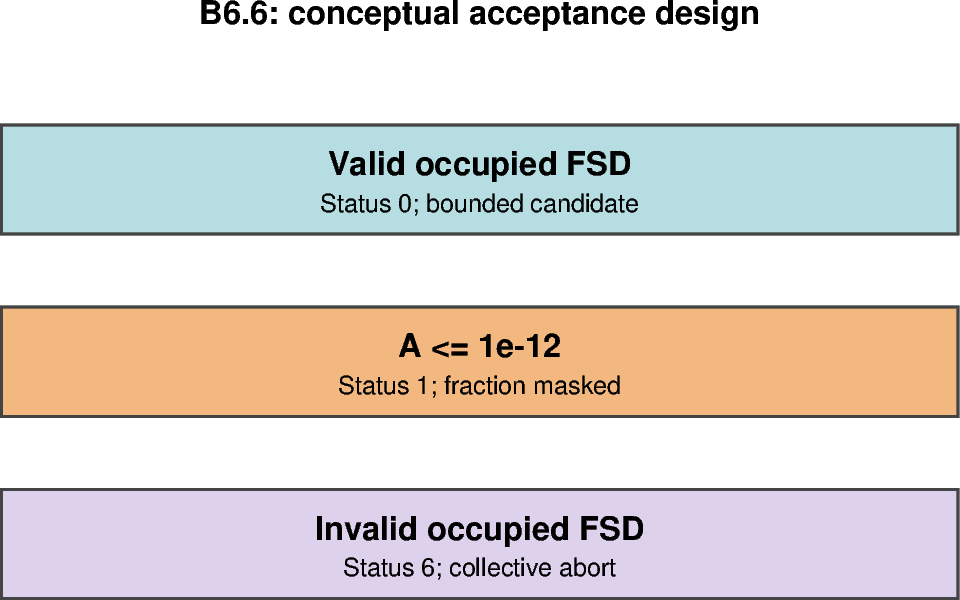

# B6.6 — Live invalid-state tests and regression checks

[Box01 contents](box01_dev_dynamic_tensile_strength.md) · [Case figure notebook](../../CICE_testing/notebooks/B6.6.ipynb)

## Status and scope

**Incomplete.** Updated 8 October 2026. The negligible-area serial and MPI continuations failed; the serial trace now identifies an active cell with FSD sums about $3.3\times10^{-8}$ below one. The earlier results and procedures are retained below.

## Revised scope — 8 October 2026

The question for this final box step is: **Does the new calculation handle invalid FSD and effectively ice-free cells sensibly, without stopping on ordinary numerical behaviour?**

We have agreed to stop expanding the artificial negligible-area continuation. Its initial area is $5\times10^{-13}$; at failure, the serial trace reports total area $1.496595697459838\times10^{-5}$ and category 2 area $1.496587278274634\times10^{-5}$, with FSD sum $0.999999966590842$. The other positive-area categories also sum to about $0.999999967$. These finite, positive bins fail the current $10^{-10}$ sum tolerance.

The category 2 area multiplied by its FSD deficit is about $4.99997\times10^{-13}$, almost the planted area. Together with remapping's category-area cutoff (`puny=10^{-11}`), this suggests a mismatch between transport of tiny area and its FSD contribution. It does not establish the complete mechanism or justify changing transport merely to pass the fixture. Source: supplied serial trace `cice.runlog.261007-080420`, received 8 October 2026.

B6.6 remains incomplete until the existing evidence, limitations and FSD checking policy have been reviewed. The failed continuation remains a failed continuation. Extra timestep injections and new B4/B5 runs listed in the historical procedures below are no longer automatic requirements; repeat relevant controls if a model change affects them. The current analyser still implements the earlier twelve-case restart-entry test and will fail on the negligible-area continuation. No analyser or model behaviour has been changed by this documentation revision.

The next work is set out in the [box01 overview](box01_dev_dynamic_tensile_strength.md#finishing-box01-and-returning-to-the-global-grid). Global FSD diagnostics should establish how often the numerical issue occurs in realistic conditions before enabling global momentum feedback.

## Purpose and test logic

Require explicit rejection of invalid occupied FSD, correct inactive entry and collective MPI termination. Also retain null/restart regression controls on the relevant build; an expected abort is not a successful physical run.

## Mathematical and implementation interpretation

For $A\le10^{-12}$, return inactive status 1, masked $F_L$, $g=1$. For $A>10^{-12}$, every positive-area category must have finite, nonnegative bins with $|\sum_kf_{k,n}-1|\le10^{-10}$. This contract differs from Icepack `puny`; no tolerance is widened in response to failure.

## Conceptual figure



This PyGMT depiction shows the configuration, analytical expectation or comparison design. It is **not measured model output**. Recreate its PNG/PDF and provenance with [B6.6.ipynb](../../CICE_testing/notebooks/B6.6.ipynb). Optional measured-history cells in the notebook call the existing PyGMT validation API with actual user-supplied files; they fail rather than substitute synthetic results.

## Current workflow entry point

Run from the repository root after `load_modules` and set `CICE_TEST_RUNS` to the existing external run root. The workflow resolves migrated cases without changing run archives. Do not recreate already accepted cases. Historical shell recipes below use the original root case paths; use the case registry for builds/submission after migration.

```bash
python CICE_testing/scripts/b66_invalid_state_workflow.py analyse \
    --repo "$PWD" --runs "$CICE_TEST_RUNS" --evidence validation_report/box/evidence
```

The full analyser still stops on the unresolved negligible-area continuation. The serial diagnostic case is `box01_tests/B6.6/dt_b66_trace_negligible_area_s1` after migration; read its model log from the unchanged external run directory. Its trace has been received; do not re-create or re-submit it merely because its configuration moved.

## Procedure, expected outcomes, code changes and recorded results

The dated record below preserves exact settings, commands, source references and numerical results. Earlier planning statements describe the state at that time; the status above and final recorded outcome take precedence. See [case organisation](case_organisation.md) for current configuration paths. Run archive IDs and immutable provenance stay historical.

### B6.6 — invalid-state tests and regression checks

Deliberately invalid occupied-category inputs must produce the expected
failure/status. Include zero-area and negligible-total-area cases as successful
inactive outcomes. Test the MPI failure path as well as the arithmetic routine.

Repeat the meaningful B4 unity/null controls and the B5-style restart comparison
with the new build. Check candidate and applied fields separately. Archive the
source revision, local diff, executable hashes, namelists, mapping parameters,
bin definitions, job logs and comparison output for every accepted result.

#### B6.6 restart-entry subset implemented — 6 October 2026

`CICE_testing/workflows/invalid_state.py` provides `InvalidStateWorkflow` and
`CICE_testing/scripts/b66_invalid_state_workflow.py` (`cice-test-invalid`).
This is a diagnostic-only **restart-entry subset** of B6.6, not completion of
all B6.6/B6 acceptance requirements. It can investigate the live failure path
following acceptance of the corrected B6.5 diagnostic matrix and B6.5-F feedback equivalence.

It creates fresh cases using `dt_b65f_large_off_s1` and
`dt_b65f_large_off_m2`, reusing each layout's accepted **B6.5-F build**, launcher
and machine configuration. These are feedback-off controls from the newly
validated matrix, rather than the earlier B6.5 executables. It first
requires a valid owned-ocean raw FSD source throughout the copied 3 January /
step 48 restart, accepting only the audited 12x12 or 14x14 extended-halo layout.
If that source check fails, stop and diagnose it rather than normalising it.

A selected occupied ocean cell in **global column 7** supplies one occupied
category for invalid-FSD tests; that column is in the second x block of the
6+6 decomposition. The actual task/block/local coordinates are read from the
model's status log, not assumed from rank numbering. Only a copied input restart
is edited. Accepted B6.5 inputs, outputs and executables are untouched.
All tests use `use_dyntens=F`, `use_dyntens_diagnostics=T`,
`dyntens_box_fixture='none'`, `restart_fsd=T` and a one-day continuation.

| Mode (each on s1 and m2) | Copied restart change | Required outcome |
|---|---|---|
| valid | None | One-day completion; independent restart IC mapping; exact physical continuity against B6.5-F feedback-off control |
| negative | One occupied fsd001 value = -0.1 | Logged mapping status 6 and explicit collective mapping abort; no successful completion/output restart |
| nonfinite | One occupied fsd001 value = NaN | Same expected status/abort; a generic floating-point or scheduler failure is not sufficient |
| bad_sum | All twelve bins in one occupied category = 0 | Same expected status/abort; no hidden repair |
| zero_area | All category areas/ice/snow volumes at selected cell scaled to zero; FSD bins zeroed | Inactive IC status 1, masked large fraction, neutral candidates and one-day completion |
| negligible_area | Areas/volumes scaled to total 5e-13; normalized source FSD retained | Same inactive IC outcome; later evolution is allowed and checked separately |

The valid case checks 26 histories (one IC, one daily and 24 hourly), one final
restart (4 January / step 72), 25 aligned non-IC physical history comparisons,
and exact decoded final restart equality. Its IC is reconstructed independently
from the raw restart. Inactive cases are not compared physically against the
unmodified control because their area/volume inputs differ. Successful cases
retain candidate/applied-field checks on all history files.

A malformed-input case must show the named collective abort and status 6 from
exactly one reporting task; the status log identifies the injected task. Cases
that complete, merely time out, or omit the expected reason fail the checker.
Archive PBS output/accounting and verify all jobs have left the queue before
analysis: the model-log check alone is not a general proof of absence of MPI
hangs. The first runtime attempt is recorded below; the subset remains FAIL.

**Still pending:** explicit in-timestep invalid-input injection, a new-build B4
null regression, and the full B5-style restart regression controls. New-build
unity/off equivalence has passed in B6.5-F. The new evidence JSON names the
gate `B6.6-entry` and records these pending requirements; a PASS is only for this
restart-entry subset. Synthetic local tests of mutation isolation, area/volume
scaling and expected-abort recognition passed, but are not Gadi runtime evidence.

##### Prepare fresh B6.6-entry cases

No new model build is required for this Python-only restart perturbation
workflow. Use the accepted B6.5-F feedback-off executables by layout. Preparation refuses
existing destination cases/runs and records source/executable/input hashes,
source revision/diff and copies of the namelist/launcher/environment.

```bash
(
set -euo pipefail
cd /g/data/gv90/da1339/src/CICE_dyntens
git pull --ff-only origin dev
load_modules
python -c 'import sys; assert sys.version_info >= (3, 10), "Activate Python 3.10+"'
runs=/g/data/gv90/da1339/cice-dirs/runs
python -m unittest discover -s CICE_testing/tests -p 'test_invalid_state.py' -v
python CICE_testing/scripts/b66_invalid_state_workflow.py prepare \
    --repo "$PWD" --runs "$runs"
)
```

Inspect the generated PBS project/queue/storage, resource counts and launchers.
The serial case must retain the serial layout executable; the m2 case must
retain its two-rank executable and launcher. Do not rebuild or copy one layout's
binary into the other.

##### Submit positive controls first

```bash
(
set -euo pipefail
cd /g/data/gv90/da1339/src/CICE_dyntens
for layout in s1 m2; do
    ( cd "dt_b66_valid_$layout"; qsub ./cice.run | tee b66-job-id.txt )
done
)
```

Wait for these two jobs to finish and confirm success before submitting the
perturbed cases. If a valid live-FSD continuation aborts, investigate the source
state/adapter and do not treat the negative cases as isolated tests.

```bash
(
set -euo pipefail
cd /g/data/gv90/da1339/src/CICE_dyntens
runs=/g/data/gv90/da1339/cice-dirs/runs
for layout in s1 m2; do
    rg -l 'CICE COMPLETED SUCCESSFULLY' "$runs/dt_b66_valid_$layout"/cice.runlog.*
done
for layout in s1 m2; do
    for mode in negative nonfinite bad_sum zero_area negligible_area; do
        ( cd "dt_b66_${mode}_${layout}"; qsub ./cice.run | tee b66-job-id.txt )
    done
done
)
```

The negative/nonfinite/bad_sum jobs are **expected to abort**. Do not apply a
success-marker loop to those cases. Retain their failure logs and PBS accounting.
Check `qstat -u da1339`; analyse only after every submitted job has finished.

##### Analyse the full restart-entry subset

```bash
(
set -euo pipefail
cd /g/data/gv90/da1339/src/CICE_dyntens
load_modules
runs=/g/data/gv90/da1339/cice-dirs/runs
python CICE_testing/scripts/b66_invalid_state_workflow.py analyse \
    --repo "$PWD" --runs "$runs" \
    --evidence validation_report/box/evidence \
    2>&1 | tee dt_b66_valid_s1/b66-entry-analysis.log
)
```

Archive `b66-entry-validation.json`, `b66-entry-analysis.txt`, the twelve
`b66-provenance/input.json` manifests, PBS logs/accounting and analysis output.
Do not mark the full B6.6 gate complete from this subset or discard B6.5 evidence.

#### B6.6-entry first runtime attempt — 6 October 2026

**FAIL/unresolved for the complete restart-entry subset.** User-supplied
`Pasted text(20261006-120355).txt` has SHA-256
`1196a365edddfe49279864eee1abd06cb152a0498f291ce8ac61c0aef7307c42`.
The analysis reports:

```text
PASS live diagnostic control continuity dt_b66_valid_s1 25 history pairs + one restart; IC independently reconstructed
PASS expected restart-entry abort dt_b66_negative_s1 status=6; rank/block/local indices= [('0', '1', '8', '4', '6')]
PASS expected restart-entry abort dt_b66_nonfinite_s1 status=6; rank/block/local indices= [('0', '1', '8', '4', '6')]
PASS expected restart-entry abort dt_b66_bad_sum_s1 status=6; rank/block/local indices= [('0', '1', '8', '4', '6')]
PASS inactive restart-entry IC and one-day completion dt_b66_zero_area_s1 not a physical-control equivalence test
FAIL: completion absent dt_b66_negligible_area_s1
```

The valid serial IC mapping is independently reconstructed at tolerance 1e-10
from the owned global interior of the 14x14 extended restart; its final clock
is 4 January / step 72. Serial negative/nonfinite/bad-sum checks identify rank
0, block 1, local i=8, j=4 and status 6, and satisfy the named expected-abort
checker. The serial zero-area case meets its inactive IC and completion checks.

| Case group | PBS evidence | Validation status |
|---|---|---|
| valid s1/m2 | Jobs 180647913/180647914, exit 0 | Serial continuity PASS; MPI scientific comparison not reached |
| zero_area s1/m2 | Jobs 180648216/180648221, exit 0 | Serial inactive IC/completion PASS; MPI check not reached |
| negative/nonfinite/bad_sum s1 | Jobs 180648213–180648215, exit 255 | Expected-abort checker PASS with status 6 and named mapping reason |
| negative/nonfinite/bad_sum m2 | Jobs 180648218–180648220, exit 255 | Jobs terminated; exact mapping reason/status not supplied or validated yet |
| negligible_area s1 | Job 180648217, exit 255; log cice.runlog.261006-230134 | Unexpected failure; success is required |
| negligible_area m2 | Job 180648222, exit 255; log cice.runlog.261006-230118 | Unexpected failure; success is required |

The two negligible-area jobs used 6 s and 4 s walltime respectively, out of a
30-minute allocation. These are recorded failures rather than evidence of a
walltime overrun. Their PBS summaries give no model abort reason, mapping status
or failing timestep. Do not infer the cause from the generic completion error
or relabel negligible-area failures as expected invalid-FSD aborts. Obtain both
model-log tails, status/abort messages and, if present, IC history to distinguish
restart initialization from subsequent evolution. Preserve the prepared restart,
provenance, logs and FAIL evidence before modifying or rerunning anything.

Analysis stops at the serial negligible-area row, so none of the MPI validation
rows have been completed by this transcript. Successful PBS exit alone does not
establish continuity/mask correctness, and exit 255 alone does not establish an
expected collective mapping abort. All twelve PBS summaries include the same
missing xp65 modules-directory message previously observed in successful
B6.5-F runs; the current evidence does not identify it as the failure cause.
No mapping tolerance, masking contract or model physics has been changed in
response to this partial result. B6.6-entry and the full B6.6 gate remain open.

#### B6.6-entry negligible-area fixture correction — 6 October 2026

The follow-up model-log tails in `Pasted text(20261006-120806).txt` (SHA-256
`751cee8a2355c15d0499a67681ab886faceadcc295c3324aac18a3b8b18671b4`) identify both failures after successful IC output and the first
instantaneous history, `iceh_inst.2005-01-03-03600.nc`. Both then reject the
modified cell with status 6 and the named collective mapping abort. The serial
log reports rank 0/block 1/local i=8,j=4; MPI reports rank 1/block 2/local i=2,j=4.
The MPI stack traces the abort through update_dyntens_candidates, evp and
step_dyn_horiz. Thus restart initialization was reached successfully, and the
failure occurs on a subsequent EVP evaluation rather than before IC output.

The original test fixture retained a total category area of 5e-13 but replaced
all its raw FSD bins with zero. The production mapping intentionally ignores
FSD bins at total area <=1e-12. Status 6 later proves that the cell has entered
the occupied-FSD validation branch. The planted zero-bin state is unsuitable
for a one-day inactive-entry **success** test if the cell becomes active.
The log does not print the exact area/bin values at rejection, so those values
are not inferred here. No production threshold or normalization rule is relaxed.

The workflow correction scales area/ice/snow volumes to 5e-13 while preserving
the already validated source FSD tracers exactly. It still requires inactive
IC status 1, a masked undefined fraction, neutral candidates, and candidate
validation at every later output. Dedicated negative/nonfinite/bad-sum cases
remain malformed occupied-FSD tests; zero_area retains zero area/volume/bins.
This changes a copied test input only, not the model or accepted archives.
The corrected case may reactivate, but a runtime success has not yet been
reported. The original failures remain useful evidence of post-IC live/MPI
rejection, not successful negligible-area continuations or completion of the
full in-timestep injection gate.

Four local regression tests pass, including exact FSD preservation, synthetic
reactivation validity, mutation isolation and selective re-preparation without
changing accepted cases. `prepare --modes negligible_area` recreates only these
two destinations after their failed cases/runs and FAIL evidence are archived.
`analyse` still checks all twelve cases; it cannot certify only a selected mode.
No new model build is required.

##### Archive and recreate only the failed negligible-area cases

```bash
(
set -euo pipefail
cd /g/data/gv90/da1339/src/CICE_dyntens
git pull --ff-only origin dev
load_modules
runs=/g/data/gv90/da1339/cice-dirs/runs
stamp=$(date +%Y%m%d-%H%M%S)
archive="$runs/b66-negligible-archive/$stamp"

for layout in s1 m2; do
    name="dt_b66_negligible_area_$layout"
    [[ -d "$PWD/$name" && -d "$runs/$name" ]]
done
mkdir -p "$archive/cases" "$archive/runs"
if [[ -d validation_report/box/evidence ]]; then
    cp -a validation_report/box/evidence "$archive/evidence"
fi
for layout in s1 m2; do
    name="dt_b66_negligible_area_$layout"
    mv "$PWD/$name" "$archive/cases/"
    mv "$runs/$name" "$archive/runs/"
done
echo "Archived failed cases: $archive"

python -m unittest discover -s CICE_testing/tests -p 'test_invalid_state.py' -v
python CICE_testing/scripts/b66_invalid_state_workflow.py prepare \
    --repo "$PWD" --runs "$runs" --modes negligible_area
for layout in s1 m2; do
    (
        cd "dt_b66_negligible_area_$layout"
        qsub ./cice.run | tee b66-job-id.txt
    )
done
)
```

##### After the two replacement jobs finish, rerun the full analysis

```bash
(
set -euo pipefail
cd /g/data/gv90/da1339/src/CICE_dyntens
load_modules
runs=/g/data/gv90/da1339/cice-dirs/runs
for layout in s1 m2; do
    rg -l 'CICE COMPLETED SUCCESSFULLY' \
        "$runs/dt_b66_negligible_area_$layout"/cice.runlog.*
done
python -u CICE_testing/scripts/b66_invalid_state_workflow.py analyse \
    --repo "$PWD" --runs "$runs" \
    --evidence validation_report/box/evidence \
    2>&1 | tee dt_b66_valid_s1/b66-entry-analysis.log
)
```

#### B6.6-entry corrected tiny-area continuation still fails — 7 October 2026

`Pasted text(20261006-205631).txt` (SHA-256
`43fc1a7d9fa1b6a23e4e459a273b0ba7e8c662571d89831c071a178905226bdd`)
confirms preparation at commit `3a7fedf` with `fsd_policy=preserve_source`.
Serial job 180650518 and MPI job 180650519 still exit 255. Both input restarts
have SHA-256 `9c14d3c7fa54810a7efa8d85ef5241bf04e490d3fbf8347eb963ff06f9cf78df`.
The serial executable hash is
`89d58ebbd489701430d2f59a946de33f3e28951a94b1ddeb8b744578e36161a5`;
the MPI executable hash is
`e5ab4a3d914461bb5592167be3097e53c0f27e7ad96f44512d667ad61c1fd3c6`.

Both logs write IC and the first hourly history before rejecting the same
modified global cell (i=7,j=3), status 6. Serial reports rank 0/block 1/local
(i=8,j=4); MPI reports rank 1/block 2/local (i=2,j=4). Preserving restart bins
has therefore not resolved continuation. The exact offending category/bin
state is absent from these logs. A transport/thermodynamic tracer change is a
possible explanation, not an established cause. No normalization, category
occupancy rule, tolerance or inactive threshold is changed on this evidence.

The first invalid live cell on each reporting task now logs total area, every
category area/FSD sum, and all raw FSD bins before the existing collective
abort. This logging requires a new build. The `trace` action clones the existing
corrected input into a separate `dt_b66_trace_negligible_area_<layout>` case,
forces independent object/output paths and preserves the original failed
cases and accepted control executables. Trace runs are diagnostic only and
cannot close B6.6-entry or be mixed into the accepted executable matrix.
Start with serial; inspect its detailed model log before further fixture or
production changes. Both B6.6-entry and full B6.6 remain open.

```bash
(
set -euo pipefail
cd /g/data/gv90/da1339/src/CICE_dyntens
git pull --ff-only origin dev
load_modules
python CICE_testing/scripts/b66_invalid_state_workflow.py trace \
    --repo "$PWD" --runs /g/data/gv90/da1339/cice-dirs/runs --layout s1
cd dt_b66_trace_negligible_area_s1
./cice.build
qsub ./cice.run | tee trace-job-id.txt
)
```

After the job finishes, return `tail -n 180` of the trace run's
`cice.runlog.*`. Do not run the acceptance analyser on this diagnostic build.

