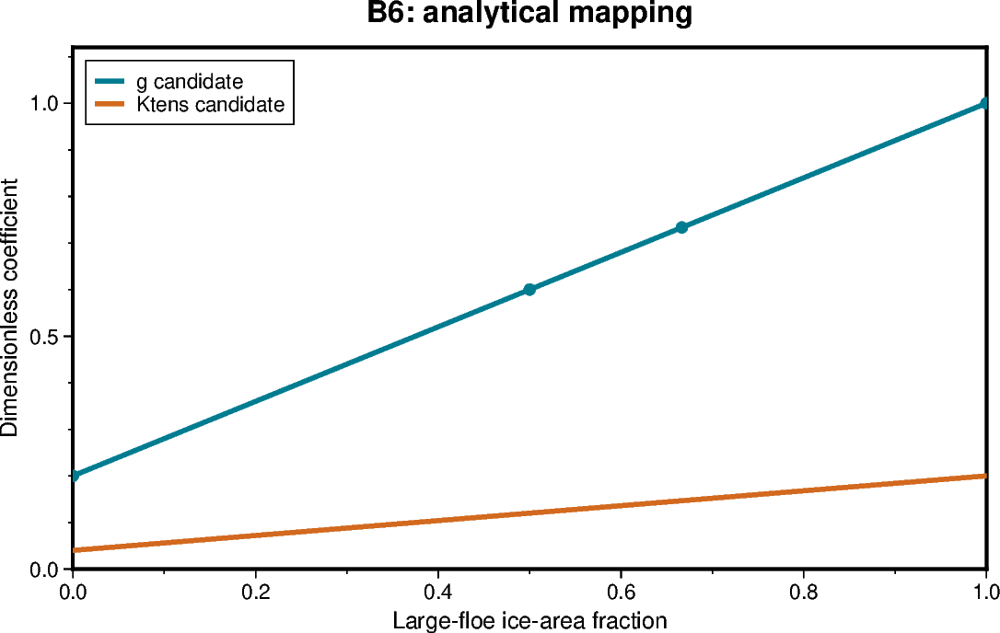

# B6 — Controlled FSD mapping: definition and acceptance

[Box01 contents](box01_dev_dynamic_tensile_strength.md) · [Case figure notebook](../../CICE_testing/notebooks/B6.ipynb)

## Status and scope

**OPEN: B6.1–B6.5-F have the recorded successes below; B6.6 is unresolved.** Updated 7 October 2026. Results below are supplied archive/log evidence; no new model runs or unseen NetCDF results are inferred by this reorganisation.

## Purpose and test logic

A working prescribed multiplier is not an FSD closure. Define the category-area weighting, bin convention and invalid-state policy, then validate calculation, adapter, timing and feedback separately.

## Mathematical and implementation interpretation

The agreed mapping and input contract are defined below.

## Conceptual figure

This PyGMT depiction shows the configuration, analytical expectation or comparison design. It is **not measured model output**. Recreate its PNG/PDF and provenance with [B6.ipynb](../../CICE_testing/notebooks/B6.ipynb). Optional measured-history cells in the notebook call the existing PyGMT validation API with actual user-supplied files; they fail rather than substitute synthetic results.

## Procedure, expected outcomes, code changes and recorded results

The dated record below preserves exact settings, commands, source references and numerical results. Earlier planning statements describe the state at that time; the status above and final recorded outcome take precedence. See [case organisation](case_organisation.md) for current configuration paths. Run archive IDs and immutable provenance stay historical.

## 1. Agreed controlled-test mapping

For this development test, adopt the README's large-floe-area-fraction candidate:

$$
L_n = \sum_{k:D_k>D_*} f_{k,n}, \qquad
A = \sum_n a_n,
$$

$$
F_L = \frac{\sum_n a_n L_n}{A}, \qquad
g_{\mathrm{candidate}} = g_{\min}+(1-g_{\min})F_L,
$$

$$
K_{t,\mathrm{candidate}} = K_t g_{\mathrm{candidate}}.
$$

| Symbol | Meaning | Units |
|---|---|---|
| a_n | Grid-cell ice-area fraction in thickness category n | 1 |
| f_{k,n} | Fraction of category n's ice area in floe bin k, integrated over the bin | 1 |
| D_k | Representative floe diameter for bin k | m |
| D_* | Large-floe diameter threshold | m |
| A | Total grid-cell ice concentration | 1 |
| L_n | Large-floe fraction within category n | 1 |
| F_L | Large-floe fraction of the ice-covered area | 1 |
| g, g_min | Tensile multipliers | 1 |
| K_t, K_{t,candidate} | Tensile coefficients in the rheology | 1 |

K_t times g is a dimensionless coefficient, not a stress in N/m or Pa.

The denominator is ice area, not total cell area and not the number of occupied
categories. Thus open water does not dilute F_L, and thick/thin categories
contribute in proportion to their areas, not their volumes.

### Test parameters and threshold convention

Use D_*=300 m, g_min=0.2 and K_t=0.2 for the analytical tests.
These are test choices, not calibrated global parameters or a settled physical
closure. They can be revised through a separately documented sensitivity study.

Use a strict representative-diameter threshold: D_k > D_*.
A representative diameter exactly equal to D_* is classified as small.
This is a whole-bin classification, not a partial integral through a bin that
straddles the threshold. Record this approximation when connecting real bins.

For a single prescribed diameter, all ice occupies that diameter. The response
is a step from g_min to one at the threshold. It is monotone but not smooth.
Intermediate g values arise from mixed distributions. A smooth diameter response
would be a different mapping and must not be introduced implicitly.

A Python diameter input must not be interpreted directly as an Icepack radius.
The adapter must establish the source convention before applying D=2r.
Do not relabel radius as diameter or double it twice.

## 2. Input validity and inactive cells

The reference contract implements the following behaviour.

| Input condition | Required controlled-test behaviour |
|---|---|
| Finite nonnegative category areas, total A > 1e-12 | Evaluate the occupied-category FSDs |
| A <= 1e-12 | Inactive result; F_L undefined; neutral g=1 and K_t,candidate=K_t |
| Exactly zero category area | Ignore its FSD values after checking array shape |
| Positive category area in an active cell | Require finite nonnegative bins and abs(sum(f)-1) <= 1e-10 |
| Zero-sum FSD in an occupied category | Reject |
| Negative, missing or nonfinite occupied-category bin | Reject |
| Material normalisation error | Reject; do not silently renormalise |
| Negative or nonfinite category area | Reject |
| Total concentration > 1 + 1e-10 | Reject |
| Missing/mismatched categories or bins | Reject |
| Nonpositive/nonfinite or unordered representative diameters | Reject |
| Invalid threshold or g_min/K_t outside [0,1] | Reject |

The inactive-cell test occurs before occupied-FSD numerical validation when
total A <= 1e-12. For an active cell, every positive-area category is checked,
even if that particular category has very small area. These choices must match
between the reference and production calculation.

The accepted sum tolerance is a numerical test tolerance, not permission to
repair inherited global FSD errors. The reference only clips F_L into [0,1]
after verifying that any excursion is within the declared tolerance. It does
not divide each category by its bin sum.

NaN is used for undefined F_L in the Python reference. In CICE history output,
use a proper masked/fill value and an explicit validity/inactive indicator;
do not emit an unmasked NaN that would violate finite-field checks. Neutral g=1
in an inactive cell is a computational convention, not evidence of cohesive ice.

For deliberately invalid controlled inputs, require an explicit error/status
and no successful mapping result. In MPI integration, arrange a collective
failure path so a local invalid cell does not leave other ranks waiting in a
halo exchange. The global diagnostic policy for inherited invalid states needs
a separate decision; never silently supply a candidate to momentum from invalid
data.

## 3. Analytical cases and expected answers

Use representative diameters [100,1000] m for the two-bin algebraic cases.
These are synthetic inputs to the calculation, not a claim about the inherited
Icepack bin grid.

| Case | Areas and category FSDs | F_L | g | K_t,candidate |
|---|---|---:|---:|---:|
| All small | a=[0.9]; f=[[1,0]] | 0 | 0.2 | 0.04 |
| All large | a=[0.9]; f=[[0,1]] | 1 | 1 | 0.2 |
| Equal mixture | a=[0.9]; f=[[0.5,0.5]] | 1/2 | 0.6 | 0.12 |
| Unequal areas | a=[0.3,0.6]; f=[[1,0],[0,1]] | 2/3 | 11/15 | 11/75 |
| More open water | a=[0.1,0.2]; same category FSDs | 2/3 | 11/15 | 11/75 |
| Empty category | a=[0,0.9]; f=[[NaN,NaN],[0,1]] | 1 | 1 | 0.2 |
| No/negligible ice | A=0 or 1e-13 | Undefined | 1, inactive | 0.2 |
| Unity limit | g_min=1; any valid FSD | As calculated | 1 | 0.2 |

For a single diameter, test 100, 299, 300, 301 and 1000 m. Expected g is
0.2, 0.2, 0.2, 1 and 1 respectively. Sweep the large-floe mixture fraction from
0 to 1 to test the intermediate values and monotonicity.

## 4. Reference-test results supplied 5 October 2026

The user ran test_scripts/test_b6_mapping_contract.py on Gadi and supplied:

~~~
Ran 10 tests in 0.001s

OK
~~~

| Test | Result |
|---|---|
| test_empty_category_is_ignored | PASS |
| test_invalid_area | PASS |
| test_invalid_occupied_fsd | PASS |
| test_monotonic_mixture | PASS |
| test_open_water_does_not_dilute_fraction | PASS |
| test_prescribed_diameter_threshold | PASS |
| test_small_large_and_mixed | PASS |
| test_unequal_category_areas | PASS |
| test_unity_limit | PASS |
| test_zero_and_negligible_ice | PASS |

This is user-supplied evidence for the local Python reference. It does not
certify the Fortran implementation, the Icepack adapter, history diagnostics,
MPI exchange, restart behaviour or physical calibration. This documentation
change does not add or replace the user's local Python file.

Repeat locally with:

~~~bash
cd /g/data/gv90/da1339/src/CICE_dyntens
bash <<'BASH'
set -euo pipefail
python3 test_scripts/test_b6_mapping_contract.py \
    2>&1 | tee test_scripts/b6_mapping_contract.log
BASH
~~~

Before using it as a tracked regression reference, preserve the exact test
source and its revision/checksum. Extend negative tests to cover bad parameters,
shape errors and diameter ordering as well as the ten reported tests.
Those input checks exist in the reference function but do not all have dedicated
tests in the reported suite.

## Current substage gates

| Stage | Status |
|---|---|
| [B6.1](B6.1.md) | Source audit complete at c7c8770; adapter integration is tested in the later stages. |
| [B6.2](B6.2.md) | PASS: 67 compiler-driven production fixtures at absolute tolerance 1e-12. |
| [B6.3](B6.3.md) | PASS: 126 candidate histories and exact matched physical-control agreement. |
| [B6.4](B6.4.md) | PASS: independently reconstructed restart IC plus 126 exact histories and five restarts. |
| [B6.5](B6.5.md) | PASS: 14 diagnostic shadow-fixture cases, analytical, neutrality, decomposition and continuation. |
| [B6.5-F](B6.5-F.md) | PASS: 21 controlled cases; nine exact map/reference pairs, three unity/off pairs and layout agreement. |
| [B6.6](B6.6.md) | OPEN / partial FAIL: corrected negligible-area serial and MPI continuations abort with status 6; trace pending. |

The mapped-feedback PASS covers controlled **uniform shadow-derived feedback**, including equivalent decompositions. It does not certify live/global FSD feedback or a nonuniform mapped-feedback boundary case. B6.6 must close before claiming complete box implementation acceptance.
