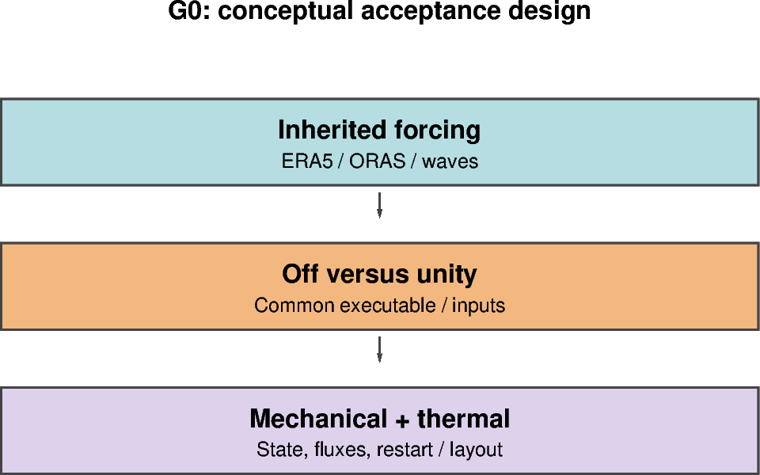

# G0 — Global forcing and unity controls

[Global contents](global_dev_dynamic_tensile_strength.md) · [Case figure notebook](../../CICE_testing/notebooks/G0.ipynb)

## Status and scope

**PLANNED: inherited global evidence is context, not acceptance of this new gate.** Updated 7 October 2026. Results below are supplied archive/log evidence; no new model runs or unseen NetCDF results are inferred by this reorganisation.

## Purpose and test logic

Re-establish the inherited global forcing and rheology before assigning any change to dynamic tensile strength. The idealised box excludes thermodynamics, active ocean forcing and waves.

## Mathematical and implementation interpretation

Unity identity is $K_{t,eff}=K_t$. Compare $\Delta S=S_{g=1}-S_{off}$ over aligned histories and restarts, including category ice/snow volumes, temperatures and energy/salt tracers.

## Conceptual figure

This PyGMT depiction shows the configuration, analytical expectation or comparison design. It is **not measured model output**. Recreate its PNG/PDF and provenance with [G0.ipynb](../../CICE_testing/notebooks/G0.ipynb). Optional measured-history cells in the notebook call the existing PyGMT validation API with actual user-supplied files; they fail rather than substitute synthetic results.

## Procedure, expected outcomes, code changes and recorded results

The dated record below preserves exact settings, commands, source references and numerical results. Earlier planning statements describe the state at that time; the status above and final recorded outcome take precedence. See [case organisation](case_organisation.md) for current configuration paths. Run archive IDs and immutable provenance stay historical.

### G0 — restore the global forcing control

After B4–B5, return to the inherited global MPI configuration with a short
control, initially a few days, using the same grid, restart and ERA5 atmosphere,
ORAS ocean and WHACS wave setup as the selected wave-forcing reference. Verify
actual namelist switches, file coverage, variable units and model/forcing dates;
do not infer an active pathway from the presence of reader code. The serial
box WHACS stub intentionally aborts if used; global WHACS must use the MPI reader.

Retain the chosen global free-slip, grounded-iceberg, lateral-drag, ocean and
wave/FSD settings across comparisons. Box mixed-layer-off and calm-ocean settings
are not a global template. Compare disabled and g=1 using a common executable;
where available compare the disabled build with the inherited control. Keep
inherited initial-history wave differences separately identified. Check active
fields, dates, forcing loading, restart continuity and representative global
decompositions before extending duration. This is verification of the inherited
configuration, not an invitation to retune snow or other baseline physics.

## Required mechanical and thermodynamic evaluation

Use the actual global grid, masks, extended restart halos, forcing and source/compiler provenance. Preserve the selected baseline thermodynamics, ocean and wave switches; box `thermo_type=none`/calm-ocean settings cannot demonstrate global thermodynamic fidelity. Check actual diagnostic definitions and time representation before calculating budgets.

- For off/unity and diagnostic-only equivalent paths, require aligned physical state, including `aicen`, `vicen`, `vsnon`, thermodynamic tracers and available surface/ocean heat fluxes, to follow the declared exact comparison criterion. Investigate differences rather than hiding them in a new tolerance.
- For feedback experiments, area/thickness changes can legitimately change thermodynamic fluxes. Compare ice/snow volume, surface temperature, growth/melt, ocean heat/freshwater exchange and budget residuals against the matched control; do not require physically different paths to be identical.
- Record finite values, physical bounds, masks, forcing coverage, restart continuity and decomposition evidence before extending duration. Declare quantitative scientific acceptance bounds before assessing the feedback run.

**No new G0–G2 execution PASS is available in this reorganisation.** The current `box_fsd`/`box_constant` feedback modes are guarded to the 12×12 controlled box. A supported live/global feedback implementation and test workflow must be added before G2 has runnable commands. The global notebooks prepare the conceptual design and expose actual-data PyGMT plotting, not a fabricated global experiment.
