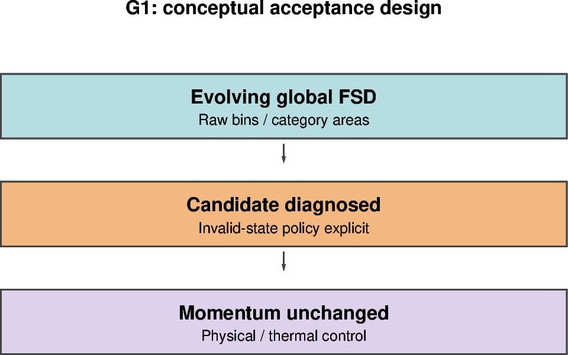

# G1 — Global evolving-FSD diagnostics without feedback

[Global contents](global_dev_dynamic_tensile_strength.md) · [Case figure notebook](../../CICE_testing/notebooks/G1.ipynb)

## Status and scope

**PLANNED: global diagnostics and the invalid-FSD policy remain to be established.** Updated 7 October 2026. Results below are supplied archive/log evidence; no new model runs or unseen NetCDF results are inferred by this reorganisation.

## Work carried forward from B6.6

The box review is complete; the tiny-area continuation remains failed. Before running the strict live mapping on global FSD, inspect the existing/control restart and history distributions independently. Separate negative/nonfinite bins from finite sum departures. Record category area, the amount of affected ice, location and timing, and quantify the effect on the calculated coefficient. This is a practical check of whether the input rules suit ordinary model behaviour, not a requirement to make every tracer sum exact.

The controlled-box thresholds are unchanged and are not yet approved for global evolving FSD. Decide the global diagnostic policy from this evidence; do not silently normalise prognostic FSD or bypass a failure by widening the tolerance. Keep momentum at the control value and verify unchanged physical results before supported global feedback is enabled. See the [B6.6 decision](B6.6.md#fsd-checking-policy).

## Purpose and test logic

Measure the evolving global FSD and candidate g without momentum feedback. The inherited global distributions have normalization departures that must be explained or given an explicit diagnostic policy.

## Mathematical and implementation interpretation

$F_L=\sum_n(a_n/A)L_n$ weights ice-covered area within a cell. Regional statistics additionally require cell area and an explicit ice-area or ocean-cell weighting. Do not infer the tail fraction from mean diameter alone.

## Conceptual figure

This PyGMT depiction shows the configuration, analytical expectation or comparison design. It is **not measured model output**. Recreate its PNG/PDF and provenance with [G1.ipynb](../../CICE_testing/notebooks/G1.ipynb). Optional measured-history cells in the notebook call the existing PyGMT validation API with actual user-supplied files; they fail rather than substitute synthetic results.

## Procedure, expected outcomes, code changes and recorded results

The dated record below preserves exact settings, commands, source references and numerical results. Earlier planning statements describe the state at that time; the status above and final recorded outcome take precedence. See [case organisation](case_organisation.md) for current configuration paths. Run archive IDs and immutable provenance stay historical.

### G1 — global evolving-FSD diagnostics: README stage 3

Requires B6 and G0. Evolve the FSD under the selected ERA5/ORAS/WHACS setup and
record category sums, ice-area-weighted size metric, candidate g, bounds/masks,
wave/fracture context and update timing. Keep the coefficient used by momentum
at the control value. A diagnostic-only run should reproduce the control's
physical state within the established comparison criterion; extra diagnostics
require an explicit variable comparison list.

The earlier global restarts already contained normalisation departures, shared
by original, disabled and g=1 runs. That is not evidence that dynamic tensile
strength caused them, but the mapping must handle their meaning explicitly before
feedback. Quantify extent and area weighting, verify tracer semantics and locate
material invalid states. Avoid both a blanket tolerance that conceals them and
an unrelated model-optimisation campaign. **R3 is reached only when these global
diagnostics and their lack of momentum feedback are verified.**

## Required mechanical and thermodynamic evaluation

Use the actual global grid, masks, extended restart halos, forcing and source/compiler provenance. Preserve the selected baseline thermodynamics, ocean and wave switches; box `thermo_type=none`/calm-ocean settings cannot demonstrate global thermodynamic fidelity. Check actual diagnostic definitions and time representation before calculating budgets.

- For off/unity and diagnostic-only equivalent paths, require aligned physical state, including `aicen`, `vicen`, `vsnon`, thermodynamic tracers and available surface/ocean heat fluxes, to follow the declared exact comparison criterion. Investigate differences rather than hiding them in a new tolerance.
- For feedback experiments, area/thickness changes can legitimately change thermodynamic fluxes. Compare ice/snow volume, surface temperature, growth/melt, ocean heat/freshwater exchange and budget residuals against the matched control; do not require physically different paths to be identical.
- Record finite values, physical bounds, masks, forcing coverage, restart continuity and decomposition evidence before extending duration. Declare quantitative scientific acceptance bounds before assessing the feedback run.

**No new G0–G2 execution PASS is available in this reorganisation.** The current `box_fsd`/`box_constant` feedback modes are guarded to the 12×12 controlled box. A supported live/global feedback implementation and test workflow must be added before G2 has runnable commands. The global notebooks prepare the conceptual design and expose actual-data PyGMT plotting, not a fabricated global experiment.
