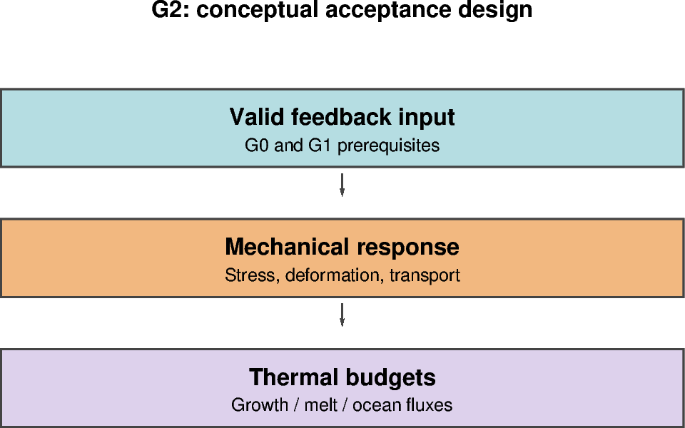

# G2 — Global feedback, physical budgets and seasonal assessment

[Global contents](global_dev_dynamic_tensile_strength.md) · [Case figure notebook](../../CICE_testing/notebooks/G2.ipynb)

## Status and scope

**PLANNED: live global feedback is not enabled by the box-only mapped mode.** Updated 7 October 2026. Results below are supplied archive/log evidence; no new model runs or unseen NetCDF results are inferred by this reorganisation.

## Purpose and test logic

Only after G0/G1 establish a valid control and candidate policy should feedback be enabled globally. Mechanical changes may alter thermodynamic budgets indirectly through area, thickness and deformation, so both must be evaluated.

## Mathematical and implementation interpretation

For a domain ice-volume budget, $\Delta V=\int(Q_{thermo}+Q_{transport}+Q_{boundary}+Q_{other})dt+R$, with every term converted to consistent volume units and sign conventions from the actual diagnostics. Report residual $R$ rather than asserting conservation from a thickness map.

## Conceptual figure

This PyGMT depiction shows the configuration, analytical expectation or comparison design. It is **not measured model output**. Recreate its PNG/PDF and provenance with [G2.ipynb](../../CICE_testing/notebooks/G2.ipynb). Optional measured-history cells in the notebook call the existing PyGMT validation API with actual user-supplied files; they fail rather than substitute synthetic results.

## Procedure, expected outcomes, code changes and recorded results

The dated record below preserves exact settings, commands, source references and numerical results. Earlier planning statements describe the state at that time; the status above and final recorded outcome take precedence. See [case organisation](case_organisation.md) for current configuration paths. Run archive IDs and immutable provenance stay historical.

### G2 — feedback, seasonal pilots and long experiments

After G1, supply FSD-derived g to the supported rheology (R4). Repeat bounds,
finite-state, restart and decomposition checks because the coefficient now
evolves; hold g fixed through each dynamics solve initially and document any lag.
Then assess attributable seasonal response (R5) before choosing the control and
two to three ten-year experiments. Keep forcing, initial states, classification
and reference rheology aligned; vary only the declared feedback/closure choice.
Exact closure parameters, integration years and experiment matrix remain to be
agreed. Ten-year runs are not required to close R3.

## Required mechanical and thermodynamic evaluation

Use the actual global grid, masks, extended restart halos, forcing and source/compiler provenance. Preserve the selected baseline thermodynamics, ocean and wave switches; box `thermo_type=none`/calm-ocean settings cannot demonstrate global thermodynamic fidelity. Check actual diagnostic definitions and time representation before calculating budgets.

- For off/unity and diagnostic-only equivalent paths, require aligned physical state, including `aicen`, `vicen`, `vsnon`, thermodynamic tracers and available surface/ocean heat fluxes, to follow the declared exact comparison criterion. Investigate differences rather than hiding them in a new tolerance.
- For feedback experiments, area/thickness changes can legitimately change thermodynamic fluxes. Compare ice/snow volume, surface temperature, growth/melt, ocean heat/freshwater exchange and budget residuals against the matched control; do not require physically different paths to be identical.
- Record finite values, physical bounds, masks, forcing coverage, restart continuity and decomposition evidence before extending duration. Declare quantitative scientific acceptance bounds before assessing the feedback run.

**No new G0–G2 execution PASS is available in this reorganisation.** The current `box_fsd`/`box_constant` feedback modes are guarded to the 12×12 controlled box. A supported live/global feedback implementation and test workflow must be added before G2 has runnable commands. The global notebooks prepare the conceptual design and expose actual-data PyGMT plotting, not a fabricated global experiment.
