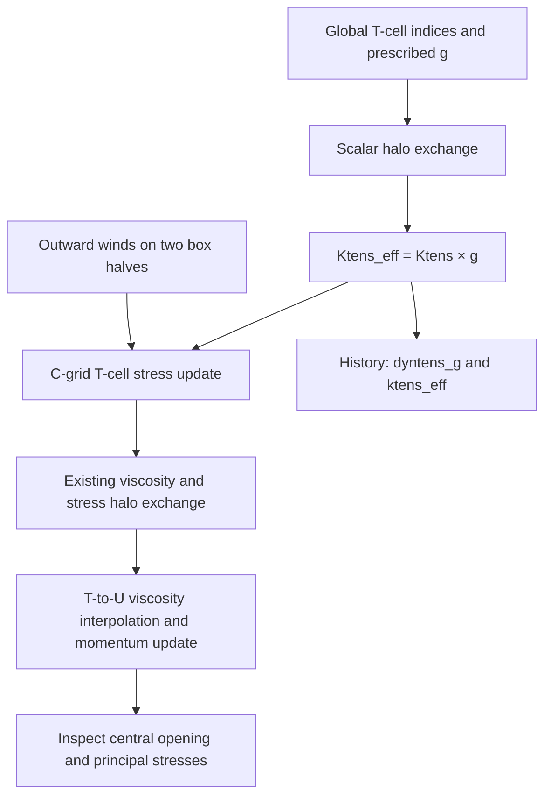

# Developing dynamic tensile strength on box01: step 3 — spatial g and tensile loading

Status: implementation prepared on 25 September 2026. Source syntax and diagnostic-fixture checks passed locally; Gadi compilation, physical results, MPI equivalence and split-run restart tests are pending. This is a prescribed-coefficient experiment, not yet g(FSD).

The preceding constant-coefficient test established that Ktens=0.2 with g=0.5 reproduced Ktens=0.1 with the feature disabled across the supplied history and restart files. See the [box01 analysis record](developing-dynamic-tensile-strength-box01.md). This step tests location-dependent coefficients and deliberately loads the central ice in extension.

## Controlled experiment

Keep the accepted 12×12, closed, free-slip C-grid box: 16 km cells, 8×8 active ocean cells, initial aice=0.9, grid-cell ice volume/area=0.9 m, initially stationary ice, calm ocean, zero Coriolis, thermodynamics and mixed-layer evolution off. Retain transport and ridging, with waves, FSD, tides and lateral drag off. Start each experiment from the same internal initial condition; do not chain the experiments through each other's restarts.

The new `box_tensile` atmospheric option prescribes uatm=-5 m/s on global columns 1–6 and +5 m/s on columns 7–12, with vatm=0. The active western half therefore pulls west and the eastern half pulls east. Existing atmospheric stress calculation is retained. Use the established `atmbndy='constant'`, `calc_strair=.false.`, `rotate_wind=.false.` settings.

The spatial option sets g=0.5 in global T columns 6–7 and g=1 elsewhere. With Ktens=0.2, the band has ktens_eff=0.1 and the surrounding ice has ktens_eff=0.2. The band spans all rows; only ocean cells participate in ice dynamics. Global indices are one-based and include the box's land margin.



Expected response: opposing zonal velocities and positive divergence around the central interface, with compression towards the outer walls. Lowering g reduces the tensile parameter at fixed compressive strength; the weak-band case should reveal a different central stress/opening response. Do not require a particular opening ratio or assume a crack must form. This continuum model, elastic relaxation, transport, concentration-dependent strength and boundary confinement determine the response. A weak band also changes the viscosity/replacement-pressure expressions; it is not an independently imposed fracture law.

Inspect the first few hours before concentration changes dominate. Use a one-day initial test with the existing one-hour timestep and EVP subcycling. If hourly snapshots miss the loading transient, add a shorter-output interval in a separately documented follow-up. Do not silently alter the timestep between controls.

## Namelist edits and run order

Rebuild after pulling the source changes. Edit existing namelist entries once rather than appending duplicate blocks. Enable these fields in `&icefields_nml` for every new control and experiment:

```fortran
    f_dyntens_g = 'd1'
    f_ktens_eff = 'd1'
    f_uatm      = 'd1'
    f_vatm      = 'd1'
    f_strength  = 'd1'
    f_divu      = 'd1'
    f_shear     = 'd1'
    f_sig1      = 'd1'
    f_sig2      = 'd1'
    f_sigP      = 'd1'
```

Retain daily and hourly streams (`histfreq='d','1',...`) and eight-byte history output. In `&setup_nml`, set `npt_unit='d'`, `npt=1`, `ice_ic='internal'` for the initial loading comparisons. Retain the established start date and restart settings.

For the **first tensile control (3A)**, set these entries in `&dynamics_nml`:

```fortran
    Ktens             = 0.2
    use_dyntens       = .true.
    dyntens_g_mode    = 'constant'
    dyntens_g_const   = 1.0
    dyntens_g_band    = 0.5
    dyntens_band_ilo  = 6
    dyntens_band_ihi  = 7
```

In `&forcing_nml`, change:

```fortran
    atm_data_type = 'box_tensile'
```

Run the following from identical initial conditions, archiving the executable, ice_in, logs, history and restart directory after each run. Give each run a fresh output directory or use the established archive workflow so stale files cannot enter the comparison.

| Test | Wind | g mode / values | Purpose |
|---|---|---|---|
| Regression | uniform_east | constant g=0.5, Ktens=0.2 versus disabled Ktens=0.1 | Recheck the accepted scalar equivalence after adding diagnostics/exchange |
| 3A | box_tensile | constant g=1, Ktens=0.2 | Strong tensile control |
| 3B | box_tensile | constant g=0.5, Ktens=0.2 | Uniformly reduced tensile control |
| 3C | box_tensile | box_band; background=1, band=0.5, columns 6–7 | Controlled spatial weakening |
| Spatial null | box_tensile | box_band; background=1, band=1 | Must reproduce 3A's physical fields |

For 3B change only `dyntens_g_const=0.5` from 3A. For 3C return it to 1 and change only `dyntens_g_mode='box_band'`. The band parameters are ignored in constant mode. When the feature is disabled, diagnostics report g=1 and ktens_eff=Ktens: g is an identity factor for that path, not a computed FSD property.

The regression's `dyntens_g` intentionally differs (1 disabled versus 0.5 enabled); its `ktens_eff` and physical fields should match. Do not apply an all-variable equality test to this pair without accounting for that diagnostic difference.

## What halos do here

Each block owns some physical cells and stores extra rows/columns containing copies of its neighbours. A stencil can then read adjacent cells without communicating individually on every access. Internal block edges are not coastlines, and a weak band's position must not depend on MPI rank or local array index.

1. At EVP initialisation and before each dynamics step, construct g on owned T cells from global column indices.
2. All ranks call `ice_HaloUpdate` with `field_loc_center` and `field_type_scalar`, outside OpenMP regions and outside EVP subcycling. It copies same-rank neighbours and communicates remote neighbours through the existing CICE infrastructure.
3. Form ktens_eff from the exchanged g array. Ktens is a broadcast scalar, so a second exchange of its product is unnecessary.
4. The existing C-grid stress path uses the local coefficient. Its existing `dyn_haloUpdate` exchanges viscosities and normal stresses before the T-to-U interpolation. A g halo exchange cannot replace that exchange of derived fields.

The exchange's `fillValue` is the background g for absent neighbours, eliminated land blocks and physical boundaries. This is a finite coefficient convention, not a stress or velocity boundary condition. Existing land masks and free-slip treatment still govern those. Physical land cells receive the prescribed profile; history checking uses the ocean mask. Constant g therefore remains constant through its halos. No vector rotation/sign reversal is applied to g.

These coefficients are prescribed, time-independent derived fields. They are reconstructed at startup, including restart startup, rather than added to restart files. This does not by itself prove a split-run restart test passes.

### Decomposition check

A one-block run tests the prescribed map and forcing but cannot exercise internal block exchange. Use a separate case for each decomposition. The setup's explicit `-p` format is tasks × threads × block-x × block-y × maximum-blocks-per-rank:

| Layout | Setup argument | What it exercises |
|---|---|---|
| One block, serial | `-p 1x1x12x12x1` | Reference |
| Two x-blocks, serial | `-p 1x1x6x12x2` | Local halo copies across columns 6/7 |
| Two x-blocks, MPI | `-p 2x1x6x12x1` | Remote halo exchange across columns 6/7 |

Use `-g gbox12 -m gadi1 -e intel -s boxforcee,boxclosed,buildclean` with separate `-c` names. Apply the accepted box settings and the same step-3 edits to each generated case: the setup options alone do not reproduce the accepted C-grid experiment. Preserve each case's generated decomposition and paths rather than copying the whole serial ice_in over the MPI one. Use the working Gadi compiler environment; the MPI job needs two processes and matching PBS resources.

Repeat 3C on these layouts. Also run a deliberate **one-column band** (`dyntens_band_ilo=6`, `dyntens_band_ihi=6`) on all three: g then jumps exactly across the internal block boundary. This asymmetric case is a communication test, so do not require east–west symmetry. Check coefficient maps exactly on ocean cells; compare the full physical history and restarts, initially with zero numerical tolerance. If MPI/build-order rounding appears, measure it and document an appropriate tolerance before accepting it. Equal prescribed maps alone do not establish correct stress/velocity halos.

A final continuous versus split-run comparison under identical prescribed settings is still required for restart reproducibility.

## Output checks

`dyntens_g` and `ktens_eff` are dimensionless T-cell fields. The latter is not tensile stress in N/m. `strength` is the evolving compressive strength; `sig1` and `sig2` are principal stresses normalised by strength. In this implementation their positive values indicate tensile principal stress; `sigP=-0.5*stressp` is positive for mean compression. Positive divergence alone is evidence of opening, not proof that the desired tensile stress state or yield limit was reached. Inspect all of these together, along with concentration and velocity.

For archived 3C output:

```bash
python3 test_scripts/check_box_spatial_g.py "$run3c" \
  --mode box_band --ktens 0.2 --background 1 --band 0.5 \
  --ilo 6 --ihi 7 --tensile
```

For 3A use `--mode constant --background 1`; for 3B use `--mode constant --background 0.5`. The checker validates maps, prescribed winds, and finite unmasked history values, and prints central divergence. It does not certify physical yielding.

For the MPI run against the same experiment in serial:

```bash
python3 test_scripts/check_box_spatial_g.py "$mpi_run" \
  --mode box_band --ktens 0.2 --background 1 --band 0.5 \
  --ilo 6 --ihi 7 --tensile --reference-run "$serial_run"
```

For the one-column halo test set `--ihi 6` as well as the matching namelist entry. Reference comparison checks history/restart inventories, dimensions, variable masks and decoded values; it excludes metadata and masked storage. Default numerical tolerances are zero.

## Source changes and validation

- `ice_dyn_shared.F90`: mode, band value and global band bounds.
- `ice_init.F90`: defaults, namelist, broadcasts, validation and run-log provenance. Spatial mode is restricted to a rectangular grid; existing C-grid EVP restrictions remain.
- `ice_dyn_evp.F90`: construct/exchange g, derive ktens_eff, expose both for history. The constitutive formulas and existing viscosity exchange are unchanged.
- `ice_forcing.F90`: box_tensile at initialisation and subsequent atmospheric updates; existing wind-to-stress calculation is reused.
- `ice_history_shared.F90` / `ice_history.F90`: field switches, registration and accumulation, including safe disabled-path values.
- `configuration/scripts/ice_in`: new options with backward-compatible defaults; current case files require manual edits.
- `test_scripts/check_box_spatial_g.py`: output gate and decomposition comparison; fixture tests deliberately reject shifted bands, wrong effective factors, inward wind and nonfinite values.

Local validation: six modified Fortran modules preprocessed and parsed as Fortran 2008; eight diagnostic-fixture tests passed. No Fortran compiler or Gadi execution was available here. Record the build outcome, archive identifiers and physical/decomposition results below before declaring this stage validated. Continue using the serial WHACS interface already applied for the accepted box build; this step does not change it.

## Results

Pending Gadi build and runs. Do not replace this with a pass based only on successful compilation.
