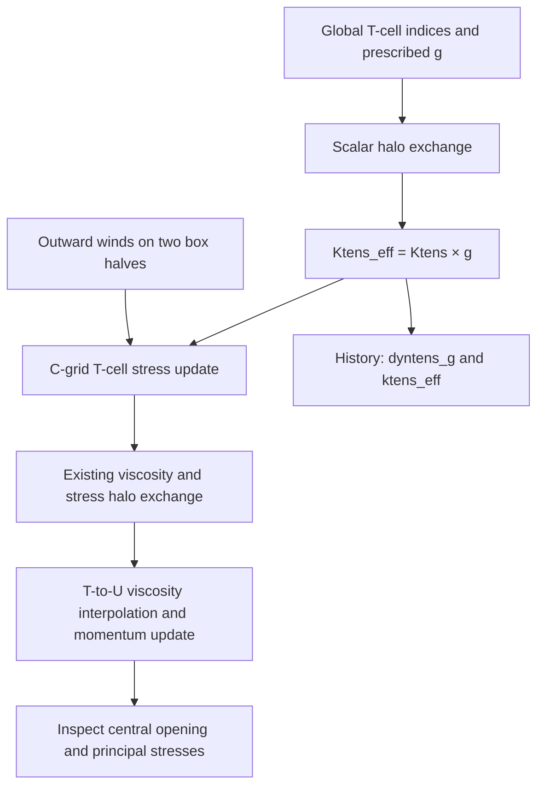

# Developing dynamic tensile strength on box01: step 3 — spatial g and tensile loading

Status (2 October 2026): all four supplied five-day archives checked end to end. Prescribed coefficients and the appropriate wind pass all 504 history files; all 20 restart files contain finite unmasked numeric values. Serial tensile response is demonstrated. Matched disabled-path tensile control, spatial-null, decomposition and split-run restart gates remain open. This is prescribed g, not yet g(FSD).

The preceding constant-coefficient test established that Ktens=0.2 with g=0.5 reproduced Ktens=0.1 with the feature disabled across the supplied history and restart files. See the [box01 analysis record](developing-dynamic-tensile-strength-box01.md). This step tests location-dependent coefficients and deliberately loads the central ice in extension.

## Controlled experiment

Keep the accepted 12×12, closed, free-slip C-grid box: 16 km cells, 8×8 active ocean cells, initial aice=0.9, grid-cell ice volume/area=0.9 m, initially stationary ice, calm ocean, zero Coriolis, thermodynamics and mixed-layer evolution off. Retain transport and ridging, with waves, FSD, tides and lateral drag off. Start each experiment from the same internal initial condition; do not chain the experiments through each other's restarts.

The new `box_tensile` atmospheric option prescribes uatm=-5 m/s on global columns 1–6 and +5 m/s on columns 7–12, with vatm=0. The active western half therefore pulls west and the eastern half pulls east. Existing atmospheric stress calculation is retained. Use the established `atmbndy='constant'`, `calc_strair=.false.`, `rotate_wind=.false.` settings.

The spatial option sets g=0.5 in global T columns 6–7 and g=1 elsewhere. With Ktens=0.2, the band has ktens_eff=0.1 and the surrounding ice has ktens_eff=0.2. The band spans all rows; only ocean cells participate in ice dynamics. Global indices are one-based and include the box's land margin.


```mermaid
flowchart TD
    P["Global T-cell indices and prescribed g"] --> H["Scalar halo exchange"]
    H --> K["Ktens_eff = Ktens × g"]
    W["Outward winds on two box halves"] --> S["C-grid T-cell stress update"]
    K --> S
    S --> V["Existing viscosity and stress halo exchange"]
    V --> U["T-to-U viscosity interpolation and momentum update"]
    K --> D["History: dyntens_g and ktens_eff"]
    U --> R["Inspect central opening and principal stresses"]
```

Expected response: opposing zonal velocities and positive divergence around the central interface, with compression towards the outer walls. Lowering g reduces the tensile parameter at fixed compressive strength; the weak-band case should reveal a different central stress/opening response. Do not require a particular opening ratio or assume a crack must form. This continuum model, elastic relaxation, transport, concentration-dependent strength and boundary confinement determine the response. A weak band also changes the viscosity/replacement-pressure expressions; it is not an independently imposed fracture law.

Inspect the first few hours before concentration changes dominate. Use a one-day initial test with the existing one-hour timestep and EVP subcycling. If hourly snapshots miss the loading transient, add a shorter-output interval in a separately documented follow-up. Do not silently alter the timestep between controls.

## Namelist edits and run order

Rebuild after pulling the source changes. Edit existing namelist entries once rather than appending duplicate blocks. Enable these fields in `&icefields_nml` for every new control and experiment:

```fortran
    f_dyntens_g = 'd1'
    f_ktens_eff = 'd1'
    f_uatm      = 'd1'
    f_vatm      = 'd1'
    f_strength  = 'd1'
    f_divu      = 'd1'
    f_shear     = 'd1'
    f_sig1      = 'd1'
    f_sig2      = 'd1'
    f_sigP      = 'd1'
```

Retain daily and hourly streams (`histfreq='d','1',...`) and eight-byte history output. In `&setup_nml`, set `npt_unit='d'`, `npt=1`, `ice_ic='internal'` for the initial loading comparisons. Retain the established start date and restart settings.

For the **first tensile control (3A)**, set these entries in `&dynamics_nml`:

```fortran
    Ktens             = 0.2
    use_dyntens       = .true.
    dyntens_g_mode    = 'constant'
    dyntens_g_const   = 1.0
    dyntens_g_band    = 0.5
    dyntens_band_ilo  = 6
    dyntens_band_ihi  = 7
```

In `&forcing_nml`, change:

```fortran
    atm_data_type = 'box_tensile'
```

Run the following from identical initial conditions, archiving the executable, ice_in, logs, history and restart directory after each run. Give each run a fresh output directory or use the established archive workflow so stale files cannot enter the comparison.

| Test | Wind | g mode / values | Purpose |
|---|---|---|---|
| Regression | uniform_east | constant g=0.5, Ktens=0.2 versus disabled Ktens=0.1 | Recheck the accepted scalar equivalence after adding diagnostics/exchange |
| 3A | box_tensile | constant g=1, Ktens=0.2 | Strong tensile control |
| 3B | box_tensile | constant g=0.5, Ktens=0.2 | Uniformly reduced tensile control |
| 3C | box_tensile | box_band; background=1, band=0.5, columns 6–7 | Controlled spatial weakening |
| Spatial null | box_tensile | box_band; background=1, band=1 | Must reproduce 3A's physical fields |

For 3B change only `dyntens_g_const=0.5` from 3A. For 3C return it to 1 and change only `dyntens_g_mode='box_band'`. The band parameters are ignored in constant mode. When the feature is disabled, diagnostics report g=1 and ktens_eff=Ktens: g is an identity factor for that path, not a computed FSD property.

The regression's `dyntens_g` intentionally differs (1 disabled versus 0.5 enabled); its `ktens_eff` and physical fields should match. Do not apply an all-variable equality test to this pair without accounting for that diagnostic difference.

## What halos do here

Each block owns some physical cells and stores extra rows/columns containing copies of its neighbours. A stencil can then read adjacent cells without communicating individually on every access. Internal block edges are not coastlines, and a weak band's position must not depend on MPI rank or local array index.

1. At EVP initialisation and before each dynamics step, construct g on owned T cells from global column indices.
2. All ranks call `ice_HaloUpdate` with `field_loc_center` and `field_type_scalar`, outside OpenMP regions and outside EVP subcycling. It copies same-rank neighbours and communicates remote neighbours through the existing CICE infrastructure.
3. Form ktens_eff from the exchanged g array. Ktens is a broadcast scalar, so a second exchange of its product is unnecessary.
4. The existing C-grid stress path uses the local coefficient. Its existing `dyn_haloUpdate` exchanges viscosities and normal stresses before the T-to-U interpolation. A g halo exchange cannot replace that exchange of derived fields.

The exchange's `fillValue` is the background g for absent neighbours, eliminated land blocks and physical boundaries. This is a finite coefficient convention, not a stress or velocity boundary condition. Existing land masks and free-slip treatment still govern those. Physical land cells receive the prescribed profile; history checking uses the ocean mask. Constant g therefore remains constant through its halos. No vector rotation/sign reversal is applied to g.

These coefficients are prescribed, time-independent derived fields. They are reconstructed at startup, including restart startup, rather than added to restart files. This does not by itself prove a split-run restart test passes.

### Decomposition check

A one-block run tests the prescribed map and forcing but cannot exercise internal block exchange. Use a separate case for each decomposition. The setup's explicit `-p` format is tasks × threads × block-x × block-y × maximum-blocks-per-rank:

| Layout | Setup argument | What it exercises |
|---|---|---|
| One block, serial | `-p 1x1x12x12x1` | Reference |
| Two x-blocks, serial | `-p 1x1x6x12x2` | Local halo copies across columns 6/7 |
| Two x-blocks, MPI | `-p 2x1x6x12x1` | Remote halo exchange across columns 6/7 |

Use `-g gbox12 -m gadi1 -e intel -s boxforcee,boxclosed,buildclean` with separate `-c` names. Apply the accepted box settings and the same step-3 edits to each generated case: the setup options alone do not reproduce the accepted C-grid experiment. Preserve each case's generated decomposition and paths rather than copying the whole serial ice_in over the MPI one. Use the working Gadi compiler environment; the MPI job needs two processes and matching PBS resources.

Repeat 3C on these layouts. Also run a deliberate **one-column band** (`dyntens_band_ilo=6`, `dyntens_band_ihi=6`) on all three: g then jumps exactly across the internal block boundary. This asymmetric case is a communication test, so do not require east–west symmetry. Check coefficient maps exactly on ocean cells; compare the full physical history and restarts, initially with zero numerical tolerance. If MPI/build-order rounding appears, measure it and document an appropriate tolerance before accepting it. Equal prescribed maps alone do not establish correct stress/velocity halos.

A final continuous versus split-run comparison under identical prescribed settings is still required for restart reproducibility.

## Output checks

`dyntens_g` and `ktens_eff` are dimensionless T-cell fields. The latter is not tensile stress in N/m. `strength` is the evolving compressive strength; `sig1` and `sig2` are principal stresses normalised by strength. In this implementation their positive values indicate tensile principal stress; `sigP=-0.5*stressp` is positive for mean compression. Positive divergence alone is evidence of opening, not proof that the desired tensile stress state or yield limit was reached. Inspect all of these together, along with concentration and velocity.

For archived 3C output:

```bash
python3 test_scripts/check_box_spatial_g.py "$run3c" \
  --mode box_band --ktens 0.2 --background 1 --band 0.5 \
  --ilo 6 --ihi 7 --tensile
```

For 3A use `--mode constant --background 1`; for 3B use `--mode constant --background 0.5`. The checker validates maps, prescribed winds, and finite unmasked history values, and prints central divergence. It does not certify physical yielding.

For the MPI run against the same experiment in serial:

```bash
python3 test_scripts/check_box_spatial_g.py "$mpi_run" \
  --mode box_band --ktens 0.2 --background 1 --band 0.5 \
  --ilo 6 --ihi 7 --tensile --reference-run "$serial_run"
```

For the one-column halo test set `--ihi 6` as well as the matching namelist entry. Reference comparison checks history/restart inventories, dimensions, variable masks and decoded values; it excludes metadata and masked storage. Default numerical tolerances are zero.

## Source changes and validation

- `ice_dyn_shared.F90`: mode, band value and global band bounds.
- `ice_init.F90`: defaults, namelist, broadcasts, validation and run-log provenance. Spatial mode is restricted to a rectangular grid; existing C-grid EVP restrictions remain.
- `ice_dyn_evp.F90`: construct/exchange g, derive ktens_eff, expose both for history. The constitutive formulas and existing viscosity exchange are unchanged.
- `ice_forcing.F90`: box_tensile at initialisation and subsequent atmospheric updates; existing wind-to-stress calculation is reused.
- `ice_history_shared.F90` / `ice_history.F90`: field switches, registration and accumulation, including safe disabled-path values.
- `configuration/scripts/ice_in`: new options with backward-compatible defaults; current case files require manual edits.
- `test_scripts/check_box_spatial_g.py`: output gate and decomposition comparison; fixture tests deliberately reject shifted bands, wrong effective factors, inward wind and nonfinite values.

Local validation: six modified Fortran modules preprocessed and parsed as Fortran 2008; eight diagnostic-fixture tests passed. No Fortran compiler or Gadi execution was available here. Record the build outcome, archive identifiers and physical/decomposition results below before declaring this stage validated. Continue using the serial WHACS interface already applied for the accepted box build; this step does not change it.

## Results

See the archive verification below. Earlier dated entries record the debugging sequence; their pending statements are superseded only where the archive evidence below closes them.

## 27 September 2026: 3C startup validation fix

The supplied `cice.runlog.260927-145305` aborted in `input_data` with
`invalid dyntens band global i bounds`, before domain initialisation or timestepping.
Columns 6–7 in the supplied 12-column namelist were valid. The implementation
incorrectly compared the band upper bound against `nx_global` before
`init_domain_blocks` read and broadcast `domain_nml`. Constant mode bypassed this
check, explaining why the earlier controls could run.

Keep positive/ordered band-bound validation in `input_data`; defer the comparison
with `nx_global` to `init_evp`, after domain initialisation and before coefficient
construction. This preserves the spatial experiment and all coefficient formulas.
Pull the fix, rebuild, and rerun 3C with the same namelist. The successful companion
log `cice.runlog.260927-143256` reaches step 120 and 2005-01-06; it does not validate
the failed spatial case. Runtime confirmation of the fix remains pending on Gadi.

## 27 September 2026: IC wind check correction

The rerun checker passed five daily histories then rejected `uatm` in
`iceh_ic.2005-01-01-00000.nc`. In the standalone driver, `accum_hist` writes IC
history before `init_forcing_atmo` and `get_forcing_atmo`. The checker now skips
only the prescribed wind-pattern assertion for the `iceh_ic.` filename prefix
(configurable with `--ic-prefix` to match `incond_file`). It still checks IC g,
effective coefficient and finite values. All subsequent histories retain the wind
assertion. No model rebuild or simulation rerun is required for this checker fix.
The reported central daily divergence was positive, falling from about 0.206 to
0.143 percent/day; hourly-file validation and comparisons to controls remain pending.

### Instantaneous stream variable names

The checker also accepts CICE's `_1` instantaneous-variable suffix (for example
`dyntens_g_1`, `ktens_eff_1`, `uatm_1`, `vatm_1`, `divu_1`). Static grid fields
remain unsuffixed. This naming is confirmed in the supplied run's history-field
registration log. Lookup applies to both data and divergence units; genuinely
missing fields still fail. IC files may contain both names; exact unsuffixed names
take precedence, with `_1` used only when the base name is absent. Seventeen fixture
tests cover daily, IC and instantaneous naming and retained validation failures.
This is a checker-only correction; no rebuild or model rerun is required.

## 2 October 2026: IC contains both history streams

The reported IC file contains both `dyntens_g` and `dyntens_g_1`. This is a valid
multi-stream IC layout, not a missing model diagnostic. The checker now selects
the exact base name first and falls back to `_1` only when the base is absent.
Invalid base values still fail even if a valid suffixed copy is present; the finite
scan continues to inspect all numeric variables. Eighteen fixture tests pass,
including dual-stream IC, suffix-only instantaneous files and invalid coefficients.
Load the Python analysis environment before running the checker (the reported
`load_modules` command supplies NumPy/netCDF4). No model rebuild or rerun is needed.
The complete 3C archive has not yet been independently checked here.


## 2 October 2026: verification of all four supplied archives

Aim: establish and document a verifiable 12×12 idealised implementation, then
return to the global configuration and develop two to three ten-year experiments
against a control tied to the wave-forcing results. Keep inherited global FSD and
snow-temperature investigations outside this box verification stage.

### Evidence and checker outcome

The checker at commit `f227494` already passes A, B and C end to end: 126 histories
each (one IC, five daily files and 120 hourly files). The reported duplicate-name
failure is not reproducible with that version on these supplied archives. No
additional model-source fix is justified by it. IC has both base and `_1` fields;
hourly histories use `_1`. Base-name precedence and the IC wind-initialisation
exception remain in force. The current checker prints an identifying banner so
an older local script is recognisable, and supports explicit wind selection.

| Archive under `~/AFIM_archive/LFI-waves-dyntens/` | Archived wind | Coefficient | History gate |
|---|---|---|---|
| `dyntens-box01.step3-0.20260927-130227` | uniform_east | disabled; effective 0.2 | 126/126 pass with uniform-east assertion |
| `dyntens-box01.step3-A.20260927-142925` | box_tensile | constant g=1; effective 0.2 | 126/126 pass |
| `dyntens-box01.step3-B.20260927-143430` | box_tensile | constant g=0.5; effective 0.1 | 126/126 pass |
| `dyntens-box01.step3-C.20260927-154047` | box_tensile | g=0.5 in columns 6–7, 1 elsewhere | 126/126 pass |

All four hourly inventories cover hours 1–120 with one-hour time-coordinate
spacing. All five restart files per archive pass an independent scan of every
unmasked numeric value for finiteness. This does not establish split-run restart
reproducibility. Masked storage and arbitrary missing-field completeness are not
certified by the finite scan.

3-0 is a uniform-east reference, not a matched disabled-path tensile control.
Its `uatm` is +5 m/s throughout the active ocean. Applying `--tensile` correctly
rejects it. Preserve it; obtain a separate disabled `box_tensile` run for the
identity comparison. A and B namelists differ only in `dyntens_g_const`; A and C
namelists differ only in `dyntens_g_mode`.

Executable SHA-256:

- 3-0, A, B: `9703f37187a64e717873c63c0dc145f6114c58aab8e6ca7565b51c463c5c2202`
- C: `24b9df36e1c01fb9e1093b2a4369c9838ac716f9f616db755e18d49d1da18158`

The C executable differs following the startup-validation rebuild. The hashes
alone cannot establish that this is its only source/build difference. Repeat the
matched tensile controls using the accepted C executable before attributing all
A–C differences exclusively to the coefficient map.

### Measured tensile response

Values below are instantaneous snapshots, sampled over active T cells in global
columns 6–7. Spatial differences within that central set are below the displayed
precision. `sig1` is dimensionless principal stress normalised by strength;
`sigP` is vertically integrated pressure, positive in compression (N/m).

| Quantity | 3A: g=1 | 3B: g=0.5 | 3C: weak band |
|---|---:|---:|---:|
| Hour 1 central divergence (%/day) | 11.547084 | 15.001759 | 14.825436 |
| Hour 1 central sig1 | 0.269396 | 0.164093 | 0.164092 |
| Hour 1 central sigP (N/m) | -165.574497 | -50.821862 | -50.821324 |
| Hour 120 central divergence (%/day) | 0.138509 | 0.143498 | 0.142564 |
| Hour 120 central sig1 | 0.243639 | 0.148884 | 0.148790 |
| Hour 120 central aice | 0.883963 | 0.878667 | 0.879060 |

At hour 1, the ocean velocity extrema have opposing signs: ±0.0213835 m/s
(A), ±0.0277810 (B), and ±0.0274545 (C). Positive central divergence and
principal stress, negative central pressure, and compression elsewhere support
the intended extensional loading. Reduced g produces greater initial opening and
lower central tensile stress. By hour 120, transport and strength feedback have
substantially reduced opening rates. A and B form the clean same-executable
comparison; C gives consistent spatial-case evidence subject to the rebuild
qualification above. These diagnostics do not by themselves certify a yield
surface, a crack threshold or resolution convergence.

Do not interpret the small central-divergence values printed for daily files as
the magnitude of the initial transient: the first hourly snapshot resolves a
much larger response. Some CICE stress/divergence fields are snapshots even in
daily output; consult their variable comments rather than assuming every field
in a daily file is a daily mean.

### Reproduce the checks

Load the analysis environment first, then pull the updated checker. These
commands do not rebuild or rerun CICE:

```bash
git pull --ff-only origin dev
load_modules
archive="$HOME/AFIM_archive/LFI-waves-dyntens"
python3 test_scripts/check_box_spatial_g.py "$archive/dyntens-box01.step3-0.20260927-130227" --mode constant --ktens 0.2 --background 1 --wind uniform_east
python3 test_scripts/check_box_spatial_g.py "$archive/dyntens-box01.step3-A.20260927-142925" --mode constant --ktens 0.2 --background 1 --tensile
python3 test_scripts/check_box_spatial_g.py "$archive/dyntens-box01.step3-B.20260927-143430" --mode constant --ktens 0.2 --background 0.5 --tensile
python3 test_scripts/check_box_spatial_g.py "$archive/dyntens-box01.step3-C.20260927-154047" --mode box_band --ktens 0.2 --background 1 --band 0.5 --ilo 6 --ihi 7 --tensile
```

Expected: four `PASS prescribed fields/finite history: 126 files` summaries.
Twenty checker-fixture tests also pass. No Fortran code was changed in this audit.

### Remaining box acceptance sequence

1. Freeze the accepted executable and namelist template. Using that executable,
   run disabled `box_tensile`, constant g=1, constant g=0.5 and spatial-null g=1
   from identical internal initial conditions for the same five days. Disabled,
   constant-one and spatial-null should match histories/restarts using the
   checker's zero-tolerance reference comparison. Compare the rebuilt g=0.5
   control with B to establish whether the rebuild changed its output.
2. Exercise the already documented serial two-block and MPI two-rank layouts,
   including the one-column band across a block boundary. A single 12×12 block
   cannot demonstrate internal neighbour communication, even when its map is
   correct. Compare physical outputs as well as coefficient maps.
3. Verify a split restart run against the uninterrupted five-day spatial run,
   comparing matching final snapshots/restarts and aligned averaging intervals.
   Coefficients must reconstruct correctly without prognostic restart variables.
4. Record those outcomes before closing prescribed-g box verification. Develop
   the FSD-derived mapping with controlled, normalised box distributions before
   the global scientific experiments; present tests do not validate g(FSD).
5. Return to the global wave-forcing reference with documented executable,
   initial-state and forcing provenance. Establish short disabled/g=1 controls
   and diagnostics before committing to the control and two to three ten-year
   simulations. Retain the same comparison basis across those experiments.
